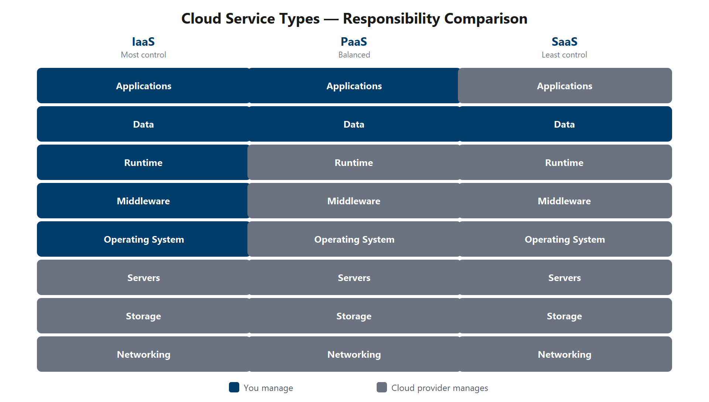
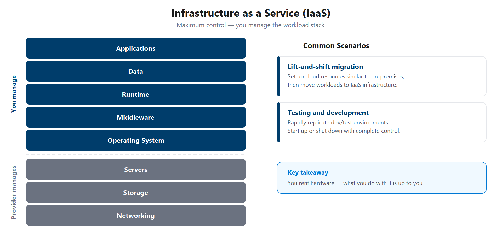
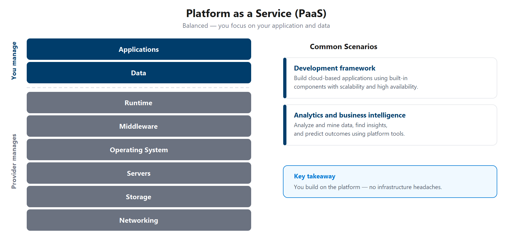
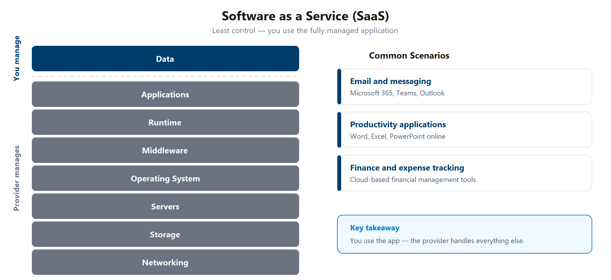

# Introduzione ai concetti fondamentali di Microsoft Azure

Microsoft Azure è una piattaforma di cloud computing con un set di servizi in continua espansione che consente di creare soluzioni che soddisfino gli obiettivi tecnici. I servizi di Azure supportano tutti gli scenari, da quelli semplici a quelli più complessi. È possibile ospitare semplici servizi Web per le app con connessione Internet, eseguire computer completamente virtualizzati per soluzioni software personalizzate o usare servizi basati sul cloud come archiviazione remota, hosting di database e gestione centralizzata degli account. Azure offre anche funzionalità di intelligenza artificiale e Internet delle cose (IoT).

In questa serie vengono illustrate le nozioni di base sul cloud computing, vengono presentati alcuni dei servizi di base forniti da Microsoft Azure e vengono fornite altre informazioni sui servizi di governance e conformità che è possibile usare.

## Che cos'è Concetti fondamentali di Azure?

Concetti fondamentali di Azure è una serie di tre percorsi di apprendimento che consentono di acquisire familiarità con Azure e i numerosi servizi e funzionalità e un percorso di apprendimento che offre la possibilità di esplorare Azure e creare soluzioni a sfide IT realistiche.

Che siate interessati ai servizi di calcolo, rete o archiviazione; a imparare le migliori pratiche per la sicurezza cloud; o a esplorare le opzioni di governance e gestione, considerate Concetti Fondamentali di Azure come la vostra guida curata ad Azure.

Fondamenti di Azure include materiale guidato e verifiche delle conoscenze che rafforzano i concetti chiave.

L'esperienza IT tecnica non è necessaria; Tuttavia, avere conoscenze IT generali ti aiuterà a sfruttare al meglio l'esperienza di apprendimento.

## Perché è consigliabile usare Concetti fondamentali di Azure?

Se si sta iniziando a lavorare con il cloud o se si ha già esperienza nel cloud, Azure Fundamentals offre tutto ciò che è necessario iniziare.

Indipendentemente dai tuoi obiettivi, Azure Fundamentals ha qualcosa per te. È consigliabile seguire questo corso se:

Avere interesse generale in Azure o nel cloud computing
Vuoi ottenere la certificazione ufficiale da Microsoft (AZ-900)
La serie di percorsi di apprendimento Concetti fondamentali di Azure consente di preparare l'esame AZ-900: Concetti fondamentali di Microsoft Azure. Questo esame include tre aree di dominio delle conoscenze:

| Area di dominio AZ-900	| Peso
----------------------------|------
Descrivere i concetti relativi al cloud|	25-30%
Descrivere l'architettura e i servizi di Azure	|35-40%
Descrivere la gestione e la governance di Azure	|30-35%

Ogni area di dominio è mappata a un percorso di apprendimento in Concetti fondamentali di Azure. Le percentuali mostrate indicano il peso relativo di ogni area nell'esame. Maggiore è la percentuale, più domande che parte dell'esame conterrà. Assicurarsi di leggere la pagina dell'esame per informazioni specifiche sulle competenze trattate in ogni area.

Questo training consente di sviluppare un'ampia comprensione di Azure.

## Introduzione al cloud computing

### Che cos'è il cloud computing

Il cloud computing è la distribuzione di servizi informatici tramite Internet. I servizi di calcolo includono un'infrastruttura IT comune, ad esempio macchine virtuali, archiviazione, database e rete. I servizi cloud espandono anche le tradizionali offerte IT per includere, ad esempio l'Internet delle cose (IoT), l'apprendimento automatico (ML) e l'intelligenza artificiale (IA).

Poiché il cloud computing usa Internet per la distribuzione di tali servizi, non deve necessariamente essere vincolato all'infrastruttura fisica, a differenza dei data center tradizionali. Questo significa che, se è necessario incrementare rapidamente l'infrastruttura IT, non bisogna attendere la costruzione di un nuovo data center, ma è possibile usare il cloud per ampliare rapidamente l'ambiente IT.

#### Esempio
Si supponga che un team di vendita al dettaglio si aspetta un traffico elevato durante un lancio stagionale. Invece di acquistare e configurare in anticipo server fisici aggiuntivi, è possibile distribuire capacità di calcolo aggiuntive nel cloud per il periodo di avvio e ridurre le prestazioni in un secondo momento. Questo approccio migliora l'agilità e consente di allineare la spesa alla domanda effettiva.

A livello di nozioni fondamentali, il cloud computing modifica la pianificazione dell'infrastruttura dai cicli di approvvigionamento lunghi al provisioning su richiesta. I team possono testare più velocemente, ripristinare più velocemente e adattare la capacità man mano che cambiano i requisiti.

Le piattaforme cloud offrono anche copertura globale, in modo che i team possano posizionare i servizi più vicini agli utenti e progettare la resilienza a livello di area senza creare più data center fisici.

Questo breve video offre un'introduzione rapida al cloud computing.
https://learn.microsoft.com/it-it/training/modules/describe-cloud-compute/3-what-cloud-compute

## Come cambiano le responsabilità nel cloud

Iniziare con un data center locale tradizionale. Il team è responsabile della gestione dello spazio fisico, della sicurezza e della gestione o della sostituzione dei server in caso di problemi. Il reparto IT è responsabile della gestione di tutta l'infrastruttura e del software necessari per mantenere operativo il data center. È anche probabile che siano responsabili di mantenere tutti i sistemi con patch e sulla versione corretta.

Con il modello di responsabilità condivisa, queste responsabilità vengono condivise tra il provider di servizi cloud e l'utente. La sicurezza fisica, l'alimentazione, il raffreddamento e la connettività di rete sono responsabilità del provider di servizi cloud. Il consumer non è collocato nel data center, quindi non sarebbe opportuno che l'utente abbia alcuna responsabilità.

Allo stesso tempo, il consumer è responsabile dei dati e delle informazioni archiviati nel cloud. Non si vuole che il provider di servizi cloud sia in grado di leggere le informazioni. L'utente è anche responsabile della sicurezza dell'accesso, vale a dire che si concede solo l'accesso a coloro che ne hanno bisogno.

Quindi, per alcune cose, la responsabilità dipende dalla situazione. Se si usa un database SQL cloud, il provider di servizi cloud sarà responsabile della gestione del database effettivo. Tuttavia, si è ancora responsabili dei dati inseriti nel database. Se è stata distribuita una macchina virtuale e ne è stato installato un database SQL, si sarà responsabili delle patch e degli aggiornamenti del database, nonché della gestione dei dati e delle informazioni archiviate nel database.

Con un data center locale, si è responsabili di tutto. Con il cloud computing, queste responsabilità cambiano. Il modello di responsabilità condivisa è strettamente legato ai tipi di servizio cloud (descritti più avanti in questo percorso di apprendimento): infrastruttura distribuita come servizio (IaaS), piattaforma distribuita come servizio (PaaS) e software distribuita come servizio (SaaS). IaaS pone la massima responsabilità per l'utente, con il provider di servizi cloud responsabile delle nozioni di base della sicurezza fisica, della potenza e della connettività. Dall'altra parte dello spettro, SaaS pone la maggior parte delle responsabilità con il provider di servizi cloud. PaaS, essendo un mezzo tra IaaS e SaaS, si trova in un punto centrale e distribuisce uniformemente la responsabilità tra il provider di servizi cloud e il consumer.

## Responsabilità in base al modello di servizio

Il diagramma seguente illustra in che modo il modello di responsabilità condivisa informa chi è responsabile di cosa, a seconda del tipo di servizio cloud.

Quando si usa un provider di servizi cloud, si sarà sempre responsabili di:

**Cosa rimane sempre con te**
- Informazioni e dati archiviati nel cloud
- Dispositivi autorizzati a connettersi al cloud (telefoni cellulari, computer e così via)
- Account e identità delle persone, dei servizi e dei dispositivi nel tuo ambiente
Il provider di servizi cloud è sempre responsabile di:

**Che cosa il provider possiede sempre**
- Datacenter fisico
- Rete fisica
- Host fisici
Il modello di servizio determinerà la responsabilità di elementi come:

**Che cosa dipende dal tipo di servizio**
- Sistemi operativi
- Controlli di rete
- Applicazioni
- Identità e accesso
- Infrastruttura

Ad esempio, l'identità e l'accesso vengono condivisi in PaaS e SaaS, ovvero si gestiscono utenti, ruoli e criteri personalizzati, mentre il provider esegue la piattaforma di autenticazione , ad esempio Microsoft Entra ID. L'infrastruttura, d'altra parte, passa interamente al provider non appena si passa dall'ambiente locale a IaaS.

## Definire i modelli cloud

Che cosa sono i modelli cloud? I modelli cloud definiscono il tipo di distribuzione delle risorse cloud. I tre modelli cloud principali sono: privato, pubblico e ibrido.

**Cloud privato**: 
Un cloud privato è un ambiente cloud usato da una singola entità. Si è evoluto naturalmente dal modello di data center tradizionale, offrendo servizi IT su Internet mantenendo al tempo stesso risorse dedicate a un'unica organizzazione. Il cloud privato offre un maggiore controllo per il team IT. Tuttavia, include anche un costo maggiore e un minor numero di vantaggi rispetto a una distribuzione cloud pubblica. Un cloud privato può essere ospitato dal data center locale o in un data center dedicato fuori sede, potenzialmente anche da terze parti.

**Cloud pubblico**: 
Un cloud pubblico viene creato, controllato e gestito da un provider di servizi cloud di terze parti. Con un cloud pubblico, chiunque voglia acquistare servizi cloud può accedere e usare le risorse. La disponibilità pubblica generale è una differenza fondamentale tra cloud pubblici e privati.

**Cloud ibrido**: 
Un cloud ibrido è un ambiente di calcolo che usa cloud pubblici e privati in un ambiente interconnesso. Un ambiente cloud ibrido può essere usato per consentire a un cloud privato di far fronte a un aumento temporaneo della domanda distribuendo risorse cloud pubbliche. Il cloud ibrido può essere usato per offrire un livello di sicurezza aggiuntivo. Ad esempio, gli utenti possono scegliere in modo flessibile quali servizi mantenere nel cloud pubblico e quali distribuire nell'infrastruttura cloud privata.

| Cloud pubblico | Cloud privato | Cloud ibrido |
|---|---|---|
| Nessuna spesa in conto capitale per l'espansione | Si ha il controllo completo sulle risorse e sulla sicurezza | Offre la massima flessibilità |
| È possibile effettuare rapidamente il provisioning e il deprovisioning delle applicazioni | I dati non vengono collocati con altri dati dei tenant | Determinare dove eseguire le applicazioni |
| Si paga solo per ciò che si usa | È necessario acquistare l'hardware per l'avvio e la manutenzione | Tu controlli i requisiti di sicurezza, conformità o legali |
| Non si ha il controllo completo sulle risorse e sulla sicurezza | L'utente è responsabile della manutenzione e degli aggiornamenti hardware | |

###  Multicloud
Un quarto scenario, e sempre più probabile, è uno scenario multicloud. In uno scenario multicloud si usano più provider di cloud pubblici. Forse si usano funzionalità diverse di diversi provider di servizi cloud. O forse il percorso cloud è iniziato con un provider e ora si sta eseguendo la migrazione a un altro provider. Indipendentemente dal fatto che in un ambiente multicloud si gestiscono due o più provider di cloud pubblici e si gestiscono risorse e sicurezza in entrambi gli ambienti.

### Azure Arc
Azure Arc è un set di tecnologie che semplifica la gestione dell'ambiente cloud. Azure Arc consente di gestire l'ambiente cloud indipendentemente dal fatto che si tratti di un cloud pubblico esclusivamente in Azure, di un cloud privato nel data center, di una configurazione ibrida o anche di un ambiente multicloud in esecuzione su più provider di servizi cloud contemporaneamente.

### Soluzione Azure VMware
Cosa accade se è già stato stabilito con VMware in un ambiente cloud privato, ma si vuole eseguire la migrazione a un cloud pubblico o ibrido? La soluzione Azure VMware consente di eseguire i carichi di lavoro VMware in Azure con integrazione e scalabilità semplificate.

## Descrivere il modello con pagamento in base al consumo

Il cloud computing opera su un modello basato sul consumo. Si paga per le risorse IT usate e niente di più. Invece di acquistare e gestire l'infrastruttura del data center, si noleggia potenza di calcolo e archiviazione e si rilasciano le risorse al termine.

Nel budget IT tradizionale, è possibile ascoltare i termini spese in conto capitale (*CapEx*) e spese operative (*OpEx*). CapEx si riferisce alla spesa iniziale sull'infrastruttura fisica, ad esempio server, hardware di rete e spazio dei data center. OpEx si riferisce alla spesa continuativa per i servizi nel tempo. Poiché si paga per i servizi cloud durante l'utilizzo, il cloud computing viene classificato come spesa operativa.

Il modello basato sul consumo offre diversi vantaggi principali:

- Non sono previsti costi iniziali per l'infrastruttura hardware o data center.
- Non è necessario acquistare e gestire la capacità che può essere sottoutilizzata.
- Possibilità di aggiungere risorse quando aumenta la domanda.
- Possibilità di rilasciare risorse quando la domanda diminuisce.

### Pianificazione della capacità: tradizionale e cloud

Con un data center tradizionale, si stimano in anticipo le esigenze future delle risorse. Sovrastimi e spendi troppo per un'infrastruttura che rimane inattiva. Sottovalutare e le applicazioni subiscono prestazioni ridotte. La risoluzione del problema implica l'acquisto, l'installazione e la fornitura di hardware, alimentazione e raffreddamento aggiuntivi.

In un modello basato sul cloud è possibile modificare le risorse in modo che corrispondano alla domanda effettiva. Aggiungere macchine virtuali quando è necessaria una maggiore capacità; rimuoverli quando la domanda scende. Si paga solo per ciò che si usa, non per la capacità inattiva. In pratica, è possibile espandere orizzontalmente durante il picco della domanda e ridurre il numero di istanze quando il traffico diminuisce.

### Prezzi del cloud

I provider di servizi cloud usano un modello di prezzi con pagamento in base al consumo. In genere si paga solo per i servizi utilizzati, che consentono di:

- Pianificare e gestire i costi operativi.
- Gestire l'infrastruttura in modo più efficiente.
- Ridimensionare man mano che cambiano le esigenze del carico di lavoro.
Il provider di servizi cloud gestisce l'infrastruttura sottostante, tra cui alimentazione, raffreddamento, hardware e rete, in modo da potersi concentrare sulla risoluzione dei problemi aziendali e sulla distribuzione di nuove funzionalità agli utenti.

# Descrivere i vantaggi dell'uso dei servizi cloud

## Descrivere i vantaggi della disponibilità elevata e della scalabilità nel cloud

Quando si compila o si distribuisce un'applicazione cloud, due degli aspetti più importanti da considerare sono il tempo di attività (o la disponibilità) e la possibilità di gestire la domanda (o la scalabilità).

### Disponibilità elevata

Quando si distribuisce un'applicazione, un servizio o qualsiasi risorsa IT, è importante che le risorse siano disponibili quando necessario. La disponibilità elevata è incentrata sulla garanzia della disponibilità massima, indipendentemente dalle interruzioni o dagli eventi che possono verificarsi.

Quando si progetta la soluzione, è necessario tenere conto delle garanzie di disponibilità del servizio. Azure è un ambiente cloud a disponibilità elevata con garanzie di disponibilità operativa che dipendono dal servizio. Queste garanzie fanno parte dei contratti di servizio.

Questo breve video descrive i contratti di servizio di Azure in modo più dettagliato.

https://learn.microsoft.com/it-it/training/modules/describe-benefits-use-cloud-services/2-high-availability-scalability-cloud

### Scalabilità

Un altro vantaggio principale del cloud computing è la scalabilità delle risorse cloud. Il termine scalabilità si riferisce alla possibilità di ridimensionare le risorse in modo da soddisfare la domanda. Se si verifica improvvisamente un picco di traffico e i sistemi sono sopraffatti, la possibilità di ridimensionare significa che è possibile aggiungere altre risorse per gestire meglio l'aumento della domanda.

L'altro vantaggio della scalabilità è che non si paga di più per i servizi. Poiché il cloud è un modello basato sul consumo, si paga solo per ciò che si usa. Se la domanda scende, è possibile ridurre le risorse e di conseguenza i costi.

Il ridimensionamento si presenta generalmente in due tipi: verticale e orizzontale. Il ridimensionamento verticale prevede l'aumento o la riduzione delle funzionalità delle risorse. Il ridimensionamento orizzontale consiste nell'aggiunta o nella sottrazione del numero di risorse.

**Scalabilità verticale**

Con il ridimensionamento verticale, se si sviluppa un'app e si rende necessaria una maggiore potenza di elaborazione, è possibile aumentare le prestazioni aggiungendo CPU o RAM alla macchina virtuale. Al contrario, se si scopre di aver sovrastimato le esigenze, è possibile ridimensionare verticalmente riducendo le specifiche di CPU o RAM.

**Scalabilità orizzontale**

Con il ridimensionamento orizzontale, se improvvisamente si verifica un brusco aumento della domanda, è possibile aumentare, automaticamente o manualmente, il numero di risorse distribuite. Ad esempio, è possibile aggiungere altre macchine virtuali o contenitori. Allo stesso modo, se si verifica un calo significativo della domanda, le risorse distribuite potrebbero essere ridimensionate (automaticamente o manualmente).

## Descrivere i vantaggi dell'affidabilità e della prevedibilità nel cloud

L'affidabilità e la prevedibilità sono due vantaggi cloud cruciali che consentono di sviluppare soluzioni con fiducia.

### Affidabilità

L'affidabilità è la capacità di un sistema di eseguire il ripristino da errori e continuare a funzionare. È anche uno dei pilastri di Microsoft Azure Well-Architected Framework.

Il cloud, grazie alla progettazione decentralizzata, supporta naturalmente un'infrastruttura affidabile e resiliente. Con una progettazione decentralizzata, il cloud consente di distribuire risorse in aree in tutto il mondo. Con questa scala globale, anche se una zona ha un evento catastrofico, le altre zone sono ancora operative. È possibile progettare le applicazioni per sfruttare automaticamente questa maggiore affidabilità. In alcuni casi, l'ambiente cloud stesso passerà automaticamente a un'area diversa, senza che sia necessaria alcuna azione da parte dell'utente. Altre informazioni su come Azure sfrutta la scalabilità globale per offrire affidabilità più avanti in questa serie.

### Prevedibilità

La prevedibilità nel cloud consente di procedere con fiducia. La prevedibilità può essere incentrata sulla prevedibilità delle prestazioni o sulla prevedibilità dei costi. Sia le prestazioni che la prevedibilità dei costi sono influenzate in modo pesante da Microsoft Azure Well-Architected Framework. Distribuire una soluzione basata su questo framework e avere una soluzione il cui costo e le prestazioni sono prevedibili.

### Prestazioni

La prevedibilità delle prestazioni è incentrata sulla stima delle risorse necessarie per offrire un'esperienza positiva per i clienti. La scalabilità automatica, il bilanciamento del carico e la disponibilità elevata sono solo alcuni dei concetti cloud che supportano la prevedibilità delle prestazioni. Se improvvisamente sono necessarie più risorse, la scalabilità automatica può distribuire risorse aggiuntive per soddisfare la domanda e quindi eseguire il ridimensionamento quando la domanda scende. In alternativa, se il traffico è incentrato su un'area, il bilanciamento del carico contribuirà a reindirizzare parte dell'overload a aree meno stressate.

### Costo

La prevedibilità dei costi è incentrata sulla stima o sulla previsione del costo della spesa cloud. Con il cloud è possibile tenere traccia dell'uso delle risorse in tempo reale, monitorare le risorse per assicurarsi di usarle nel modo più efficiente e applicare l'analisi dei dati per trovare modelli e tendenze che consentono di pianificare meglio le distribuzioni delle risorse. Operando nel cloud e usando analisi e informazioni cloud, è possibile prevedere i costi futuri e regolare le risorse in base alle esigenze. È anche possibile usare strumenti come il Calcolatore prezzi di Azure per ottenere una stima della potenziale spesa per il cloud.

## Descrivere i vantaggi della sicurezza e della governance nel cloud

Sia che si distribuisca l'infrastruttura distribuita come servizio o software come servizio, le funzionalità cloud supportano la governance e la conformità.

Strumenti come i modelli consentono di garantire che le risorse distribuite soddisfino gli standard tecnici e i requisiti normativi. Man mano che cambiano gli standard, è possibile aggiornare le risorse su larga scala. Il controllo basato sul cloud consente di contrassegnare le risorse che non sono conformi alla baseline e forniscono strategie di mitigazione. A seconda del modello operativo, possono essere applicate automaticamente anche patch e aggiornamenti software, che consentono sia la governance che la sicurezza.

Per quanto riguarda la sicurezza, è possibile trovare una soluzione cloud che soddisfi specifiche esigenze. Se si vuole avere il massimo controllo della sicurezza, l'infrastruttura distribuita come servizio fornisce risorse fisiche, ma consente di gestire i sistemi operativi e il software installato, incluse le patch e la manutenzione. Se si preferisce che le patch e la manutenzione vengano gestite automaticamente, la strategia cloud ottimale potrebbe includere una soluzione di piattaforma distribuita come servizio o di software come un servizio.

I provider di servizi cloud sono in genere particolarmente adatti per gestire elementi come attacchi DDoS (Distributed Denial of Service), rendendo la rete più affidabile e sicura.

Stabilendo in anticipo una base di governance ottimale, è possibile mantenere aggiornato, sicuro e ben gestito il proprio cloud.

## Descrivere i vantaggi della gestibilità nel cloud

Uno dei principali vantaggi del cloud computing è rappresentato dalle opzioni di gestibilità. Esistono due tipi di gestibilità per il cloud computing e entrambi sono vantaggi eccellenti.

### Gestione del cloud

Per gestione del cloud si intende la gestione delle risorse cloud. Nel cloud è possibile:

- Dimensionare automaticamente la distribuzione delle risorse in base alle esigenze.
- Distribuire le risorse in base a un modello preconfigurato, rimuovendo la necessità di configurazioni manuali.
- Monitorare l'integrità delle risorse e sostituire automaticamente quelle con errori.
- Ricevere avvisi automatici in base alle metriche configurate, in modo da essere consapevoli delle prestazioni in tempo reale.

### Gestione nel cloud

La gestione nel cloud illustra come gestire l'ambiente e le risorse cloud. Puoi gestire questi:

- Tramite un portale Web.
- Usando un'interfaccia della riga di comando.
- Usando le API.
- Usando PowerShell.

Ad esempio, un team operativo può distribuire risorse dai modelli, monitorare l'integrità nel portale e automatizzare le attività ricorrenti con l'interfaccia della riga di comando o gli script di PowerShell. Questa combinazione riduce lo sforzo manuale e consente di mantenere configurazioni coerenti.

## Descrivere le considerazioni sulla sostenibilità nel cloud

Il cloud computing può supportare gli obiettivi di sostenibilità quando i team ottimizzano attivamente la distribuzione e l'uso delle risorse.

### Perché il cloud può migliorare l'efficienza

I provider di servizi cloud operano su larga scala, migliorando l'utilizzo delle risorse rispetto a molti ambienti locali isolati. In Azure è anche possibile ridurre gli sprechi associando le risorse distribuite alla domanda effettiva.

### Pratiche cloud allineate alla sostenibilità

Esempi di procedure che supportano la sostenibilità e l'efficienza dei costi includono:

Riduzione delle risorse quando la domanda diminuisce
Disattivazione o deallocazione di risorse non in uso
Scelta di servizi e configurazioni efficienti per ridurre il provisioning eccessivo
Uso della governance e del monitoraggio per tenere traccia delle tendenze di utilizzo e ottimizzare le distribuzioni nel tempo
Ad esempio, un ambiente di sviluppo che viene eseguito solo durante l'orario di ufficio può essere arrestato automaticamente durante la notte e nei fine settimana. Questa procedura riduce l'utilizzo non necessario pur rispettando le esigenze del team.

A livello fondamentale, la sostenibilità nel cloud è strettamente legata alle buone abitudini operative: dimensioni corrette, automatizzare, monitorare e ottimizzare continuamente.

# Descrivere l'infrastruttura distribuita come servizio

L'infrastruttura distribuita come servizio (IaaS) è la categoria più flessibile di servizi cloud. Fornisce la quantità massima di controllo per le risorse cloud. In un modello IaaS, il provider di servizi cloud è responsabile della gestione dell'hardware, della connettività di rete a Internet e della sicurezza fisica. L'utente è responsabile di tutto il resto, tra cui:

- Installazione, configurazione e manutenzione del sistema operativo
- Configurazione di rete
- Configurazione del database e dell'archiviazione

Con IaaS, si sta essenzialmente noleggiando l'hardware in un data center cloud, ma ciò che si fa con quell'hardware dipende dall'utente.

In precedenza si è appreso come il modello di responsabilità condivisa divide i compiti tra l'utente e il provider di servizi cloud. Il diagramma seguente illustra i singoli livelli dell'infrastruttura, ad esempio rete, archiviazione, server e runtime. Evidenzia i livelli in cui si opera in ogni modello di servizio.

## Focus sulla responsabilità in IaaS

In IaaS il provider di servizi cloud è responsabile dell'infrastruttura fisica e della connettività Internet. È possibile gestire la maggior parte dello stack di carico di lavoro, inclusi i sistemi operativi, l'applicazione di patch, la configurazione e molti controlli di sicurezza. Questo modello offre la massima flessibilità e la massima responsabilità operativa.

### Scenari
Gli scenari comuni in cui IaaS può avere senso includono:

- Migrazione lift-and-shift: si configurano risorse cloud simili al data center locale e quindi si spostano i carichi di lavoro nell'infrastruttura IaaS.
- Test e sviluppo: è necessario replicare rapidamente le configurazioni stabilite per gli ambienti di sviluppo e test. È possibile avviare o arrestare rapidamente ambienti diversi con una struttura IaaS mantenendo il controllo completo.

## Descrivere la piattaforma come servizio (PaaS)

La piattaforma distribuita come servizio (PaaS) è una via di mezzo tra l'affitto di spazio in un data center (infrastruttura distribuita come servizio) e il pagamento di una soluzione completa e distribuita (software come un servizio). In un ambiente PaaS, il provider di servizi cloud gestisce l'infrastruttura fisica, la sicurezza fisica e la connessione a Internet. Gestiscono anche i sistemi operativi, il middleware, gli strumenti di sviluppo e i servizi di analisi che costituiscono una soluzione cloud. In uno scenario PaaS non bisogna preoccuparsi delle licenze o dell'applicazione di patch per sistemi operativi e database.

La soluzione PaaS è particolarmente adatta per ottenere un ambiente di sviluppo completo senza i problemi associati alla gestione dell'intera infrastruttura.

### Focus sulla responsabilità in PaaS

In PaaS il provider di servizi cloud gestisce l'infrastruttura fisica e i componenti della piattaforma, ad esempio sistemi operativi, middleware e runtime gestiti. Ci si concentra sul codice, sui dati e sui controlli di accesso dell'applicazione. A seconda della configurazione del servizio, alcune impostazioni di sicurezza delle applicazioni e di rete vengono condivise.

### Scenari
Gli scenari comuni in cui PaaS può avere senso includono:

- Framework di sviluppo: PaaS fornisce un framework su cui gli sviluppatori possono sviluppare o personalizzare applicazioni basate sul cloud. Gli sviluppatori possono creare applicazioni usando componenti software predefiniti. Le funzionalità del cloud come scalabilità, disponibilità elevata e multi-tenant sono incluse, riducendo così la quantità di codice che deve essere scritta dagli sviluppatori.
- Analisi o business intelligence: gli strumenti forniti come servizio con PaaS consentono ai team di analizzare e estrarre i dati, trovare informazioni dettagliate e modelli e prevedere i risultati per migliorare la pianificazione e le decisioni operative.

## Descrivere il software come un servizio (SaaS)

Il software come un servizio (SaaS) è il modello di servizi cloud più completo dal punto di vista del prodotto. Con SaaS, si sta essenzialmente noleggiando o usando un'applicazione completamente sviluppata. La posta elettronica, il software finanziario, le applicazioni di messaggistica e il software di connettività sono esempi tipici di un'implementazione SaaS.

Anche se il modello SaaS può essere il meno flessibile, è anche il più semplice da usare. Il pieno utilizzo richiede la quantità minima di conoscenze tecniche o competenze.

### Focus sulla responsabilità in SaaS

In SaaS, il provider di servizi cloud gestisce quasi tutti gli stack di applicazioni, tra cui infrastruttura, piattaforma e manutenzione delle applicazioni. Si gestiscono principalmente i dati, le impostazioni di identità e di accesso e il comportamento di accesso dei dispositivi. SaaS ha il sovraccarico operativo più basso per i clienti.

Ad esempio, un team che usa una piattaforma di collaborazione SaaS può concentrarsi sull'onboarding degli utenti, sui controlli di accesso e sulla governance dei dati, mentre il provider gestisce l'applicazione di patch dell'infrastruttura, gli aggiornamenti delle applicazioni e la disponibilità.

### Scenari
Gli scenari comuni per SaaS includono:

- Posta elettronica e messaggistica.
- Applicazioni di produttività.
- Monitoraggio di contabilità e spese.
