# Che cos'è Microsoft Azure

Azure è un set di servizi cloud in continua espansione che consente di soddisfare le sfide IT attuali e future. Azure offre la libertà di creare, gestire e distribuire applicazioni in una rete globale di grandi dimensioni usando gli strumenti e i framework preferiti.

## Che cosa offre Azure?

**Innovazione illimitata**. Creare app e soluzioni intelligenti con tecnologia, strumenti e servizi avanzati per portare le operazioni al livello successivo. Unificare facilmente la tecnologia per semplificare la gestione della piattaforma e offrire innovazioni in modo efficiente e sicuro in un cloud attendibile.

- **Portare le idee alla vita**: Creare una piattaforma attendibile per migliorare le funzionalità del team con servizi di intelligenza artificiale e cloud leader del settore.
- **Unificare senza problemi**: Gestire in modo efficiente tutte le soluzioni di infrastruttura, dati, analisi e intelligenza artificiale in una piattaforma integrata.
- **Innovazione sulla fiducia**: Affidarsi alla tecnologia attendibile di un partner dedicato alla sicurezza e alla responsabilità.

## Cosa è possibile fare con Azure?

Azure offre centinaia di servizi che consentono di eseguire tutte le operazioni dall'esecuzione delle applicazioni esistenti nelle macchine virtuali all'esplorazione di nuovi paradigmi software, ad esempio bot intelligenti e intelligenza artificiale generativa.

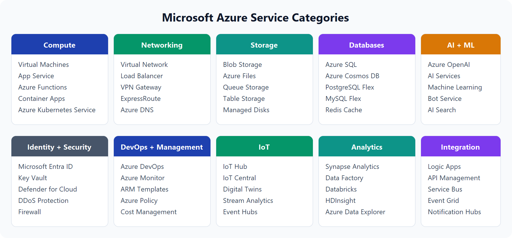

Molti team iniziano a esplorare il cloud spostando le applicazioni esistenti in macchine virtuali (VM) eseguite in Azure. La migrazione delle app esistenti alle macchine virtuali è un buon punto di partenza, ma il cloud è molto più che un'altra posizione per eseguire le macchine virtuali.

Man mano che le competenze aumentano, è possibile modernizzare un carico di lavoro alla volta, ad esempio passare da server gestiti manualmente a database gestiti, ridimensionamento automatico delle app Web o servizi basati su eventi.

## Esempio pratico

Si immagini che la vostra organizzazione utilizzi un'applicazione interna con picchi di domanda stagionali. In Azure è possibile ospitare l'app in macchine virtuali o servizi app gestiti, archiviare i dati nei database gestiti e monitorare l'integrità da un dashboard centralizzato. Con l'aumentare della domanda, è possibile aumentare o ridurre le risorse e quindi ridurre le prestazioni quando la domanda scende in modo da non pagare per tutto l'anno la capacità inutilizzata.

Ad esempio, Azure offre servizi di intelligenza artificiale di Azure e servizio OpenAI di Azure per aggiungere funzionalità di intelligenza artificiale generative, visione vocale e linguaggio alle applicazioni. Offre anche servizi Azure Machine Learning, Internet delle cose (IoT) e soluzioni di archiviazione che aumentano dinamicamente per supportare grandi quantità di dati. I servizi di Azure consentono soluzioni che non sono fattibili senza la potenza del cloud.

# Introduzione agli account Azure

Per creare e usare i servizi di Azure, è necessaria una sottoscrizione di Azure. Quando si lavora con applicazioni e carichi di lavoro personalizzati, si crea un account Azure e viene creata automaticamente una sottoscrizione. Dopo aver creato un account Azure, è possibile creare sottoscrizioni aggiuntive. Ad esempio, il team potrebbe usare un singolo account Azure e sottoscrizioni separate per carichi di lavoro di sviluppo, test e produzione. Dopo aver creato una sottoscrizione di Azure, è possibile iniziare a creare le risorse di Azure all'interno di ogni sottoscrizione.

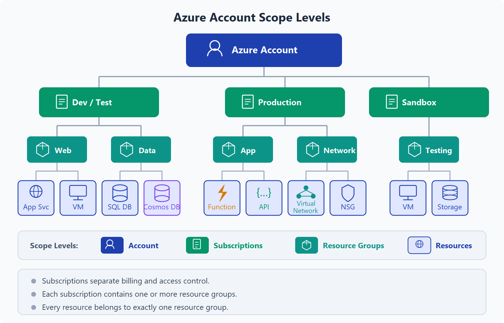

Se non si ha familiarità con Azure, è possibile iscriversi per ottenere un account gratuito nel sito Web di Azure e iniziare a esplorare i servizi senza sostenere alcun costo. Quando si è pronti, è possibile scegliere di aggiornare l'account gratuito. È anche possibile creare una nuova sottoscrizione con cui iniziare a pagare per i servizi di Azure di cui si necessita e che non sono compresi nell'account gratuito.

## Creare un account Azure

È possibile acquistare l'accesso ad Azure direttamente da Microsoft iscrivendosi nel sito Web di Azure o tramite un rappresentante Microsoft. È anche possibile acquistare l'accesso ad Azure tramite un partner Microsoft. I partner Cloud Solution Provider offrono una gamma di soluzioni cloud gestite complete per Azure.

## Che cos'è l'account Azure gratuito?

L'account Azure gratuito include:

- Accesso gratuito ai prodotti di Azure più diffusi per 12 mesi.
- Credito da usare per i primi 30 giorni.
- Accesso a più di 65 servizi sempre gratuiti.

[L'account gratuito di Azure](https://azure.microsoft.com/pricing/purchase-options/azure-account?cid=msft_learn_98802cd5-8434-6c84-d584-7b1cdb90c5e7) è un ottimo modo per i nuovi utenti per iniziare ed esplorare. Per iscriversi, è necessario un numero di telefono, una carta di credito e un account Microsoft o GitHub. I dati della carta di credito vengono usati esclusivamente a scopo di verifica dell'identità. Non verrà addebitato alcun costo per i servizi fino a quando non si esegue l'aggiornamento a una sottoscrizione a pagamento.

## Che cos'è l'account gratuito di Azure per studenti?

L'offerta dell'account gratuito di Azure per studenti include:

- Accesso gratuito a determinati servizi di Azure per 12 mesi.
- Credito da usare nei primi 12 mesi.
- Accesso gratuito a determinati strumenti di sviluppo di software.

L'account per studenti gratuito di Azure è un'offerta per studenti che offre 100 dollari di credito e strumenti di sviluppo gratuiti. Consente inoltre di iscriversi senza una carta di credito.

Se stai esercitandoti creando risorse su Azure, monitora l'utilizzo e rimuovi le risorse che non sono più necessarie per evitare costi imprevisti.

# Descrivere l'infrastruttura fisica di Azure

I componenti principali dell'architettura di Azure possono essere suddivisi in due raggruppamenti principali: l'infrastruttura fisica e l'infrastruttura di gestione. Questa unità illustra il lato fisico, ovvero il modo in cui Azure organizza i data center, le aree e le zone di disponibilità per offrire servizi affidabili in tutto il mondo.

Infrastruttura fisica
L'infrastruttura fisica per Azure inizia con i data center. Questi data center sono strutture con server disposti in rack, con un'infrastruttura dedicata di alimentazione, raffreddamento e rete, simile a un data center locale, ma su larga scala.

In qualità di provider di servizi cloud globale, Azure ha data center in tutto il mondo. Tuttavia, non si interagisce direttamente con i singoli data center. I data center vengono invece raggruppati in aree di Azure e zone di disponibilità di Azure che offrono resilienza e affidabilità per i carichi di lavoro.

Il sito [Infrastruttura globale](https://infrastructuremap.microsoft.com/) offre la possibilità di esplorare in modo interattivo l'infrastruttura di Azure sottostante.

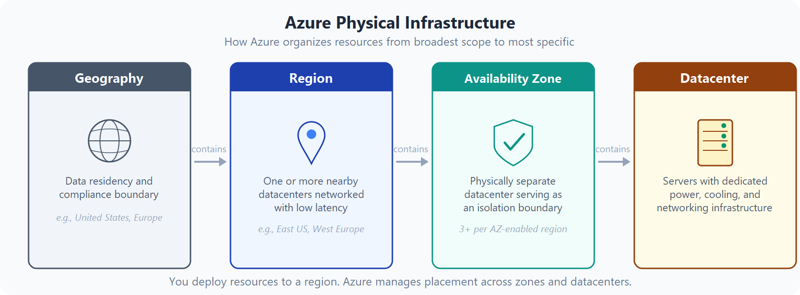

## Regioni

Un'area è un'area geografica del mondo che contiene almeno uno, ma potenzialmente più data center in stretta vicinanza collegati tra loro tramite una rete a bassa latenza. Azure assegna e controlla in modo intelligente le risorse contenute in ogni area per garantire che i carichi di lavoro siano correttamente bilanciati.

Quando si distribuisce una risorsa in Azure, è spesso necessario scegliere l'area in cui si vuole distribuirla.

> Alcuni servizi o funzionalità delle macchine virtuali(VM) sono disponibili solo in determinate aree geografiche, ad esempio alcuni tipi di archiviazione o dimensioni delle VM. Per alcuni servizi globali di Azure non è necessario selezionare un'area specifica, come nel caso di Microsoft Entra ID, Gestione traffico di Azure e DNS di Azure.

## Zone di disponibilità

Le zone di disponibilità sono data center separati fisicamente all'interno di un'area di Azure. Ogni zona di disponibilità è costituita da uno o più data center dotati di impianti indipendenti per l'energia, il raffreddamento e la rete. Una zona di disponibilità è configurata per essere un limite di isolamento. Se una zona diventa inattiva, l'altra continua a funzionare. Le zone di disponibilità sono connesse tramite reti in fibra ottica private ad alta velocità.

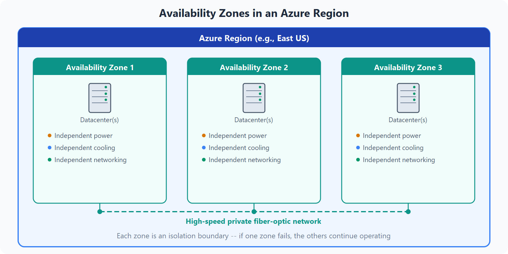

> Per assicurare la resilienza, sono presenti almeno tre zone di disponibilità separate in tutte le aree abilitate per le zone di disponibilità. Tuttavia, non tutte le aree di Azure attualmente supportano le zone di disponibilità.

## Usare le zone di disponibilità per i carichi di lavoro

Quando si gestisce un'infrastruttura in sede, la configurazione della ridondanza implica l'acquisto e la gestione di hardware duplicato. Con Azure è possibile proteggere i carichi di lavoro distribuendoli tra zone di disponibilità all'interno di un'area.

Le macchine virtuali, l'archiviazione, i database e altre risorse vengono posizionate in una zona di disponibilità e replicate in altre zone all'interno della stessa area. Tenere presente che potrebbe esserci un costo per duplicare i servizi e trasferire i dati tra zone.

I servizi di Azure che supportano le zone di disponibilità rientrano in tre categorie:

Servizi di zona: le risorse, ad esempio macchine virtuali, dischi gestiti o indirizzi IP, vengono associate a una zona specifica.
Servizi a ridondanza di zona: la piattaforma replica automaticamente tra le zone, ad esempio l'archiviazione con ridondanza di zona o il database SQL.
Servizi non a livello di area: i servizi sono sempre disponibili nelle aree geografiche di Azure e sono resilienti alle interruzioni a livello di zona, oltre che alle interruzioni a livello di area.

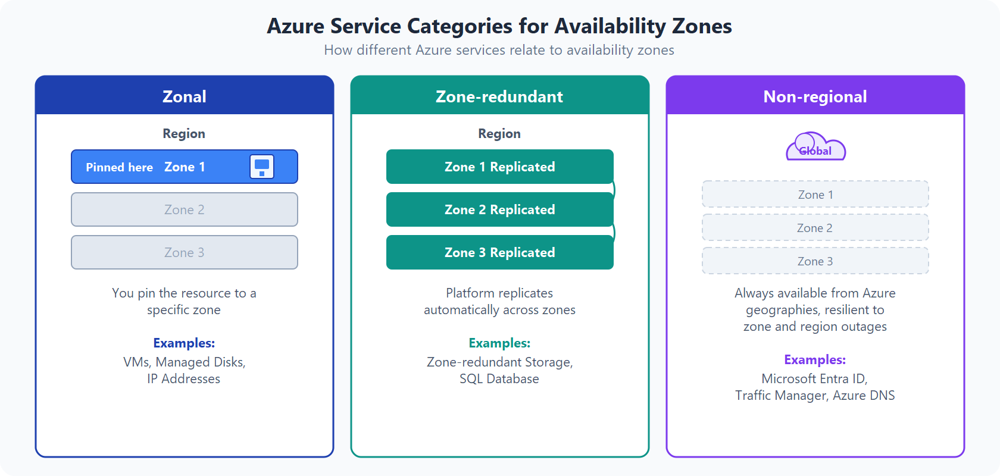

Anche con la resilienza aggiuntiva offerta dalle zone di disponibilità, è possibile che un evento sia così grande da influire su più zone di disponibilità in una singola area. Per offrire una maggiore resilienza, Azure include le coppie di aree.

## Coppie di aree

La maggior parte delle aree di Azure è associata a un'altra area con la stessa collocazione geografica (ad esempio Stati Uniti, Europa o Asia) ad almeno 480 km di distanza. Questo approccio consente la replica delle risorse in due diverse aree geografiche in modo da ridurre la probabilità di interruzioni dovute a eventi come calamità naturali, agitazioni, interruzioni di corrente o interruzioni della rete fisica che interessano un'intera area. Ad esempio, se una regione di una coppia fosse colpita da una calamità naturale, i servizi passerebbero automaticamente all'altra regione della coppia.

> Non tutti i servizi di Azure replicano automaticamente i dati o eseguono automaticamente il fallback da un'area problematica per eseguire la replica incrociata in un'altra area abilitata. In questi scenari il ripristino e la replica devono essere configurati dal cliente.

Esempi di coppie di aree in Azure sono Stati Uniti occidentali abbinati ad Stati Uniti orientali e Asia sud-orientale associati all'Asia orientale. Poiché la coppia di regioni è direttamente connessa e sufficientemente distante da essere isolata dai disastri regionali, è possibile utilizzarle per fornire servizi affidabili e ridondanza dei dati.

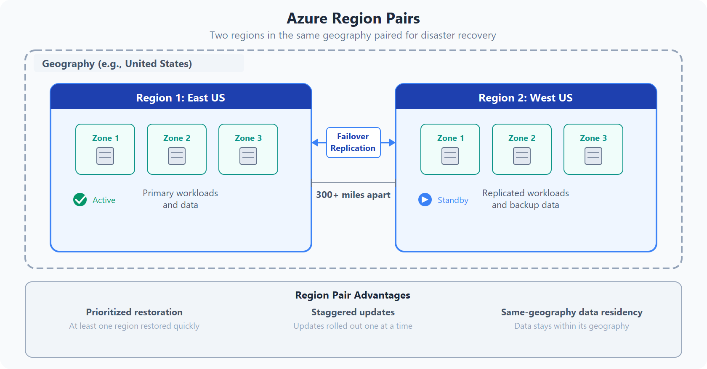

Altri vantaggi delle coppie di aree includono:
- Nel caso di un'interruzione di Azure di vaste proporzioni, viene assegnata la priorità a un'area di ogni coppia per assicurarsi che almeno una venga ripristinata il più rapidamente possibile per le applicazioni ospitate nella coppia di aree.
- Gli aggiornamenti pianificati di Azure vengono implementati nelle coppie di aree un'area alla volta per ridurre al minimo il tempo di inattività e il rischio di interruzione delle applicazioni.
- I dati continuano a risiedere nella stessa area geografica della coppia (ad eccezione del Brasile meridionale) per scopi di residenza e conformità dei dati.

> La maggior parte delle aree è abbinata in due direzioni, ovvero ciascuna è il backup per l'area che fornisce loro il backup (Stati Uniti Occidentali e Stati Uniti Orientali si supportano a vicenda come aree di backup). Tuttavia, alcune aree, come il Brasile meridionale, sono abbinate in una sola direzione. In un abbinamento unidirezionale, la regione primaria non fornisce il backup per la sua regione secondaria. L'area Brasile meridionale è unica perché è abbinata a un'area esterna alla sua area geografica. L'area secondaria del Brasile meridionale è Stati Uniti centro-meridionali. L'area secondaria degli Stati Uniti centro-meridionali non è il Brasile meridionale. Inoltre, alcune aree (ad esempio Italia settentrionale, Polonia centrale e Israele centrale) non hanno una coppia di aree tradizionali e si basano invece sulle zone di disponibilità e sull'archiviazione con ridondanza geografica per la resilienza.

## Aree sovrane

Oltre alle aree normali, Azure include anche aree sovrane. Le aree sovrane sono istanze di Azure isolate dall'istanza principale di Azure. Può essere necessario usare un'area sovrana per scopi legali o di conformità.

Le aree sovrane di Azure includono:

US DoD Central, US Gov Virginia, US Gov Arizona e altro ancora: queste aree sono istanze fisiche e logiche isolate dalla rete di Azure per enti pubblici e partner statunitensi. Questi data center sono gestiti da cittadini statunitensi selezionati e includono certificazioni di conformità aggiuntive.
Cina orientale, Cina settentrionale e altre: queste aree sono disponibili nel contesto di una partnership esclusiva tra Microsoft e 21Vianet, in virtù della quale i datacenter non sono gestiti direttamente da Microsoft.

# Descrivere l'infrastruttura di gestione di Azure

L'infrastruttura di gestione include risorse e gruppi di risorse, sottoscrizioni e account di Azure. Comprendere questa gerarchia consente di organizzare le risorse, controllare chi può accedere a cosa e gestire i costi man mano che aumenta l'utilizzo di Azure.

## Risorse e gruppi di risorse di Azure

Una risorsa è l'elemento costitutivo di base di Azure. Tutto ciò che si crea, viene fornito o distribuito è una risorsa. Le macchine virtuali, le reti virtuali, i database e i servizi di intelligenza artificiale di Azure sono tutti esempi di risorse.

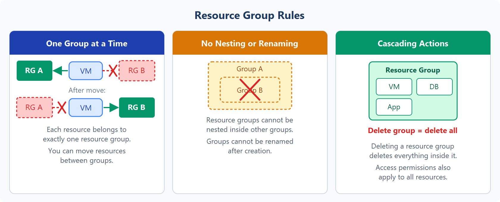

I gruppi di risorse sono raggruppamenti di risorse. Ogni risorsa deve appartenere esattamente a un gruppo di risorse. È possibile spostare alcune risorse tra gruppi, ma una risorsa è associata a un solo gruppo alla volta. I gruppi di risorse non possono essere annidati e non possono essere rinominati dopo la creazione, quindi scegliere una convenzione di denominazione chiara dall'inizio.

Le azioni applicate a un gruppo di risorse influiscono su tutte le risorse al suo interno. L'eliminazione di un gruppo di risorse comporta l'eliminazione di tutti gli elementi in esso contenuti. La concessione o la negazione dell'accesso si applica a tutte le relative risorse.

Ad esempio, se si configura un ambiente di sviluppo temporaneo, il raggruppamento di tutte le risorse consente di eliminare l'intero gruppo al termine. Se si eseguono più progetti, creare un gruppo di risorse separato per ognuno in modo che ogni team veda e gestisca solo le proprie risorse.

Non esistono regole rigide per strutturare i gruppi di risorse, scegliere l'approccio più adatto alla propria situazione.

## Sottoscrizioni Azure

Le sottoscrizioni sono un'unità di gestione, fatturazione e scalabilità in Azure. Le sottoscrizioni consentono di organizzare i gruppi di risorse e controllare la fatturazione separatamente dall'accesso.

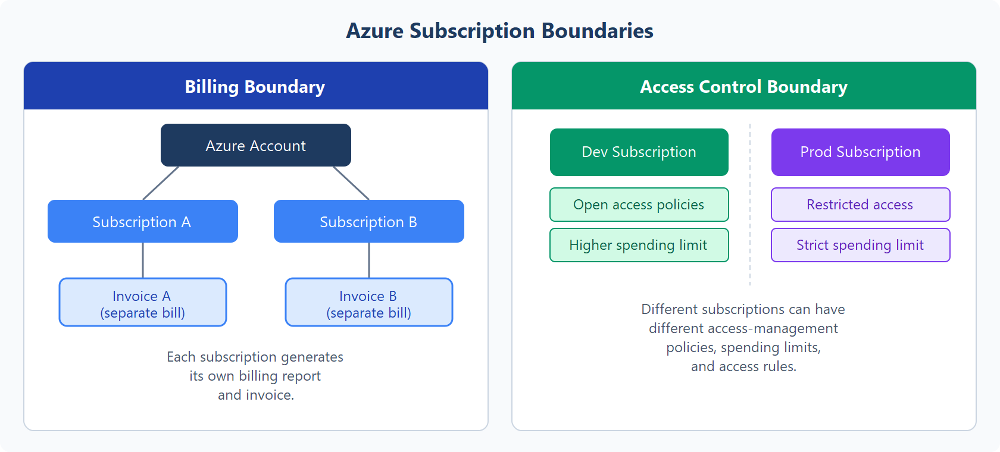

L'uso di Azure richiede una sottoscrizione di Azure. Una sottoscrizione fornisce l'accesso a prodotti e servizi di Azure e funge da unità di fatturazione. Una sottoscrizione di Azure è collegata a un account Azure, ovvero un'identità in Microsoft Entra ID o in una directory considerata attendibile da Microsoft Entra ID.

Un account può avere più sottoscrizioni, ma ne è necessaria una sola. In un account multiscrizioni è possibile configurare modelli di fatturazione e criteri di accesso diversi. Esistono due tipi di limiti di sottoscrizione:

- **Limite di fatturazione**: determina la modalità di fatturazione di un account Azure. È possibile creare più sottoscrizioni per requisiti di fatturazione diversi. Azure genera report di fatturazione e fatture separati per ogni sottoscrizione.
- **Limite di controllo di accesso**: Azure applica i criteri di gestione degli accessi a livello di sottoscrizione. Ad esempio, è possibile creare una sottoscrizione per il lavoro di sviluppo e un'altra per la produzione, ognuna con limiti di spesa diversi e regole di accesso.

## Creare sottoscrizioni di Azure aggiuntive
È possibile creare sottoscrizioni aggiuntive per separare:

- **Ambienti**: sottoscrizioni per fasi del ciclo di vita, ad esempio sandbox, sviluppo, test e produzione. Il controllo di accesso si verifica a livello di sottoscrizione, rendendo questo limite naturale.
- **Limiti del team e del carico di lavoro**: assegnare a ogni progetto la propria sottoscrizione in modo che i costi siano facili da tenere traccia o separare gli ambienti sandbox dall'ambiente di produzione.
- **Fatturazione**: creare sottoscrizioni per tenere traccia dei costi separatamente, ad esempio uno per i carichi di lavoro di produzione e un altro per lo sviluppo e il test.

## Gruppi di gestione di Azure
Le risorse vengono inserite in gruppi di risorse e i gruppi di risorse vengono inseriti nelle sottoscrizioni. Per un ambiente di piccole dimensioni, è sufficiente. Tuttavia, quando si hanno più sottoscrizioni tra più team o aree geografiche, è necessario un modo per gestire l'accesso e i criteri a un livello superiore.

I gruppi di gestione di Azure si trovano sopra le sottoscrizioni. Le sottoscrizioni vengono organizzate in gruppi di gestione e vengono applicate condizioni di governance, ad esempio criteri di accesso o regole di conformità, al gruppo. Tutte le sottoscrizioni in un gruppo di gestione ereditano automaticamente tali condizioni, proprio come le risorse ereditano le impostazioni dal proprio gruppo di risorse. I gruppi di gestione possono essere annidati fino a sei livelli di profondità (senza contare il livello radice o il livello di sottoscrizione), consentendoti di creare una gerarchia che rispecchia l'organizzazione.

Ogni tenant di Microsoft Entra ha un solo gruppo radice del tenant di primo livello. Tutti gli altri gruppi di gestione e sottoscrizioni sono raggruppati sotto questo gruppo radice, che consente di applicare i criteri di governance a livello globale.

## Gerarchia di gruppi di gestione, sottoscrizioni e gruppi di risorse

È possibile creare una struttura flessibile di gruppi di gestione e sottoscrizioni, in modo da organizzare le risorse in una gerarchia per la gestione unificata di accesso e criteri.

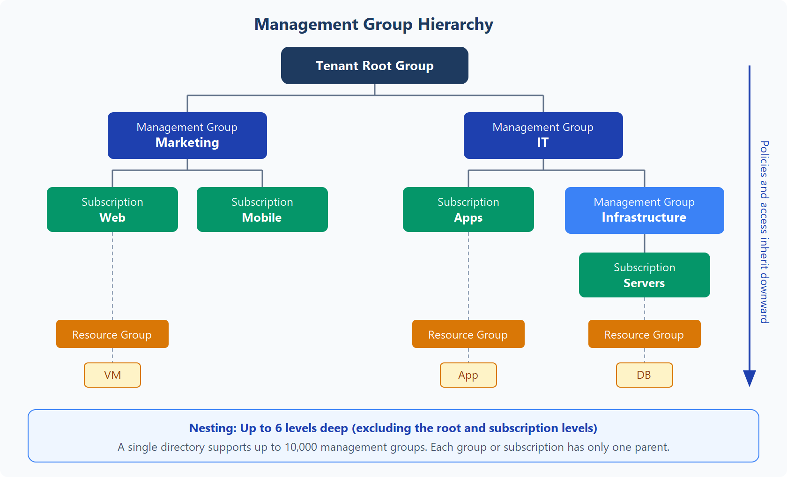

Esempi di come è possibile usare i gruppi di gestione:

- **Applicare un criterio tra sottoscrizioni**. È ad esempio possibile limitare le posizioni delle macchine virtuali all'area Stati Uniti occidentali in un gruppo chiamato Produzione. Questo criterio viene ereditato da tutte le sottoscrizioni nel gruppo di gestione e si applica a tutte le macchine virtuali in tali sottoscrizioni. Il proprietario della risorsa o della sottoscrizione non può eseguirne l'override, che rafforza la governance.
- **Concedere l'accesso a più sottoscrizioni contemporaneamente**. Inserendo le sottoscrizioni in un gruppo di gestione, è possibile creare un'unica assegnazione Azure RBAC per il gruppo. Tutti i gruppi di sottogestione, le sottoscrizioni, i gruppi di risorse e le risorse sottostanti ereditano tali autorizzazioni, senza dover creare script del controllo degli accessi in base al ruolo di Azure tra le singole sottoscrizioni.
 
Informazioni importanti sui gruppi di gestione:
  - Una singola directory supporta fino a 10.000 gruppi di gestione.
  - Ogni gruppo di gestione e sottoscrizione può avere un solo elemento padre.

# Descrivere le macchine virtuali di Azure

Con macchine virtuali di Azure è possibile eseguire server virtualizzati in Azure come infrastruttura distribuita come servizio (IaaS). Come un server fisico, è possibile controllare il sistema operativo e il software installato. Le macchine virtuali sono adatte quando è necessario:

Il controllo totale del sistema operativo.
La possibilità di eseguire software personalizzato.
Usare configurazioni di hosting personalizzate.
Le macchine virtuali di Azure rimuovono la necessità di acquistare e gestire l'hardware del server fisico. Come servizio IaaS, è comunque possibile gestire l'applicazione di patch, gli aggiornamenti e la configurazione all'interno della macchina virtuale.

È possibile distribuire rapidamente le macchine virtuali da immagini predefinite. Un'immagine è un modello che include già un sistema operativo e strumenti come i componenti di hosting Web.

## Esempi di quando usare le macchine virtuali

I casi d'uso comuni delle macchine virtuali includono:

- **Test e sviluppo**. Creare rapidamente diverse configurazioni del sistema operativo e dell'app, quindi rimuovere la macchina virtuale al termine del test.
- **Hosting di applicazioni cloud**. Eseguire applicazioni in Azure e aumentare o ridurre la capacità man mano che cambia la domanda.
- **Estensione del data center**. Estendere una rete locale in Azure e ospitare carichi di lavoro in una rete virtuale connessa.
- **Ripristino di emergenza**. Mantenere la capacità di failover in Azure ed eseguire carichi di lavoro critici se il sito primario non è disponibile.
- **Migrazione in modalità lift-and-shift**. Spostare i carichi di lavoro del server esistenti con una riprogettazione minima delle applicazioni.

## Risorse e dimensionamento delle macchine virtuali

Quando si effettua il provisioning di una macchina virtuale, si scelgono risorse come:

- **Dimensioni** (scopo, numero di core del processore e quantità di RAM)
- **Dischi di archiviazione** (unità disco rigido, unità SSD e così via)
- **Rete** (rete virtuale, indirizzo IP pubblico e configurazione della porta)

## Informazioni sulle famiglie di dimensioni e sui nomi delle VM

Le dimensioni delle macchine virtuali di Azure vengono raggruppate in famiglie in modo da poter scegliere rapidamente una dimensione in base alle esigenze del carico di lavoro.

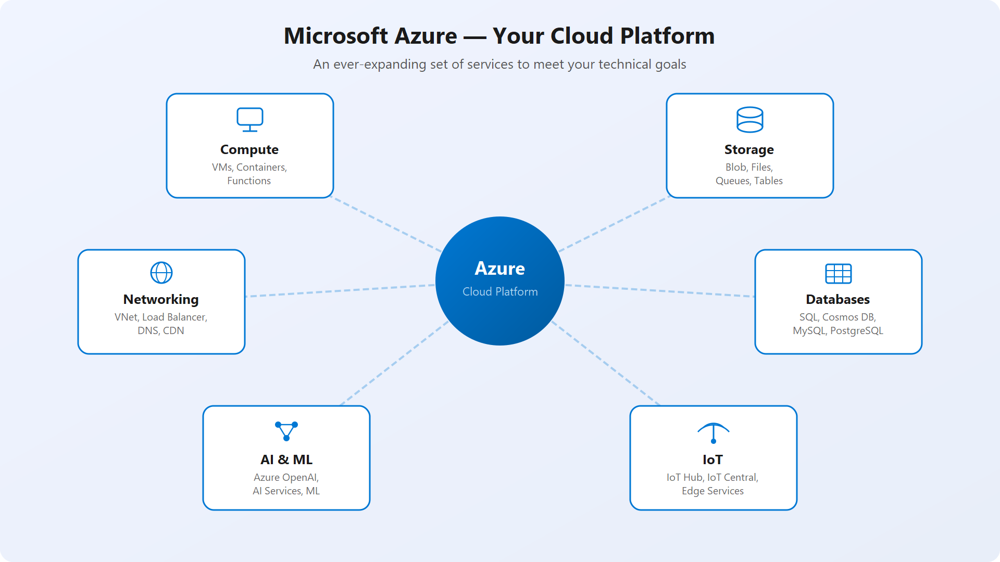

La tabella seguente illustra i casi d'uso comuni per le famiglie di macchine virtuali di Azure.

| Famiglia | Focus tipico | Esempio di utilizzo |
|---|---|---|
| Serie B | Scalabile, conveniente in termini di costo | Carichi di lavoro di sviluppo/test con picchi occasionali della CPU |
| Serie D | Utilizzo generico | Server Web, server app di piccole e medie dimensioni |
| Serie E | Ottimizzazione della memoria | Database in memoria, carichi di lavoro di analisi |
| Serie F | Con ottimizzazione per il calcolo | Livelli di applicazione a elevato utilizzo di CPU |
| Serie M | Footprint della memoria di grandi dimensioni | Database aziendali di grandi dimensioni |
| Serie L | Con ottimizzazione per l'archiviazione | Archiviazione e elaborazione dati ad alta capacità di elaborazione |
| Serie N | GPU abilitata | Training/inferenza dell'intelligenza artificiale e carichi di lavoro grafici |

Ogni macchina virtuale include anche opzioni che è possibile personalizzare in base alle esigenze. È possibile modificare il numero di CPU virtuali (vCPU), la quantità di RAM e la configurazione del disco di archiviazione.

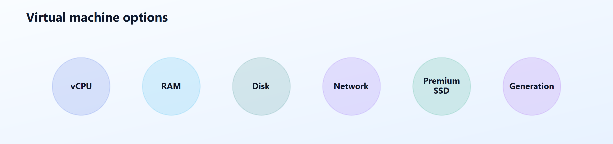

Alcune delle modifiche che è possibile apportare sono:

- **Numero di vCPU**: influisce sulla capacità di calcolo per i carichi di lavoro simultanei e associati alla CPU.
- **RAM**: influisce sulla quantità di dati funzionanti che la macchina virtuale può mantenere in memoria.
- **Configurazione del disco**: influisce sulla capacità di archiviazione, sulle operazioni di I/O al secondo e sulla velocità effettiva.
- **Velocità effettiva di rete**: influisce sulle prestazioni di trasferimento dei dati all'interno e all'esterno della macchina virtuale.
- **Supporto ssd Premium**: indica se le dimensioni supportano dischi gestiti Premium.
- **Generazione hardware**: indica la generazione della piattaforma e può influire sulle prestazioni di base.
I nomi delle macchine virtuali contengono anche informazioni utili sul ridimensionamento. Il nome di base indica la famiglia (o scopo), il numero di vCPU e la generazione dell'hardware. Può anche indicare funzionalità come il supporto dell'archiviazione Premium.

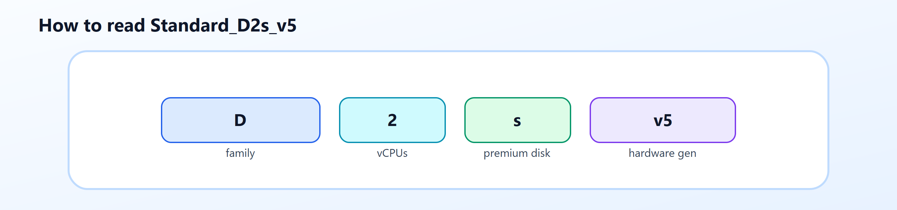

- `D`: famiglia di macchine virtuali (per utilizzo generico in questo caso)
- `2`: numero di vCPU in questa dimensione
- `s`: supporta l'archiviazione SSD Premium
- `v5`: generazione hardware per la famiglia

A livello di nozioni fondamentali, iniziare selezionando una famiglia che corrisponde al comportamento del carico di lavoro, quindi scegliere le dimensioni che soddisfano le esigenze di prestazioni e ridimensionare man mano che aumenta la domanda.

## Opzioni di scalabilità e resilienza per le macchine virtuali
È possibile eseguire singole macchine virtuali per attività di test, di sviluppo o secondarie oppure è possibile raggruppare le macchine virtuali per offrire disponibilità elevata, scalabilità e ridondanza. Azure può gestire questi raggruppamenti con funzionalità quali set di scalabilità e set di disponibilità.

## Set di scalabilità per macchine virtuali
I set di scalabilità di macchine virtuali consentono di creare e gestire gruppi di macchine virtuali identiche con bilanciamento del carico. Senza set di scalabilità, è necessario mantenere manualmente la configurazione della macchina virtuale coerente, monitorare l'utilizzo e regolare i conteggi delle istanze. I set di scalabilità centralizzano la configurazione e possono adattare automaticamente il numero di istanze, aumentando o diminuendo, in base a richieste o pianificazioni. Si integrano anche con il bilanciamento del carico in modo che il traffico venga distribuito in modo efficiente.

## Set di disponibilità di macchine virtuali
I set di disponibilità delle macchine virtuali migliorano la resilienza delle macchine virtuali all'interno di un'area. Riducono la probabilità che tutte le macchine virtuali siano interessate da un evento di manutenzione o da un errore hardware.

I set di disponibilità raggruppano le macchine virtuali per:

- **Dominio di aggiornamento**: macchine virtuali che possono essere riavviate insieme durante la manutenzione pianificata.
- **Dominio di guasto**: macchine virtuali che condividono un potenziale punto di guasto di alimentazione o di rete.

Usare i set di disponibilità per la ridondanza a livello di macchina virtuale. Nelle aree che supportano zone di disponibilità, le progettazioni basate su zona sono spesso preferite perché offrono un isolamento degli errori più ampio. I set di disponibilità stessi non aggiungono costi; si paga per le istanze di macchina virtuale.

# Descrivere il desktop virtuale di Azure

Desktop virtuale Azure è un servizio di virtualizzazione di applicazioni e desktop in Azure. Consente agli utenti di accedere in modo sicuro a desktop e app di Windows da molti tipi di dispositivi e posizioni.

A livello di nozioni fondamentali, Desktop virtuale Azure è un'opzione gestita per l'accesso desktop remoto in cui desktop e app rimangono nel cloud anziché nei dispositivi locali.

Il video seguente offre una panoramica di Desktop virtuale Azure:

[Desktop virtuale Azure](https://learn.microsoft.com/it-it/training/modules/describe-azure-compute-networking-services/4-virtual-desktop)

## Quando usare Desktop virtuale Azure
Usare Desktop virtuale Azure quando un team necessita dell'accesso centralizzato a desktop e app tra utenti distribuiti, terzisti o ruoli di lavoro ibridi. Ad esempio, un team di supporto può usare desktop ospitati nel cloud standardizzati, in modo che ogni turno abbia gli stessi strumenti, criteri di accesso e controlli di sicurezza.

Se è necessaria un'esperienza desktop completa per molti utenti con gestione centralizzata, Desktop virtuale Azure è spesso più semplice da usare rispetto alla creazione di ambienti desktop separati basati su macchine virtuali per ogni gruppo di utenti.

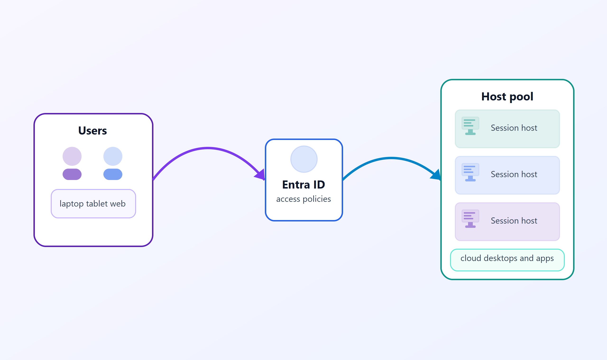

- Centralizza la distribuzione di desktop e app in Azure e si integra con Microsoft Entra ID per i controlli di identità e accesso.
- Consente di ridurre l'esposizione dei dati nei dispositivi locali perché le app e i dati possono rimanere nelle sessioni ospitate in Azure.
- Supporta esperienze Windows a sessione singola e multisessione, a seconda delle esigenze dell'utente e del carico di lavoro.

# Descrivere i contenitori di Azure

Le macchine virtuali riducono i costi rispetto all'hardware fisico, ma sono ancora limitati a un singolo sistema operativo per macchina virtuale. I contenitori sono la scelta ideale per eseguire più istanze di un'applicazione in un singolo computer host.

## Che cosa sono i contenitori?

Contenitori sono un ambiente di virtualizzazione. Così come è possibile eseguire più macchine virtuali in un singolo host fisico, si possono eseguire più contenitori in un singolo host fisico o virtuale. A differenza delle macchine virtuali, il sistema operativo di un contenitore non viene gestito dall'utente. Ogni macchina virtuale esegue il proprio sistema operativo a cui è possibile connettersi e gestire. I contenitori sono leggeri e progettati per essere creati, aumentati e arrestati dinamicamente. È possibile creare e distribuire macchine virtuali man mano che aumenta la domanda di applicazioni, ma i contenitori sono un metodo più leggero e agile. I contenitori consentono di rispondere alle modifiche su richiesta e riavviare rapidamente dopo un arresto anomalo o un'interruzione dell'hardware. Uno dei motori di contenitori più diffusi è Docker, che è supportato da Azure.

## Confrontare le macchine virtuali e i contenitori
Il video seguente illustra alcune delle principali differenze tra macchine virtuali e contenitori:

[Contenitori di Azure](https://learn.microsoft.com/it-it/training/modules/describe-azure-compute-networking-services/5-containers)

## Istanze di Azure Container
Istanze di Azure Container offre il modo più rapido e semplice per eseguire un contenitore in Azure, senza gestire macchine virtuali o adottare servizi aggiuntivi. Istanze di Azure Container sono un'offerta PaaS (Platform as a Service, piattaforma distribuita come servizio). Carichi i container e il servizio li esegue automaticamente.

## App contenitore di Azure
Le app contenitore di Azure presentano molte somiglianze con un'istanza di contenitore. Consentono di iniziare subito a funzionare, di rimuovere il sovraccarico di gestione dei contenitori e sono un'offerta PaaS. Le app contenitore includono anche il bilanciamento del carico e il ridimensionamento predefiniti, in modo che la progettazione possa adattarsi alla domanda in continua evoluzione.

## Servizio Azure Kubernetes
Il servizio Azure Kubernetes è un servizio di orchestrazione dei contenitori. Un servizio di orchestrazione gestisce il ciclo di vita dei contenitori. Quando distribuisci una flotta di contenitori, AKS può rendere la gestione della flotta più semplice e in modo più efficiente.

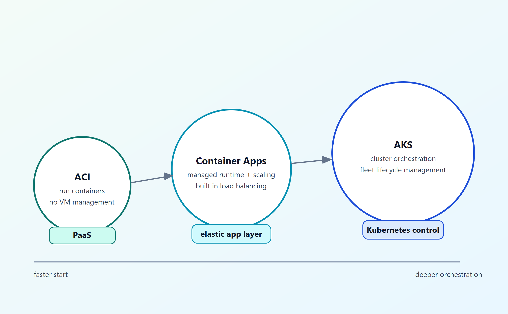

## Usare i contenitori nelle soluzioni
I contenitori vengono spesso usati per creare soluzioni che usano un'architettura di microservizi. In questa architettura le soluzioni vengono suddivise in parti più piccole e indipendenti. È ad esempio possibile dividere un sito Web in tre contenitori: uno che ospita il front-end, un altro per il back-end e un terzo per la risorsa di archiviazione. Questa suddivisione consente di gestire, ridimensionare o aggiornare ogni parte dell'app in modo indipendente.

Si supponga che il back-end del sito Web raggiunga la capacità, ma il front-end e lo spazio di archiviazione non sono stressati. Con i contenitori, è possibile ridimensionare il back-end separatamente per migliorare le prestazioni. È anche possibile modificare il servizio di archiviazione o modificare il front-end senza influire sugli altri componenti.

# Descrivere le funzioni di Azure

Funzioni di Azure è un servizio di calcolo serverless guidato dagli eventi che non richiede la gestione di macchine virtuali o contenitori. Se si crea un'app usando macchine virtuali o contenitori, tali risorse devono essere "in esecuzione" per consentire all'app di funzionare. Con Funzioni di Azure, un evento riattiva la funzione eliminando la necessità di disporre le risorse in assenza di eventi.

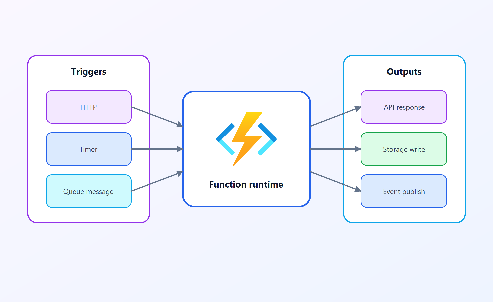

## Vantaggi di Funzioni di Azure
Le Funzioni di Azure sono ideali quando ci si concentra solo sul codice che esegue il tuo servizio e non sulla piattaforma o sull'infrastruttura sottostante. La soluzione Funzioni viene usata comunemente quando occorre eseguire operazioni in risposta a un evento (spesso tramite una richiesta REST), un timer o un messaggio proveniente da un altro servizio di Azure e quando l'operazione può essere completata in pochi secondi al massimo.

Le funzioni offrono scalabilità automatica in base alla domanda, quindi possono essere una buona scelta quando la domanda è variabile.

Funzioni di Azure esegue il tuo codice quando viene attivato e dealloca automaticamente le risorse al termine della funzione. In questo modello Azure addebita solo il tempo di CPU usato durante l'esecuzione della funzione.

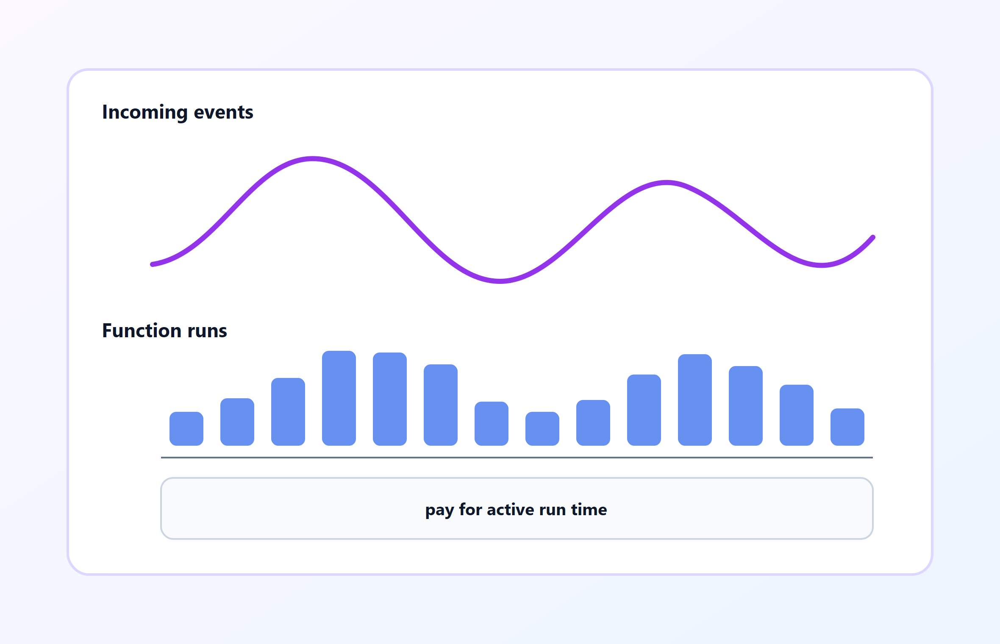

Le funzioni possono essere con stato o senza stato. Quando sono senza stato (impostazione predefinita), si comportano come se venissero riavviate ogni volta che rispondono a un evento. Quando sono con stato persistente (chiamate Durable Functions), il runtime passa un contesto all'interno della funzione per tenere traccia delle attività precedenti.

Le funzioni sono un componente chiave della computazione serverless. oltre a essere una piattaforma di calcolo generale per l'esecuzione di qualsiasi tipo di codice. Se le esigenze dell'app cambiano, è possibile distribuire il progetto in un ambiente non serverless. Questa flessibilità consente di gestire il ridimensionamento, l'esecuzione su reti virtuali e persino isolare completamente le funzioni.

# Descrivere i servizi di intelligenza artificiale, Machine Learning e IoT/Edge in Azure

Azure include categorie di servizi che consentono di creare soluzioni intelligenti e connesse senza iniziare da zero.

## Servizi di intelligenza artificiale di Azure
I servizi di intelligenza artificiale di Azure offrono funzionalità predefinite per scenari di intelligenza artificiale comuni, ad esempio linguaggio, riconoscimento vocale, visione visiva ed elaborazione dei documenti. Questi servizi sono utili quando si vogliono aggiungere funzionalità intelligenti tramite API invece di eseguire prima il training del proprio modello.

Il servizio OpenAI di Azure è un'altra opzione di intelligenza artificiale in Azure che supporta scenari generativi di intelligenza artificiale, ad esempio la generazione di chat e contenuti, con controlli di sicurezza e governance predefiniti.

## Modelli di intelligenza artificiale agente
Le applicazioni agentic combinano un modello di intelligenza artificiale con istruzioni, contesto e strumenti usati per completare gli obiettivi con più passaggi. In Azure questi modelli vengono in genere creati combinando i servizi di Intelligenza artificiale di Azure e il servizio Azure OpenAI con la logica dell'applicazione.

A livello di concetti fondamentali, considerare l'intelligenza artificiale agente come modello di applicazione basato sulle funzionalità di intelligenza artificiale di Azure, non come categoria di servizio di calcolo separata.

## Azure Machine Learning (Apprendimento Automatico di Azure)
Usare Azure Machine Learning quando è necessario compilare, eseguire il training e gestire modelli di Machine Learning personalizzati. Questa opzione è più adatta quando lo scenario richiede lo sviluppo, la sperimentazione e la gestione del ciclo di vita del modello.

## Servizi IoT e Edge
I servizi Azure IoT consentono di connettere, monitorare e gestire i dispositivi.

- L'hub IoT di Azure consente comunicazioni bidirezionali sicure tra i servizi cloud e i dispositivi IoT.
- Azure IoT Central offre una piattaforma IoT IoT (Software as a Service) semplificata per i generatori di soluzioni.
- Azure IoT Edge estende le funzionalità cloud ai dispositivi perimetrali, in modo che alcuni carichi di lavoro possano essere eseguiti più vicino alla posizione in cui vengono generati i dati.

Questo flusso inizia in genere con i dispositivi che inviano dati di telemetria tramite l'hub IoT, quindi usa l'analisi cloud per generare informazioni dettagliate e aggiornamenti del modello applicati dal runtime IoT Edge nei dispositivi. IoT Central può semplificare la gestione delle soluzioni per questi scenari di dispositivi connessi.

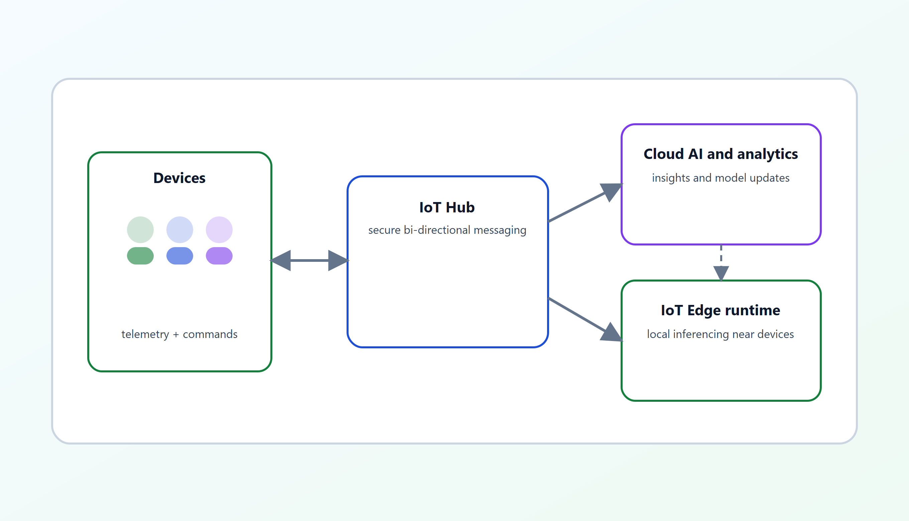

## Scelta dell'opzione corretta
A livello di nozioni fondamentali, usare questo modello decisionale:

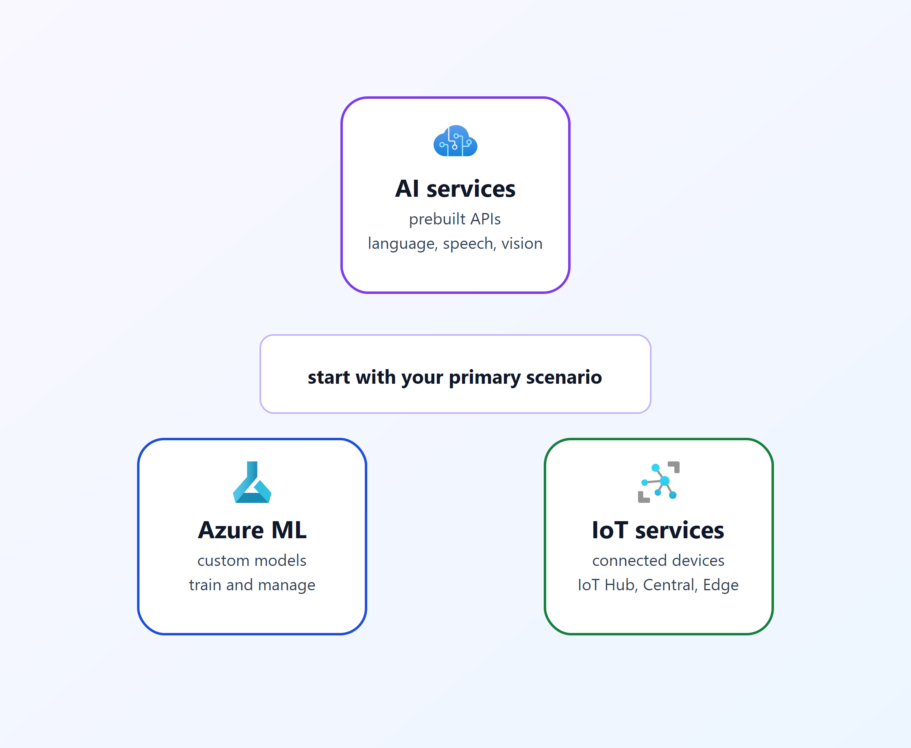

- Usare i servizi di intelligenza artificiale di Azure quando sono necessarie funzionalità di intelligenza artificiale predefinite esposte tramite le API.
- Usare Azure Machine Learning quando è necessario lo sviluppo e la gestione di modelli personalizzati.
- Usare i servizi Azure IoT quando la soluzione si concentra su dispositivi connessi e dati di telemetria.

# Descrivere le opzioni di hosting per le applicazioni

Se è necessario ospitare l'applicazione in Azure, inizialmente si potrebbe scegliere di usare una macchina virtuale o contenitori. Sia le macchine virtuali che i contenitori offrono soluzioni di hosting eccellenti. Le macchine virtuali offrono il massimo controllo sull'ambiente di hosting e consentono di configurarlo esattamente come si vuole. Le macchine virtuali sono inoltre il metodo di hosting più conosciuto se non si ha familiarità con il cloud. I contenitori, con la possibilità di isolare e gestire singolarmente diversi aspetti della soluzione di hosting, possono essere un'opzione affidabile e accattivante.

Ci sono altre opzioni di hosting che è possibile usare con Azure, tra cui il servizio app di Azure.

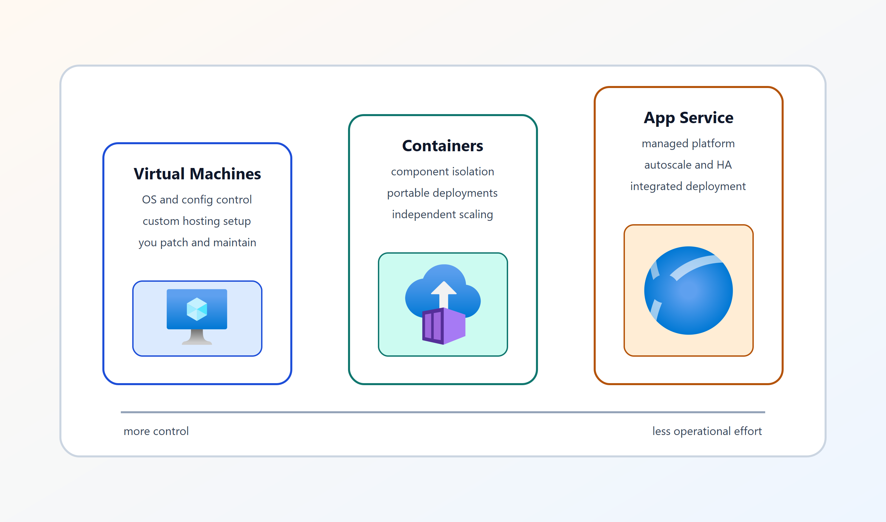

## Servizio app di Azure
Il servizio app consente di compilare e ospitare app Web, processi in background, back-end per dispositivi mobili e API RESTful nel linguaggio di programmazione preferito senza gestire l'infrastruttura. Offre scalabilità automatica e disponibilità elevata. Il servizio app supporta Windows e Linux e supporta distribuzioni automatizzate da GitHub, Azure DevOps o qualsiasi repository Git per la distribuzione continua.

Il Servizio app di Azure è un servizio per l'hosting di applicazioni Web, API REST e back-end mobili, basato su HTTP. Consente di concentrarsi sulla compilazione e sulla gestione dell'app, mentre Azure mantiene l'ambiente operativo. Il servizio app supporta più linguaggi e framework, tra cui .NET, .NET Core, Java, PHP, Python e Node.js.

## Tipi di servizi app
Con il servizio app è possibile ospitare gli stili di app più comuni:

- App Web
- App per le API
- WebJobs
- App per dispositivi mobili

Servizio app gestisce la maggior parte delle decisioni relative all'infrastruttura che devono essere affrontate per ospitare le app accessibili dal Web:

- La distribuzione e la gestione sono integrate nella piattaforma.
- Gli endpoint possono essere protetti.
- I siti possono essere dimensionati rapidamente per gestire i carichi di traffico elevati.
- I servizi integrati di bilanciamento del carico e gestione del traffico garantiscono la disponibilità elevata.

Tutti questi stili di app sono ospitati nella stessa infrastruttura e condividono questi vantaggi. La flessibilità fa del servizio app la scelta ideale per ospitare applicazioni orientate al Web.

## App Web
Il servizio app include il supporto completo per l'hosting di app Web con ASP.NET, ASP.NET Core, Java, Ruby, Node.js, PHP o Python. È possibile scegliere Windows o Linux come sistema operativo host.

## App per le API
Analogamente all'hosting di un sito Web, è possibile creare API Web basate su REST usando il linguaggio e il framework preferiti. Il servizio app offre il supporto completo di Swagger e la possibilità di creare pacchetti e pubblicare l'API in Azure Marketplace. Le API pubblicate possono essere utilizzate da qualsiasi client basato su HTTP o HTTPS.

## WebJobs
È possibile usare la funzionalità Processi Web per eseguire un programma (EXE, Java, PHP, Python o Node.js) o uno script (CMD, BAT, PowerShell o Bash) nello stesso contesto di un'app Web, un'app per le API o un'app per dispositivi mobili. Questi processi possono essere pianificati o eseguiti da un trigger. WebJobs sono spesso utilizzati per eseguire attività in background come parte della logica della tua applicazione.

## App per dispositivi mobili
Usare la funzionalità "App per dispositivi mobili" di "Servizio app" per creare rapidamente un backend per app iOS e Android. Con pochi passaggi nel portale di Azure è possibile:

- Archiviare i dati delle app per dispositivi mobili in un database SQL basato sul cloud.
- Autenticare i clienti attraverso fornitori di servizi social comuni, come Microsoft Account, Google, X e Facebook.
- Inviare notifiche push.
- Eseguire la logica di back-end personalizzata in C# o Node.js.

Sul lato app per dispositivi mobili è disponibile il supporto SDK per app native iOS e Android, Xamarin e React Native.

# Descrivere la rete virtuale di Azure

Le subnet virtuali e le reti virtuali di Azure consentono alle risorse di Azure, come macchine virtuali, app Web e database, di comunicare tra loro, con gli utenti in Internet e con i computer client locali. È possibile paragonare una rete di Azure a un'estensione della rete locale, con risorse che collegano altre risorse di Azure.

Le reti virtuali di Azure forniscono le funzionalità di rete essenziali seguenti:

- Isolamento e segmentazione
- Comunicazioni Internet
- Comunicazione tra risorse di Azure
- Comunicazione con le risorse locali
- Indirizzare il traffico di rete
- Filtrare il traffico di rete
- Connettere reti virtuali

La rete virtuale di Azure supporta endpoint sia pubblici che privati per consentire la comunicazione tra risorse esterne o interne con altre risorse interne.

- Gli endpoint pubblici hanno un indirizzo IP pubblico e sono accessibili da qualsiasi parte del mondo.
- Gli endpoint privati si trovano in una rete virtuale e hanno un indirizzo IP privato all'interno dello spazio indirizzi di tale rete virtuale.

## Isolamento e segmentazione

La rete virtuale di Azure consente di creare più reti virtuali isolate. Quando si configura una rete virtuale, si definisce uno spazio indirizzi IP privato usando intervalli di indirizzi IP pubblici o privati. L'intervallo IP esiste solo all'interno della rete virtuale e non è instradabile in Internet. È possibile dividere tale spazio indirizzi IP in subnet e allocare una parte dello spazio indirizzi definito a ogni subnet denominata.

Per la risoluzione dei nomi è possibile usare il servizio di risoluzione dei nomi integrato in Azure. È anche possibile configurare la rete virtuale per l'uso di un server DNS interno o esterno.

## Comunicazioni Internet
È possibile abilitare le connessioni in ingresso da Internet assegnando un indirizzo IP pubblico a una risorsa di Azure o usando un servizio di bilanciamento del carico pubblico.

## Comunicazione tra risorse di Azure
Le risorse di Azure possono comunicare in modo sicuro tra loro in uno dei due modi seguenti:

- Le reti virtuali possono connettere non solo le VM ma anche altre risorse di Azure, come l'ambiente del servizio app per Power Apps, il servizio Azure Kubernetes e i set di scalabilità di macchine virtuali di Azure.
- Gli endpoint di servizio consentono la connessione ad altri tipi di risorse di Azure, come account di archiviazione e database SQL di Azure. Questo approccio consente di collegare più risorse di Azure alle reti virtuali per migliorare la sicurezza e offrire un routing ottimale tra le risorse.

## Comunicazione con le risorse locali

Le reti virtuali di Azure consentono di collegare le risorse nell'ambiente locale e all'interno della sottoscrizione di Azure. È possibile creare una rete che si estende sia negli ambienti locali che nell'ambiente cloud. Esistono tre modi per ottenere questa connettività:

- Le connessioni punto-a-sito di rete privata virtuale partono da un computer esterno al tuo ambiente per rientrare nella tua rete privata. In questo caso, il computer client avvia una connessione VPN crittografata per connettersi alla rete virtuale di Azure.
- Le reti private virtuali da sito a sito collegano il gateway o il dispositivo VPN locale al gateway VPN di Azure in una rete virtuale. I dispositivi in Azure possono di fatto risultare come se si trovassero nella rete locale. La connessione è crittografata e viene effettuata tramite Internet.
- Azure ExpressRoute fornisce connettività privata dedicata ad Azure, non basata su Internet. ExpressRoute è utile per gli ambienti che richiedono maggiore larghezza di banda e livelli di sicurezza ancora più elevati.

## Indirizzare il traffico di rete
Per impostazione predefinita, Azure indirizza il traffico tra subnet su qualsiasi rete virtuale connessa, sulle reti locali e su Internet. È anche possibile controllare il routing ed eseguire l'override di queste impostazioni, come indicato di seguito:

- Le tabelle di route consentono di definire regole su come indirizzare il traffico. È possibile creare tabelle di route personalizzate che controllano il modo in cui i pacchetti vengono indirizzati tra subnet.
- Border Gateway Protocol (BGP) interagisce con i gateway VPN di Azure, Server di route Azure o Azure ExpressRoute per propagare le route BGP locali nelle reti virtuali di Azure.
- Le route definite dall'utente consentono di controllare le tabelle di routing tra subnet all'interno di una rete virtuale o tra reti virtuali, offrendo un maggiore controllo sul flusso del traffico di rete.

## Filtrare il traffico di rete
Le reti virtuali di Azure consentono di filtrare il traffico tra subnet usando gli approcci seguenti:

- I gruppi di sicurezza di rete sono risorse di Azure che possono contenere più regole di sicurezza in ingresso e in uscita. È possibile definire queste regole per consentire o bloccare il traffico in base a fattori come l'indirizzo IP di origine e di destinazione, la porta e il protocollo.
- Le appliance virtuali di rete sono macchine virtuali specializzate paragonabili a un'appliance di rete con protezione avanzata. Un'appliance virtuale di rete svolge una funzione di rete specifica, ad esempio l'esecuzione di un firewall o l'ottimizzazione di una rete WAN (Wide Area Network).

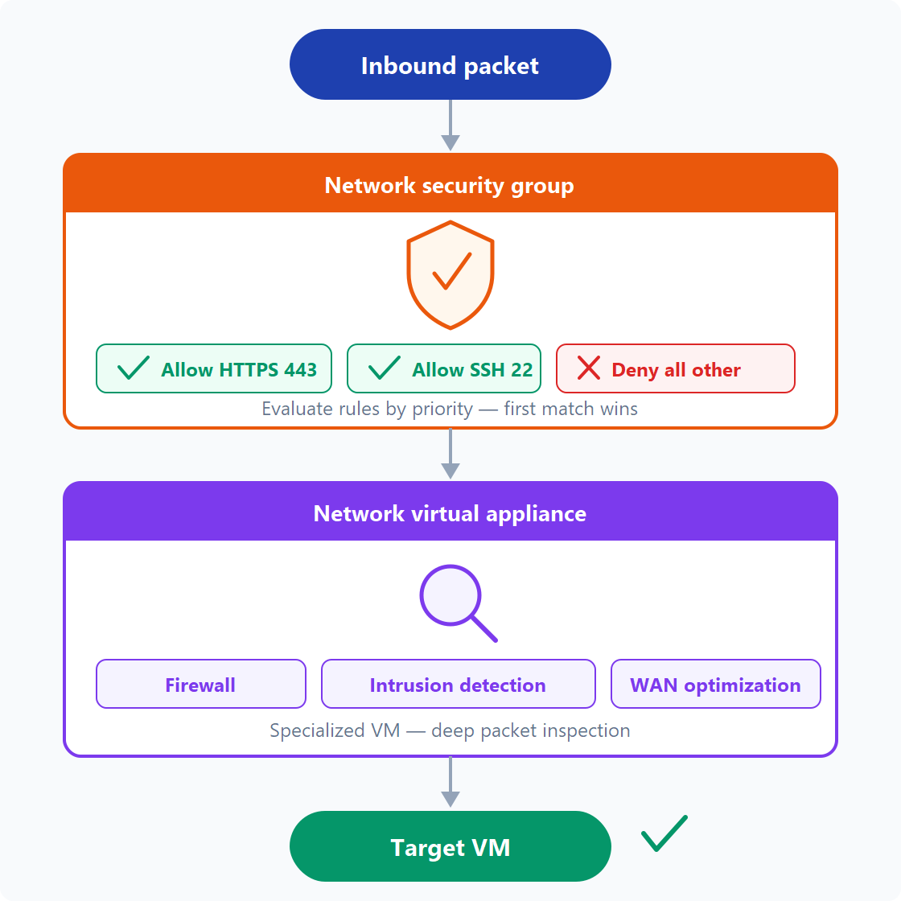

## Connettere reti virtuali
È possibile collegare le reti virtuali tramite il peering di reti virtuali. Il peering consente a due reti virtuali di connettersi direttamente tra loro. Il traffico di rete tra reti con peering è privato e si sposta nella rete backbone Microsoft, senza entrare mai nella rete Internet pubblica. Il peering consente alle risorse in ogni rete virtuale di comunicare tra loro. Queste reti virtuali possono trovarsi in aree separate, che consentono di creare una rete interconnessa globale tramite Azure.

# Descrivere le reti private virtuali di Azure

Una rete privata virtuale (VPN) usa un tunnel crittografato all'interno di un'altra rete. Le reti VPN vengono in genere distribuite per connettere due o più reti private attendibili attraverso una rete non attendibile, in genere la rete Internet pubblica. Il traffico sulla rete non attendibile viene crittografato per evitare intercettazioni o altri attacchi. Le VPN possono consentire alle reti di condividere in modo sicuro e protetto le informazioni sensibili.

## Gateway VPN

Un gateway VPN è un tipo di gateway di rete virtuale, Le istanze di Gateway VPN di Azure vengono distribuite in una subnet dedicata della rete virtuale e consentono la connettività seguente:

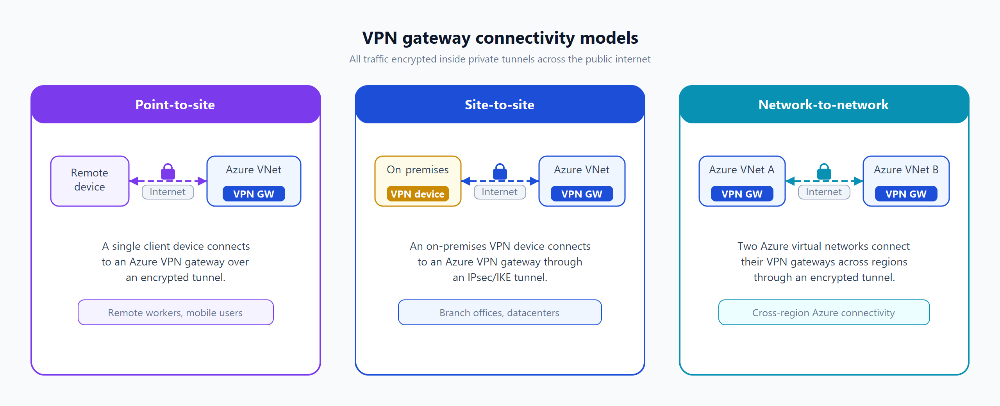

- Connettere i data center locali a reti virtuali attraverso una connessione da sito a sito.
- Connettere i singoli dispositivi alle reti virtuali attraverso una connessione da punto a sito.
- Connettere le reti virtuali ad altre reti virtuali attraverso una connessione da rete a rete.

Tutti i dati trasferiti vengono crittografati in un tunnel privato mentre attraversano Internet. È possibile distribuire un solo gateway VPN in ogni rete virtuale. È tuttavia possibile usare un gateway per connettersi a più posizioni, tra cui altre reti virtuali o i data center locali.

Quando si configura un gateway VPN, è necessario specificare il tipo di VPN, basata su criteri o su route. La distinzione principale tra questi due tipi è il modo in cui determinano il traffico che richiede la crittografia. In Azure, indipendentemente dal tipo di VPN, il metodo di autenticazione usato è una chiave precondivisa.

- I gateway VPN basati su criteri specificano staticamente l'indirizzo IP dei pacchetti che devono essere crittografati in ogni tunnel. Questo tipo di dispositivo valuta ogni pacchetto di dati rispetto a tali set di indirizzi IP per scegliere il tunnel attraverso il quale viene inviato il pacchetto.
- Nei gateway basati su route, i tunnel IPSec vengono modellati come interfaccia di rete o interfaccia del tunnel virtuale. L'instradamento IP (instradamenti statici o protocolli di instradamento dinamici) decide quale interfaccia di tunneling usare per l'invio di ogni pacchetto. Le VPN basate su route sono il metodo di connessione preferito per i dispositivi locali. Sono più resilienti alle modifiche della topologia, ad esempio la creazione di nuove subnet.

Usare un gateway VPN basato su route se è necessario uno dei tipi seguenti di connettività:

- Connessioni tra reti virtuali
- Connessioni da punto a sito
- Connessioni multisito
- Coesistenza con un gateway di Azure ExpressRoute

## Scenari di disponibilità elevata
Se si sta configurando una VPN per garantire la sicurezza delle informazioni, è anche necessario assicurarsi che si tratti di una configurazione VPN a disponibilità elevata e a tolleranza di errore. Ci sono alcuni modi per ottimizzare la resilienza del gateway VPN.

### Attivo/Standby

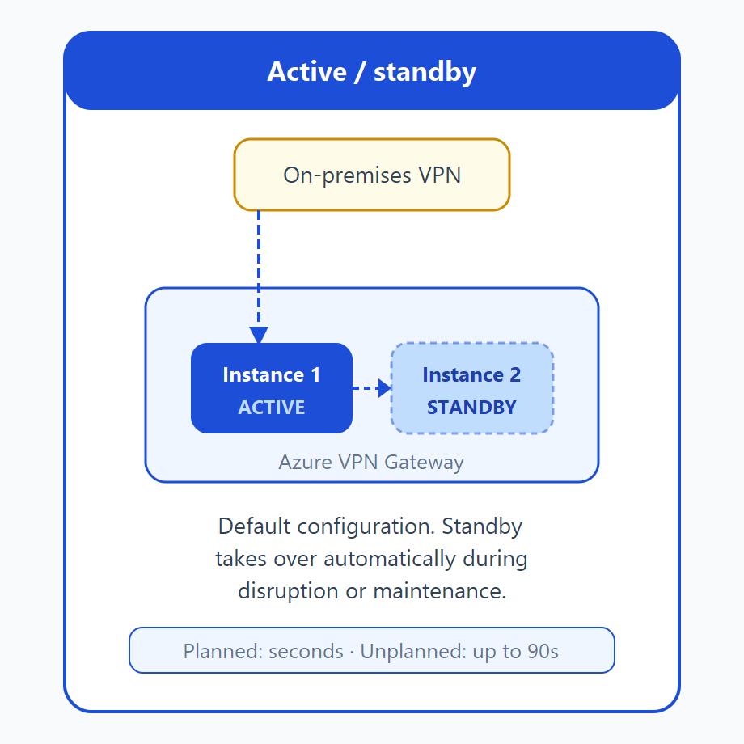

Per impostazione predefinita, i gateway VPN vengono distribuiti come due istanze in una configurazione attiva/in standby, anche se in Azure è visibile una sola risorsa gateway VPN. Se la manutenzione pianificata o un'interruzione imprevista influisce sull'istanza attiva, l'istanza in standby assume automaticamente la responsabilità delle connessioni senza alcun intervento da parte dell'utente. Le connessioni vengono interrotte durante questo failover, ma in genere vengono ripristinate entro pochi secondi per la manutenzione pianificata ed entro 90 secondi per le interruzioni impreviste.

### Attivo/Attivo

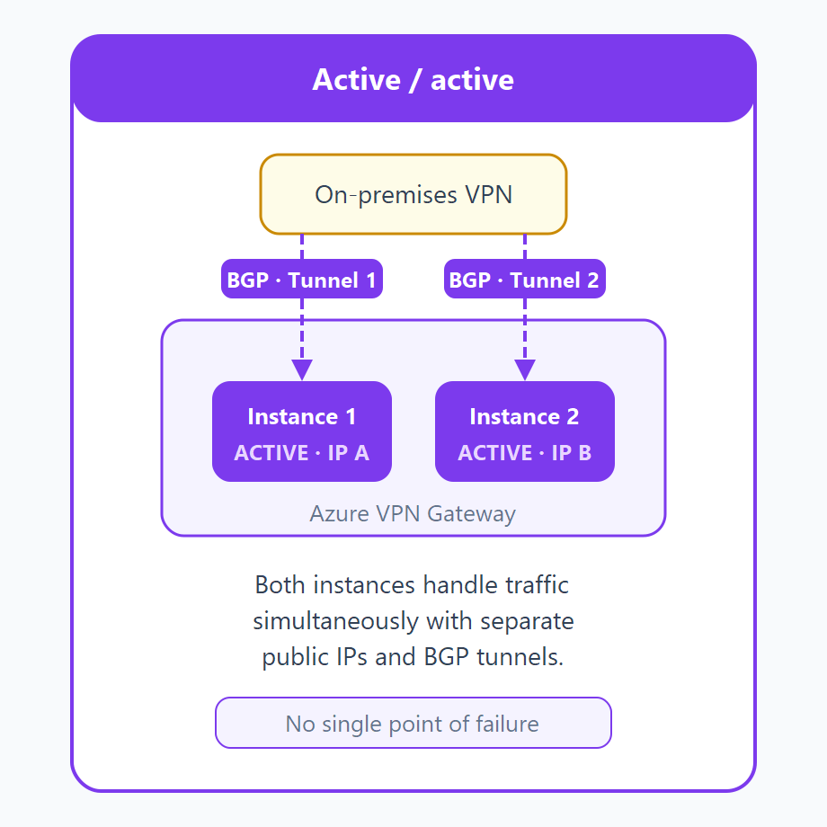

Con l'introduzione del supporto per il protocollo di routing BGP è ora possibile distribuire i gateway VPN in una configurazione di tipo attivo/attivo. In questa configurazione si assegna un indirizzo IP pubblico univoco a ogni istanza. Si creano tunnel separati dal dispositivo locale a ogni indirizzo IP. È possibile estendere la disponibilità elevata distribuendo un dispositivo VPN aggiuntivo in locale.

### Failover di ExpressRoute
Un'altra opzione di disponibilità elevata consiste nel configurare un gateway VPN come percorso di failover protetto per le connessioni ExpressRoute. I circuiti ExpressRoute hanno la resilienza incorporata. Non sono però immuni da potenziali problemi fisici dei cavi di connettività o da interruzioni dell'intero sito ExpressRoute. Negli scenari a disponibilità elevata con rischio associato a un'interruzione di un circuito ExpressRoute, è anche possibile eseguire il provisioning di un gateway VPN che usa Internet come metodo di connettività alternativo. In questo modo è possibile garantire sempre la disponibilità di una connessione alle reti virtuali.

### Gateway con ridondanza della zona

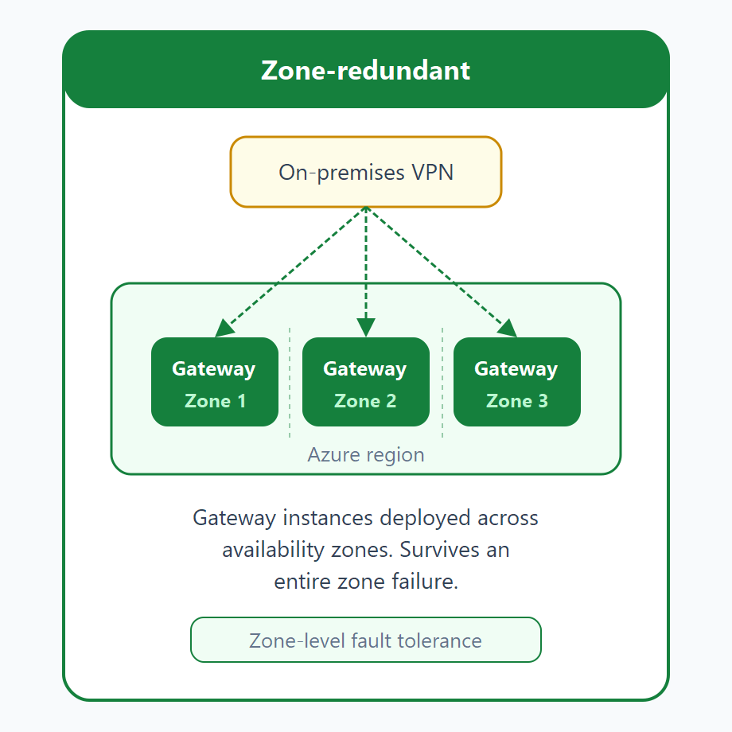

Nelle regioni che supportano le zone di disponibilità, i gateway VPN e i gateway ExpressRoute possono essere implementati in una configurazione a zona ridondante. Con questa configurazione i gateway di rete virtuale ottengono maggiore disponibilità, scalabilità e resilienza. La distribuzione di gateway in zone di disponibilità di Azure separa fisicamente e logicamente i gateway all'interno di un'area e nel contempo permette di proteggere la connettività di rete locale ad Azure da errori a livello di zona. Questi gateway richiedono unità di gestione dello stock (SKU) del gateway differenti e utilizzano indirizzi IP pubblici Standard anziché indirizzi IP pubblici Basic.

# Descrivere Azure ExpressRoute

Azure ExpressRoute consente di estendere le reti locali nel cloud Microsoft tramite una connessione privata, con l'aiuto di un provider di connettività. Questa connessione è denominata circuito ExpressRoute. Con ExpressRoute è possibile stabilire connessioni ai servizi cloud Microsoft, ad esempio Microsoft Azure e Microsoft 365. ExpressRoute consente di connettere uffici, data center o altre strutture al cloud Microsoft. Ogni posizione avrà un proprio circuito ExpressRoute.

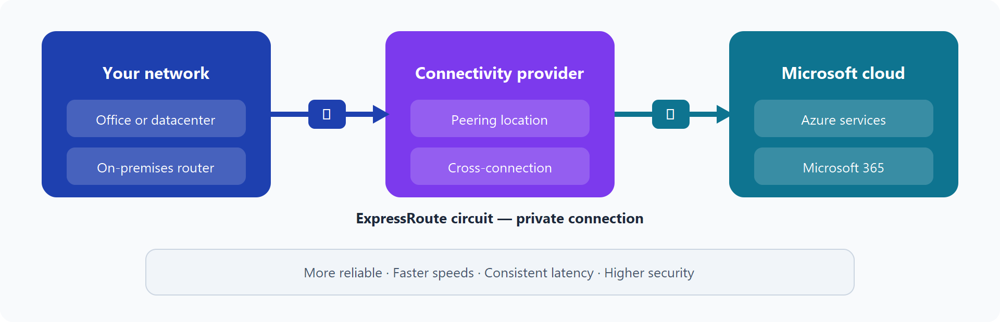

La connettività può essere stabilita da una rete Any-to-Any (IPVPN), da una rete Ethernet punto a punto o da una Cross Connection virtuale tramite un provider di connettività presso una struttura di coubicazione. Le connessioni ExpressRoute non vengono instradate attraverso la rete Internet pubblica. Poiché ignorano la rete Internet pubblica, le connessioni ExpressRoute offrono maggiore affidabilità, velocità più veloci, latenze coerenti e maggiore sicurezza rispetto alle connessioni Internet tipiche.

## Funzionalità e vantaggi di ExpressRoute

L'uso di ExpressRoute come servizio di connessione tra Azure e le reti locali offre diversi vantaggi.

- Connettività ai servizi cloud Microsoft in tutte le aree all'interno dell'area geopolitica.
- Connettività globale ai servizi Microsoft in tutte le aree con Copertura globale di ExpressRoute.
- Routing dinamico tra la rete e Microsoft tramite Border Gateway Protocol (BGP).
- Ridondanza incorporata in ogni località di peering per una maggiore affidabilità.

## Connettività ai servizi cloud Microsoft
ExpressRoute consente l'accesso diretto ai servizi seguenti in tutte le aree:

- Microsoft Office 365
- Microsoft Dynamics 365
- Servizi di calcolo di Azure, ad esempio macchine virtuali di Azure
- Servizi cloud di Azure, ad esempio Azure Cosmos DB e Archiviazione di Azure

## Connettività globale
È possibile abilitare Copertura globale di ExpressRoute per lo scambio di dati tra i siti locali connettendo i circuiti ExpressRoute. Si supponga, ad esempio, di avere un ufficio in Asia e un data center in Europa, entrambi con circuiti ExpressRoute che li connettono alla rete Microsoft. È possibile usare Copertura globale di ExpressRoute per connettere queste due funzionalità, consentendo loro di comunicare senza trasferire i dati tramite internet pubblico.

Un diagramma mostra due siti locali connessi tramite il backbone Microsoft usando ExpressRoute Global Reach, senza transito internet pubblico.

## Routing dinamico
ExpressRoute usa BGP per scambiare route tra reti locali e risorse in esecuzione in Azure. Questo protocollo abilita il routing dinamico tra la rete locale e i servizi in esecuzione nel cloud Microsoft.

## Ridondanza predefinita
Ogni provider di connettività usa dispositivi ridondanti per garantire che le connessioni stabilite con Microsoft siano a disponibilità elevata. È possibile configurare più circuiti per integrare questa funzionalità.

## Opzioni del modello di connettività
ExpressRoute supporta diverse opzioni di connettività a seconda del provider e della progettazione della rete, tra cui connettività basata su provider, Ethernet da punto a punto e connettività diretta in posizioni ExpressRoute. A questo livello, concentrarsi su quando usare ExpressRoute anziché modelli di implementazione dettagliati.

A livello generale, scegliere ExpressRoute quando:

- È necessaria una connettività privata e coerente tra le reti locali e Azure.
- Il vostro team ha requisiti rigorosi di conformità o di trasferimento dei dati.
- È necessaria una latenza prevedibile e prestazioni di rete ad alta capacità.
- Si vuole evitare di inviare traffico critico tramite La rete Internet pubblica.

## Considerazioni relative alla sicurezza
Con ExpressRoute, i dati non passano attraverso la rete Internet pubblica, riducendo i rischi associati alle comunicazioni Internet. ExpressRoute è una connessione privata dall'infrastruttura locale all'infrastruttura di Azure. Anche se si dispone di una connessione ExpressRoute, le query DNS, il controllo dell'elenco di revoche di certificati e le richieste della rete per la distribuzione di contenuti di Azure vengono comunque inviate tramite Internet pubblico.

# Descrivere il DNS di Azure

DNS di Azure è un servizio di hosting per i domini DNS che offre la risoluzione dei nomi usando l'infrastruttura di Microsoft Azure. Ospitando i domini in Azure, è possibile gestire i record DNS usando le stesse credenziali, API, strumenti e fatturazione degli altri servizi Azure.

## Vantaggi di DNS di Azure
DNS di Azure usa l'ambito e la scalabilità di Microsoft Azure per offrire numerosi vantaggi, tra cui:

- Affidabilità e prestazioni
- sicurezza
- Semplicità d'uso
- Reti virtuali personalizzabili
- Record alias

## Affidabilità e prestazioni
I domini DNS in DNS di Azure sono ospitati nella rete globale di server dei nomi DNS di Azure, offrendo resilienza e disponibilità elevata. DNS di Azure usa la rete anycast, quindi il server DNS più vicino risponde a ogni query DNS, offrendo prestazioni rapide e disponibilità elevata per il dominio.

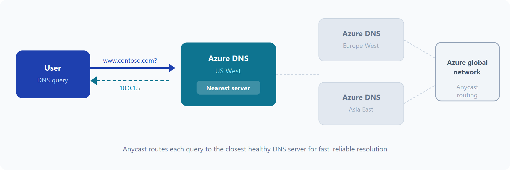

## Sicurezza
DNS di Azure si basa su Azure Resource Manager, che offre funzionalità come il controllo degli accessi in base al ruolo di Azure, i log attività e i blocchi delle risorse per proteggere le risorse e i record DNS.

## Semplicità d'uso
DNS di Azure può gestire i record DNS per i servizi di Azure e fornire DNS anche per le risorse esterne. DNS di Azure è integrato nel portale di Azure e usa le stesse credenziali, il contratto di supporto e la fatturazione degli altri servizi di Azure.

Poiché DNS di Azure viene eseguito in Azure, è possibile gestire domini e record con il portale di Azure, i cmdlet di Azure PowerShell e l'interfaccia della riga di comando di Azure multipiattaforma. Le applicazioni che richiedono la gestione DNS automatizzata possono integrarsi con il servizio usando l'API REST e gli SDK.

## Reti virtuali personalizzabili con domini privati
DNS di Azure supporta anche domini DNS privati. Questa funzionalità consente di usare i propri nomi di dominio personalizzati nelle reti virtuali private anziché i nomi forniti da Azure.

## Record alias
DNS di Azure supporta anche i set di record alias. È possibile usare un set di record alias per fare riferimento a una risorsa di Azure, ad esempio, un indirizzo IP pubblico di Azure, un profilo di Gestione traffico di Azure o un endpoint della rete per la distribuzione di contenuti di Azure. Se l'indirizzo IP della risorsa sottostante viene modificato, il set di record alias si aggiorna automaticamente durante la risoluzione DNS. Il set di record alias punta all'istanza del servizio e l'istanza del servizio viene associata a un indirizzo IP.

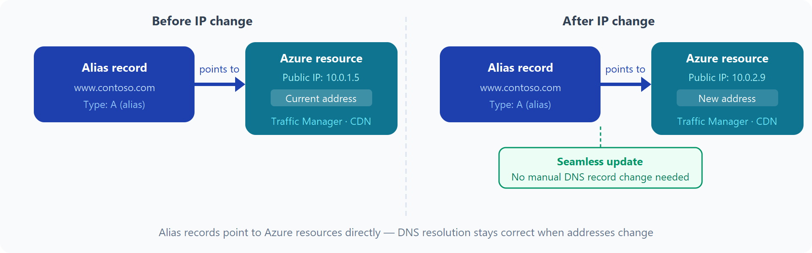

> Non è possibile usare DNS di Azure per acquistare un nome di dominio. Per una tariffa annuale, è possibile acquistare un nome di dominio usando i domini del servizio app o un registrar di nomi di dominio di terze parti. Dopo l'acquisto, i domini possono essere ospitati in DNS di Azure per la gestione dei record.

# Descrivere gli account di archiviazione di Azure

Un account di archiviazione offre uno spazio dei nomi univoco per i dati di Archiviazione di Azure, accessibile da qualsiasi parte del mondo tramite HTTP o HTTPS. I dati in questo account offrono sicurezza, disponibilità elevata, durabilità e un elevato livello di scalabilità.

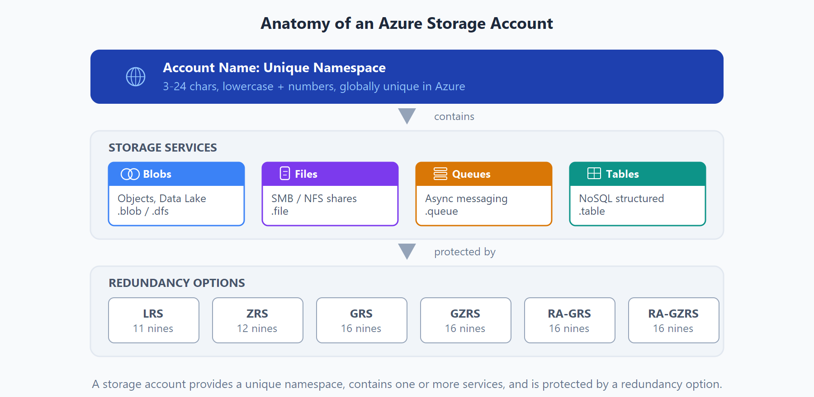

Quando crei il tuo account di archiviazione, inizia selezionando il tipo di account di archiviazione. Il tipo di account determina i servizi di archiviazione e le opzioni di ridondanza e influisce sui casi d'uso. Queste opzioni di ridondanza sono illustrate più avanti in questo modulo:

- Archiviazione con ridondanza locale
- Archiviazione con ridondanza geografica (GRS)
- Archiviazione con ridondanza geografica e accesso in lettura (RA-GRS)
- Archiviazione con ridondanza della zona (ZRS)
- Archiviazione con ridondanza della zona geografica (GZRS)
- Archiviazione con ridondanza geografica della zona e accesso in lettura (RA-GZRS)

| Tipo | Servizi supportati | Opzioni di ridondanza | Utilizzo |
| --- | --- | --- | --- |
| Utilizzo generico v2 Standard | Archiviazione BLOB (incluso Data Lake Storage), archiviazione code, archiviazione tabelle e File di Azure | Archiviazione con ridondanza locale, archiviazione con ridondanza geografica, archiviazione con ridondanza geografica e accesso in lettura, archiviazione con ridondanza della zona, archiviazione con ridondanza geografica della zona, archiviazione con ridondanza geografica della zona e accesso in lettura | Tipo di account di archiviazione Standard per BLOB, condivisioni file, code e tabelle. Consigliato per la maggior parte degli scenari che usano Archiviazione di Azure. Per supportare NFS (Network File System) in File di Azure, usare il tipo di account per condivisioni file Premium. |
| BLOB in blocchi Premium | Archiviazione BLOB (incluso Data Lake Storage) | LRS, ZRS | Tipo di account di archiviazione Premium per i BLOB in blocchi e i BLOB di accodamento. Scelta consigliata per gli scenari con frequenze di transazioni elevate o che usano oggetti più piccoli o che richiedono una latenza di archiviazione costantemente bassa. |
| Condivisioni file Premium | File di Azure | LRS, ZRS | Tipo di account di archiviazione Premium solo per le condivisioni file. Consigliato per applicazioni su larga scala o ad alte prestazioni. Usare questo tipo di account se si vuole un account di archiviazione che supporti sia le condivisioni file SMB (Server Message Block) che NFS. |
| BLOB di pagine Premium | Solo BLOB di pagine | LRS | Tipo di account di archiviazione Premium solo per i BLOB di pagine. |

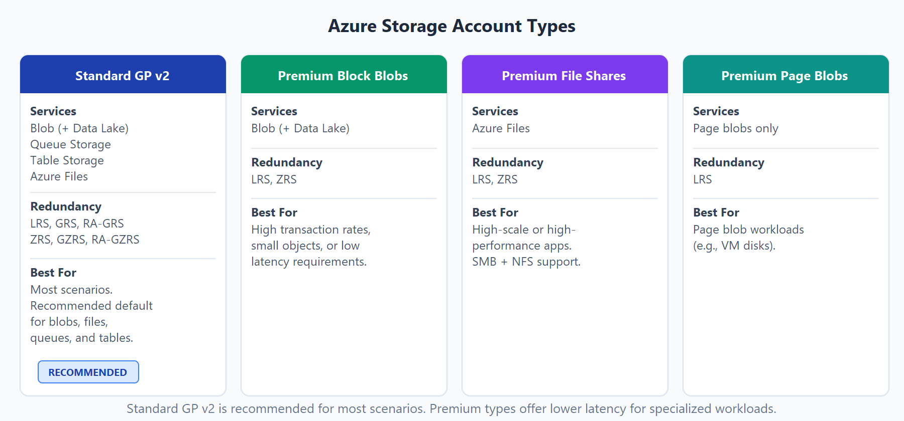

## Endpoint dell'account di archiviazione
Uno dei vantaggi dell'uso di un account di archiviazione di Azure è avere uno spazio dei nomi univoco in Azure per i dati. Ogni account di archiviazione deve avere un nome di account univoco all'interno di Azure. La combinazione del nome dell'account e dell'endpoint del servizio Azure Storage formano gli endpoint del tuo account di archiviazione.

Quando si assegna un nome all'account di archiviazione, tenere presenti queste regole:

- I nomi degli account di archiviazione devono avere una lunghezza compresa tra 3 e 24 caratteri e possono contenere solo numeri e lettere minuscole.
- Il nome dell'account di archiviazione deve essere univoco all'interno di Azure. Due account di archiviazione non possono avere lo stesso nome. In questo modo è possibile avere uno spazio dei nomi univoco e accessibile in Azure.

La tabella seguente illustra il formato dell'endpoint per i servizi di archiviazione di Azure.

| Servizio di archiviazione | Punto finale |
| --- | --- |
| Archiviazione BLOB | `https://storage-account-name.blob.core.windows.net` |
| Data Lake Storage Gen2 | `https://<storage-account-name>.dfs.core.windows.net` |
| File di Azure | `https://<storage-account-name>.file.core.windows.net` |
| Archiviazione code | `https://<storage-account-name>.queue.core.windows.net` |
| Archiviazione tabelle | `https://<storage-account-name>.table.core.windows.net` |

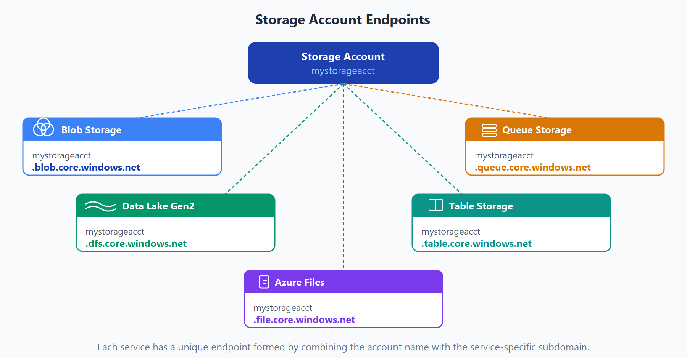

# Descrivere la ridondanza di archiviazione di Azure

Azure Storage mantiene più copie dei dati per proteggersi da errori hardware, interruzioni e disastri regionali. Le opzioni di ridondanza determinano disponibilità, durabilità e costi.

Quando si seleziona un'opzione di ridondanza, bilanciare i costi inferiori rispetto alla disponibilità più elevata. I fattori decisionali principali includono:

Modalità di replica dei dati nella regione primaria.
Valutare se i dati vengono replicati in una seconda area geograficamente distante dall'area primaria, per proteggersi da situazioni di emergenza a livello di area.
Possibilità che l'applicazione richieda l'accesso in lettura ai dati replicati nell'area secondaria nel caso in cui l'area primaria diventasse non disponibile.

## Ridondanza nell'area primaria

I dati in Archiviazione di Azure vengono sempre replicati tre volte nell'area primaria. Le opzioni dell'area primaria sono l'archiviazione con ridondanza locale (LRS) e l'archiviazione con ridondanza di zona (ZRS).

## Archiviazione con ridondanza locale

L'archiviazione con ridondanza locale replica i dati tre volte all'interno di un unico data center nell'area primaria. L'archiviazione con ridondanza locale garantisce almeno 11 nove (99,999999999%) di durabilità degli oggetti nell'arco di un anno specifico.

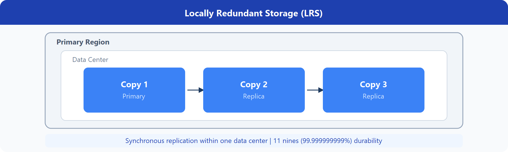

L'archiviazione con ridondanza locale (LRS) è l'opzione più economica e offre protezione contro gli errori del rack del server e delle unità in un data center. Poiché tutte le repliche rimangono in tale data center, un'emergenza a livello di data center può comunque causare una perdita di dati. Per una maggiore resilienza, utilizzare ZRS, GRS o GZRS.

## Archiviazione con ridondanza della zona
Per le aree abilitate per le zone di disponibilità, l'archiviazione a ridondanza di zona (ZRS) replica i dati di Archiviazione di Azure in modo sincrono attraverso tre zone di disponibilità di Azure nell'area primaria. L'archiviazione con ridondanza della zona offre almeno 12 nove (99,9999999999%) di durabilità degli oggetti dati di Archiviazione di Azure nell'arco di un anno specifico.

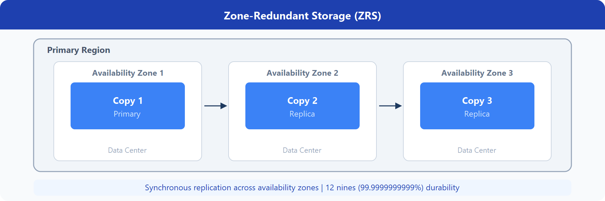

Con ZRS, i dati rimangono disponibili per le operazioni di lettura e scrittura anche se una zona non è disponibile. Azure esegue aggiornamenti di rete, ad esempio il repoint DNS, durante il ripristino.

Microsoft consiglia ZRS per scenari a disponibilità elevata all'interno della regione e per i requisiti che mantengono la replica all'interno di un paese o di una regione.

## Ridondanza in un'area secondaria
Per una maggiore durabilità, è possibile replicare i dati in un'area secondaria geograficamente distante dall'area primaria.

Quando si crea un account di archiviazione, si sceglie l'area primaria. Azure assegna l'area secondaria abbinata in base alle coppie di aree.

Le opzioni dell'area secondaria sono l'archiviazione con ridondanza geografica (GRS) e l'archiviazione con ridondanza geografica zonale (GZRS). GRS utilizza LRS in entrambe le regioni, mentre GZRS utilizza ZRS nella regione primaria e LRS nella regione secondaria.

Per impostazione predefinita, i dati dell'area secondaria non sono leggibili a meno che non si verifichi il failover. Se l'area primaria non è disponibile, è possibile eseguire il failover in modo che l'area secondaria diventi primaria.

> Poiché i dati vengono replicati in modo asincrono nell'area secondaria, un errore che interessa l'area primaria può provocare la perdita di dati se non è possibile recuperare l'area primaria. L'intervallo tra le scritture più recenti nell'area primaria e l'ultima scrittura nell'area secondaria è noto come obiettivo del punto di ripristino (RPO). L'RPO indica il punto nel tempo in cui è possibile recuperare i dati. L'obiettivo del punto di ripristino di Archiviazione di Azure è in genere inferiore a 15 minuti, anche se attualmente non è previsto alcun contratto di servizio sulla durata della replica dei dati nell'area secondaria.

## Archiviazione con ridondanza geografica
GRS copia i dati in modo sincrono tre volte nell'area primaria (LRS), quindi in modo asincrono nell'area secondaria (anche LRS). Fornisce almeno 16 nove di durabilità in un anno.

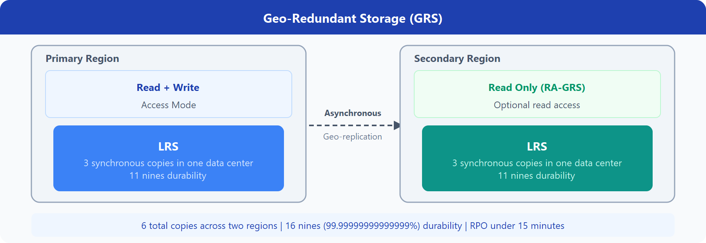

## Archiviazione geograficamente ridondante
GZRS combina la resilienza a livello di zona nella regione primaria con la replica geografica in una regione secondaria. I dati vengono copiati in tre zone di disponibilità nell'area primaria e replicati nell'area secondaria abbinata utilizzando l'archiviazione con ridondanza locale (LRS). Microsoft consiglia GZRS (archiviazione con ridondanza geografica della zona) per i carichi di lavoro che richiedono la massima coerenza, disponibilità e resilienza per il ripristino di emergenza.

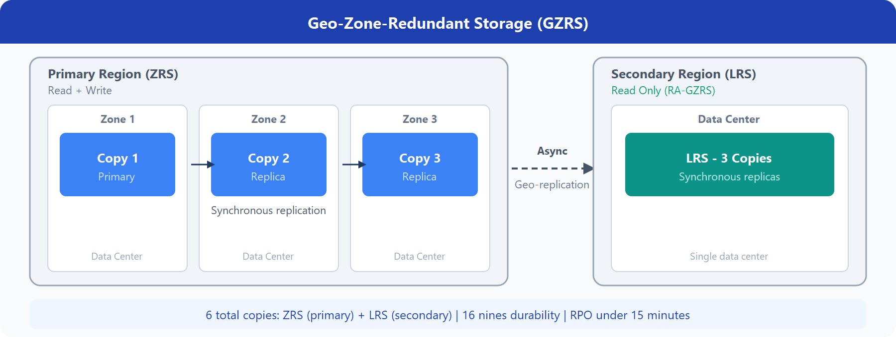

L'archiviazione con ridondanza geografica della zona è progettata per garantire almeno 16 nove (99,99999999999999%) di durabilità degli oggetti nell'arco di un anno specifico.

## Accesso in lettura ai dati nell'area secondaria
L'archiviazione con ridondanza geografica (GRS) e l'archiviazione con ridondanza geografica della zona (GZRS) proteggono dalle interruzioni a livello di area replicando i dati in una posizione secondaria. Per leggere i dati dell'area secondaria prima del failover, abilitare l'archiviazione con ridondanza geografica e accesso in lettura (RA-GRS) o l'archiviazione con ridondanza geografica della zona e accesso in lettura (RA-GZRS).

> Tenere presente che i dati nell'area secondaria possono non essere aggiornati a causa dell'RPO.

# Descrivere i servizi di archiviazione di Azure

Azure Storage include questi servizi dati di base:

- BLOB di Azure: archivio oggetti a scalabilità elevata per dati di testo e binari. Include anche il supporto per l'analisi dei Big Data con Data Lake Storage Gen2.
- File di Azure: condivisioni file gestite per distribuzioni cloud o locali.
- Code di Azure: un archivio messaggi per una messaggistica affidabile tra componenti delle applicazioni.
- Dischi di Azure: volumi di archiviazione a livello di blocco per le macchine virtuali di Azure.
- Tabelle di Azure: opzione di tabella NoSQL per dati strutturati e non relazionali.

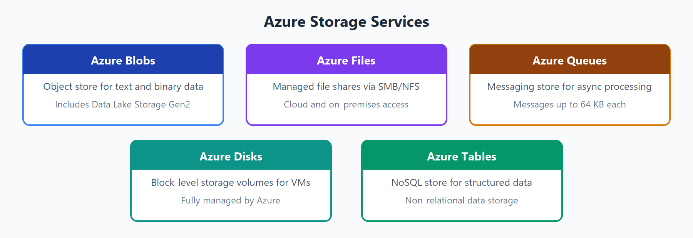

## Vantaggi di Archiviazione di Azure

Archiviazione di Azure offre questi vantaggi:

- **Durabilità e disponibilità elevata**. Le opzioni di ridondanza proteggono i dati da errori hardware, interruzioni e eventi imprevisti a livello di area.
- **Sicuro**. Tutti i dati scritti in un account di Archiviazione di Azure vengono crittografati dal servizio. Azure Storage offre un controllo granulare su chi può accedere ai tuoi dati.
- **Scalabile**. Archiviazione di Azure è progettata per offrire scalabilità elevata in modo da soddisfare le esigenze di archiviazione dati e di prestazioni delle applicazioni moderne.
- **Gestito**. Azure gestisce automaticamente le attività di manutenzione dell'hardware, gli aggiornamenti e i problemi critici.
- **Accessibile**. È possibile accedere ai dati a livello globale tramite HTTP o HTTPS usando API REST, SDK, interfaccia della riga di comando di Azure, Azure PowerShell, il portale di Azure o Azure Storage Explorer.

## Blob di Azure

L'archiviazione BLOB di Azure è un servizio di archiviazione oggetti non strutturati per grandi volumi di dati di testo o binari. È progettato per scenari come caricamenti di grandi dimensioni, contenuto multimediale, file di log e set di dati di analisi. Gli sviluppatori archivia gli oggetti come BLOB mentre Azure gestisce l'infrastruttura di archiviazione sottostante.

L'archiviazione Blob è ideale per:

- **Invio di immagini o documenti direttamente in un browser.**
- **Archiviazione di file per l'accesso distribuito.**
- **Streaming di audio e video.**
- **Archiviazione di dati per backup e ripristino, ripristino di emergenza e archiviazione.**
- **Archiviazione di dati a scopo di analisi da parte di un servizio locale o ospitato in Azure.**

## Accesso all'archiviazione BLOB

Gli oggetti nell'archivio BLOB sono accessibili da qualsiasi punto del mondo tramite HTTP o HTTPS. Gli utenti o le applicazioni client possono accedere ai BLOB tramite URL, l'API REST di Archiviazione Azure, Azure PowerShell, Azure CLI, oppure una libreria client di Azure Storage. Sono disponibili librerie client di archiviazione per più linguaggi, tra cui .NET, Java, Node.js, Python, PHP e Ruby.

## Livelli di archiviazione BLOB
I modelli di accesso ai dati cambiano nel tempo, quindi l'archiviazione BLOB di Azure offre livelli di accesso che bilanciano i costi di archiviazione rispetto alla velocità di recupero. I livelli di accesso disponibili sono i seguenti:

- **Livello di accesso frequente**: ottimizzato per l'archiviazione di dati a cui si accede di frequente, ad esempio immagini per il sito Web.
- **Livello di accesso sporadico**: ottimizzato per l'archiviazione di dati a cui si accede poco frequentemente e che rimangono archiviati per almeno 30 giorni, ad esempio fatture per i clienti.
- **Livello di accesso saltuario**: ottimizzato per l'archiviazione dei dati a cui si accede poco frequentemente e che vengono archiviati per almeno 90 giorni.
- **Livello di accesso archivio**: adatto per i dati a cui si accede raramente e che rimangono archiviati per almeno 180 giorni, con requisiti di latenza flessibili, ad esempio backup a lungo termine.

Considerazioni per i livelli di accesso:

- È possibile impostare a livello di account i livelli di accesso sporadico, saltuario e frequente. Il livello di accesso archivio non è disponibile a livello di account.
- I livelli archivio ad accesso frequente, sporadico e a freddo archivio possono essere impostati a livello di BLOB durante o dopo il caricamento.
- I livelli 'cool' e 'cold' hanno costi di archiviazione inferiori, ma costi di accesso più elevati e SLA di disponibilità inferiori.
- Il livello archivio ha il costo di archiviazione più basso e la latenza di riattivazione e il costo di accesso più alti.

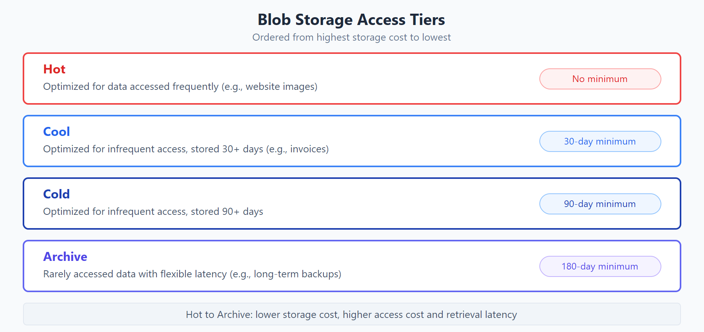

## File di Azure
File di Azure offre condivisioni file completamente gestite nel cloud accessibili tramite i protocolli SMB (Server Message Block) standard del settore o NFS (Network File System). Le condivisioni file di Azure possono essere montate simultaneamente da distribuzioni cloud o locali. Le condivisioni file SMB di Azure sono accessibili da client Windows, Linux e macOS. Le condivisioni file di Azure NFS sono accessibili dai client Linux o macOS. Le condivisioni file SMB di Azure possono anche essere memorizzate nella cache in Windows Server con Sincronizzazione file di Azure per l'accesso rapido in prossimità della posizione in cui vengono usati i dati.

## Vantaggi principali di File di Azure
Accesso condiviso: il supporto del protocollo SMB e NFS consente la compatibilità con le applicazioni esistenti.
Completamente gestito: nessun hardware server o applicazione di patch del sistema operativo da gestire.
Script e strumenti: gestire condivisioni con l'interfaccia della riga di comando di Azure, Azure PowerShell, il portale di Azure e Storage Explorer.
Resilienza: creata per la disponibilità elevata.
Programmabilità familiare: le applicazioni possono usare API di I/O di file standard, oltre ad AZURE SDK e API REST.

## Code di Azure
Azure Queue Storage archivia un numero elevato di messaggi per l'elaborazione asincrona. Le code di coda sono accessibili tramite chiamate autenticate HTTP/HTTPS, possono contenere milioni di messaggi e supportare messaggi fino a 64 KB.

L'archiviazione delle code è comunemente associata a Funzioni di Azure in modo che i messaggi attivino azioni in background.

## Dischi di Azure
Archiviazione su disco di Azure (dischi gestiti) offre volumi a livello di blocco per le macchine virtuali di Azure. Sono virtualizzati e gestiti da Azure per migliorare la resilienza e le operazioni più semplici.

## Tabelle di Azure
Archiviazione Tabelle di Azure è un archivio NoSQL per grandi quantità di dati strutturati, non relazionali, accessibili tramite richieste autenticate da ambienti cloud e ibridi.

# Identificare le opzioni di migrazione dei dati di Azure

Ora che si conoscono le diverse opzioni di archiviazione all'interno di Azure, è importante comprendere anche come ottenere i dati in Azure. Azure supporta sia la migrazione in tempo reale dell'infrastruttura, delle applicazioni dei dati con Azure Migrate, sia la migrazione asincrona dei dati con Azure Data Box.

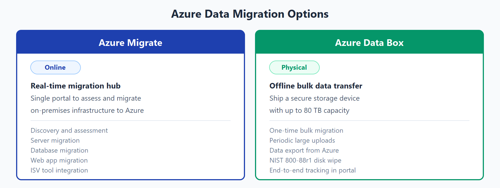

## Azure Migrate
Azure Migrate è un servizio che consente di eseguire la migrazione da un ambiente locale al cloud. Azure Migrate funziona come un hub per gestire la valutazione e la migrazione del data center locale ad Azure. Fornisce le risorse seguenti:

- Piattaforma di migrazione unificata: un singolo portale per avviare, eseguire e tenere traccia della migrazione ad Azure.
Gamma di strumenti: una gamma di strumenti per la valutazione e la migrazione. Gli strumenti di Azure Migrate includono Azure
- Migrate: Individuazione e valutazione e Azure Migrate: Migrazione server. Azure Migrate si integra con altri servizi e strumenti di Azure, oltre che con offerte di fornitori di software indipendenti (ISV).
- Valutazione e migrazione: nell'hub di Azure Migrate è possibile valutare ed eseguire la migrazione dell'infrastruttura locale ad Azure.

## Strumenti integrati
Oltre a usare gli strumenti degli ISV, l'hub di Azure Migrate include opzioni integrate per l'individuazione e la valutazione, la migrazione del server, la migrazione del database e la migrazione delle app Web.

## Azure Data Box
Azure Data Box è un servizio di migrazione fisica che consente di trasferire grandi quantità di dati in modo rapido, economico e affidabile. Il trasferimento sicuro dei dati viene accelerato grazie alla spedizione di un dispositivo di archiviazione proprietario di Data Box con capacità massima di archiviazione utilizzabile di 80 terabyte. Il Data Box viene trasportato da e verso il data center da un corriere locale, protetto da una scatola robusta per evitare possibili danni durante il transito.

È possibile ordinare il dispositivo Data Box tramite il portale di Azure, per importare o esportare dati da Azure. Dopo avere ricevuto il dispositivo, lo si può configurare rapidamente usando l'interfaccia utente Web locale e poi collegarlo alla rete. Al termine del trasferimento dei dati (in o da Azure), è sufficiente restituire il Data Box. Se si trasferiscono dati in Azure, i dati vengono caricati automaticamente quando Microsoft riceve il Data Box restituito. L'intero processo viene monitorato per tutta la durata dal servizio Data Box nel portale di Azure.

## Casi d'uso
Data Box è ideale per lo spostamento di set di dati di dimensioni molto grandi (spesso decine di terabyte o più) quando la larghezza di banda di rete è limitata.

Gli scenari comuni di Data Box includono:

- Migrazione in blocco occasionale dei dati locali in Azure.
- Caricamenti periodici di dati di grandi dimensioni in cui il trasferimento online è troppo lento.
- Esportazione di set di dati di grandi dimensioni da Azure per esigenze di ripristino o normative.

Dopo che i dati dell'ordine di importazione sono stati caricati in Azure, il contenuto dei dischi sul dispositivo viene cancellato, in conformità agli standard NIST 800-88r1. Per un ordine di esportazione, i dischi vengono cancellati quando il dispositivo raggiunge il data center di Azure.

# Identificare le opzioni di spostamento dei file di Azure

Oltre alla migrazione su larga scala usando servizi come Azure Migrate e Azure Data Box, Azure include anche strumenti progettati per facilitare lo spostamento o l'interazione con singoli file o piccoli gruppi di file. ad esempio AzCopy, Azure Storage Explorer e Sincronizzazione file di Azure.

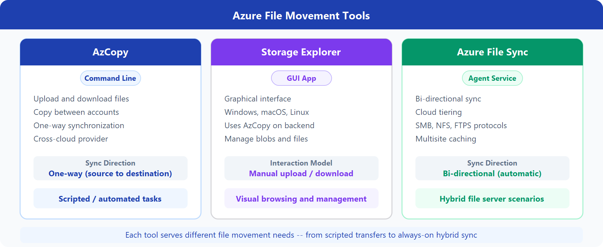

## AzCopy

AzCopy è un'utilità da riga di comando che consente di copiare blob o file in o da un account di archiviazione. Con AzCopy è possibile caricare file, scaricare file, copiare file tra account di archiviazione e persino sincronizzare i file. AzCopy può anche essere configurato per l'uso con altri provider di servizi cloud al fine dello spostamento dei file tra cloud.

> La sincronizzazione di BLOB o file con AzCopy è una sincronizzazione a una direzione. Quando si esegue la sincronizzazione, si designa l'origine e la destinazione e AzCopy copia i file o i BLOB in tale direzione. Non sincronizza in modo bidirezionale in base ai timestamp o ad altri metadati.

## Azure Storage Explorer
Azure Storage Explorer è un'app autonoma che offre un'interfaccia grafica per la gestione di file e BLOB nell'account di archiviazione di Azure. Funziona nei sistemi operativi Windows, macOS e Linux e usa AzCopy nel back-end per eseguire tutte le attività di gestione di file e BLOB. Con Storage Explorer è possibile caricare in Azure, scaricare da Azure o spostarsi tra account di archiviazione.

## Sincronizzazione file di Azure
Azure File Sync è uno strumento che consente di centralizzare le condivisioni file in Azure Files e di mantenere la flessibilità, le prestazioni e la compatibilità di un file server Windows. È quasi come trasformare il file server Windows in una rete per la distribuzione di contenuti in miniatura. Dopo aver installato Sincronizzazione file di Azure nel server Windows locale, verrà eseguita automaticamente la sincronizzazione bidirezionale con i file in Azure.

Con Sincronizzazione file di Azure è possibile:

- Usare qualsiasi protocollo disponibile in Windows Server, inclusi SMB, NFS e FTPS per accedere ai dati in locale.
- Usare qualsiasi numero di cache necessario in tutto il mondo.
- Sostituire un server locale guasto installando Azure File Sync su un nuovo server nel medesimo datacenter.
- Configurare la suddivisione in livelli nel cloud in modo che i file a cui si accede più frequentemente vengano replicati in locale, mentre i file a cui si accede raramente vengono mantenuti nel cloud fino a quando non vengono richiesti.

# Descrivere i servizi directory di Azure

Microsoft Entra ID è il servizio di gestione delle identità e degli accessi basato sul cloud di Microsoft. Consente di effettuare l'accesso e utilizzare sia le applicazioni cloud Microsoft che le applicazioni cloud che sviluppi.

Se hai lavorato con Active Directory on-premises, Microsoft Entra ID ti sembrerà familiare. La differenza principale è che si controllano gli account di identità, mentre Microsoft garantisce che il servizio sia disponibile a livello globale.

La connessione dei due sblocca una protezione aggiuntiva. In modo autonomo, Active Directory locale non monitora il comportamento di accesso. Una volta connessi a Microsoft Entra ID, Microsoft può rilevare tentativi di accesso sospetti senza costi aggiuntivi, ad esempio accessi da posizioni impreviste o dispositivi sconosciuti.

## Chi usa Microsoft Entra ID?
Microsoft Entra ID è per:

- **Amministratori IT**. Gli amministratori possono usare Microsoft Entra ID per controllare l'accesso alle applicazioni e alle risorse in base ai requisiti di sicurezza e carico di lavoro.
- **Sviluppatori di app**. Gli sviluppatori possono usare Microsoft Entra ID per offrire un approccio basato su standard per l'aggiunta di funzionalità alle applicazioni sviluppate, ad esempio l'aggiunta di funzionalità SSO a un'app o l'abilitazione di un'app per l'uso delle credenziali esistenti di un utente.
- **Utenti**. Gli utenti possono gestire le proprie identità e intraprendere azioni di manutenzione, ad esempio la reimpostazione della password self-service.
- **Abbonati a servizi online**. Gli abbonati a Microsoft 365, Microsoft Office 365, Azure e Microsoft Dynamics CRM Online usano già Microsoft Entra ID per l'autenticazione nel proprio account.

## Che cosa fa Microsoft Entra ID?
Microsoft Entra ID fornisce servizi come:

- **Autenticazione**: verifica l'identità prima di concedere l'accesso. Include la reimpostazione della password self-service, l'autenticazione a più fattori, gli elenchi di password escluse e il blocco intelligente.
- **Single Sign-On (SSO)**: consente a un'identità di accedere a più applicazioni. I vantaggi e il comportamento dell'accesso Single Sign-On sono trattati nell'unità metodi di autenticazione.
- **Gestione delle applicazioni**: gestisce le app cloud e locali tramite funzionalità come Application Proxy, integrazione di app SaaS e il portale App personali.
- **Gestione dei dispositivi**: supporta la registrazione e la gestione dei dispositivi tramite strumenti come Microsoft Intune. Abilita i criteri di accesso condizionale basati su dispositivo che limitano l'accesso ai dispositivi noti.

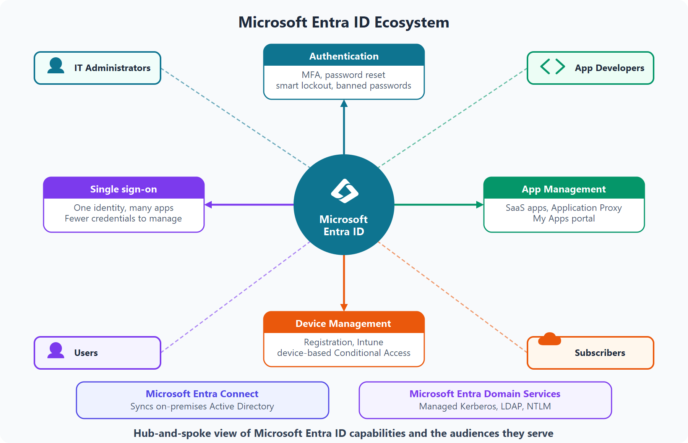

## È possibile connettere l'istanza locale di Active Directory con Microsoft Entra ID?
Senza una connessione, una distribuzione di Active Directory locale e una distribuzione cloud di Microsoft Entra ID richiedono la manutenzione di due set di identità separati. Microsoft Entra Connect consente di colmare il divario.

Microsoft Entra Connect sincronizza le identità utente tra l'istanza locale di Active Directory e Microsoft Entra ID. Poiché le modifiche fluiscono tra i due sistemi, gli utenti ottengono un'esperienza coerente, inclusi SSO, autenticazione a più fattori e reimpostazione della password self-service, sia che accedano alle risorse locali o a quelle cloud.

## Che cos'è Microsoft Entra Domain Services?
Microsoft Entra Domain Services fornisce servizi di dominio gestiti — unione al dominio, criteri di gruppo, LDAP, e autenticazione Kerberos/NTLM — senza richiedere la distribuzione o la gestione dei controller di dominio nel cloud.

Ciò è particolarmente utile per le applicazioni legacy che non possono usare l'autenticazione moderna. È possibile trasferire in modalità lift-and-shift tali applicazioni dall'ambiente locale a un dominio gestito senza gestire un ambiente di Active Directory Domain Services nel cloud.

Poiché Microsoft Entra Domain Services si integra con il tenant di Microsoft Entra esistente, gli utenti possono accedere al dominio gestito con le credenziali esistenti. Anche i gruppi esistenti e gli account utente vengono mantenuti, fornendo un percorso di migrazione più semplice.

## Come funziona Microsoft Entra Domain Services?
Quando si crea un dominio gestito di Microsoft Entra Domain Services, si definisce uno spazio dei nomi univoco. Questo namespace è il nome di dominio. Due controller di dominio Windows Server vengono quindi distribuiti nell'area di Azure selezionata. Questa distribuzione di controller di dominio (DCs) è nota come set di repliche.

Non è necessario gestire, configurare o aggiornare questi controller di dominio (DC). La piattaforma Azure gestisce i controller di dominio come parte del dominio gestito, inclusi i backup e la crittografia a riposo tramite crittografia dischi di Azure.

## Le informazioni sono sincronizzate?
Un dominio gestito è configurato per eseguire una sincronizzazione unidirezionale da Microsoft Entra ID a Microsoft Entra Domain Services. È possibile creare risorse direttamente nel dominio gestito, ma non vengono sincronizzate con Microsoft Entra ID. In un ambiente ibrido con un ambiente Active Directory Domain Services locale, Microsoft Entra Connect sincronizza le informazioni sull'identità con Microsoft Entra ID, che viene quindi sincronizzato con il dominio gestito.

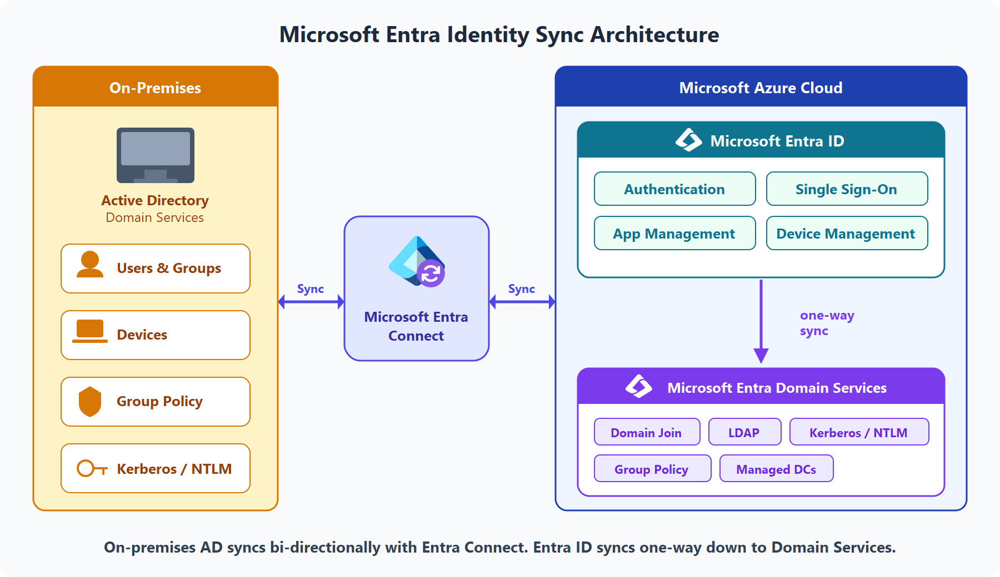

Le applicazioni, i servizi e le VM in Azure che si connettono al dominio gestito possono quindi usare funzionalità comuni di Microsoft Entra Domain Services come l'aggiunta a un dominio, Criteri di gruppo, LDAP e l'autenticazione Kerberos/NTLM.

# Descrivere i metodi di autenticazione di Azure

L'autenticazione stabilisce l'identità di una persona, di un servizio o di un dispositivo richiedendo le credenziali. In Azure i metodi comuni includono password, Single Sign-On (SSO), autenticazione a più fattori (MFA) e accesso senza password. Gli approcci moderni sono progettati per migliorare sia la sicurezza che la praticità degli utenti.

Il diagramma seguente mostra il livello di sicurezza rispetto alla praticità. Si noti che l'autenticazione senza password offre livelli elevati sia di sicurezza che di praticità, mentre le password da sole sono poco sicure ma molto pratiche.

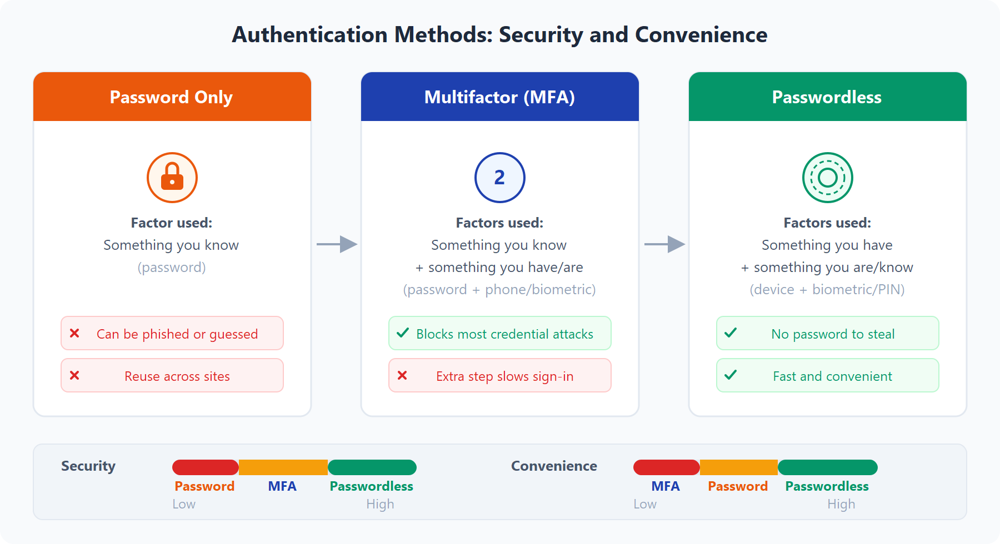

## Cos'è il Single Sign-On?
Single Sign-On (SSO) consente a un utente di accedere una sola volta e di accedere a più applicazioni attendibili. L'accesso Single Sign-On riduce lo sprawl delle password, riducendo così la probabilità di eventi imprevisti correlati alle credenziali e riducendo il blocco e la reimpostazione dell'account.

Dal punto di vista delle operazioni, l'accesso Single Sign-On semplifica anche la gestione del ciclo di vita. L'accesso è associato a un'identità, semplificando l'aggiornamento o la rimozione dell'accesso quando i ruoli cambiano.

> L'accesso Single Sign-On è sicuro solo se lo è l'autenticatore iniziale, perché le connessioni successive sono tutte basate sulla sicurezza di tale autenticatore.

## Che cos'è l'autenticazione a più fattori?

L'autenticazione a più fattori (MFA) richiede all'utente un fattore aggiuntivo durante l'accesso, quindi una password compromessa da sola non è sufficiente per l'accesso. Questi fattori rientrano in tre categorie:

- **Qualcosa che l'utente conosce**, ovvero una password o una domanda di verifica.
- **Qualcosa che l'utente ha**, ovvero un codice inviato a un telefono cellulare.
- **Qualcosa che l'utente è**, ovvero un segnale biometrico, ad esempio un'impronta digitale o un'analisi del viso.

Con l'autenticazione a più fattori abilitata, un utente malintenzionato che ottiene una password richiede ancora il secondo fattore, ad esempio un prompt telefonico o un segnale biometrico, per completare l'accesso.

## Che cos'è l'autenticazione a più fattori di Microsoft Entra?
L'autenticazione a più fattori di Microsoft Entra è un servizio Microsoft che fornisce funzionalità di autenticazione a più fattori. L'autenticazione a più fattori di Microsoft Entra consente agli utenti di scegliere una forma aggiuntiva di autenticazione durante l'accesso, ad esempio una telefonata o una notifica dell'app per dispositivi mobili.

## Che cos'è l'autenticazione senza password?
Mentre l'autenticazione a più fattori aggiunge sicurezza, le password rimangono una sfida di usabilità e rischio. I metodi senza password eliminano completamente la password, sostituendola con un dispositivo attendibile più un segnale biometrico o un PIN.

Dopo la registrazione iniziale, l'utente accede con un fattore che conosce o è, ad esempio un PIN o un'impronta digitale, invece di digitare una password.

Microsoft Entra ID supporta tre opzioni senza password:

- Windows Hello for Business
- App Microsoft Authenticator
- Chiavi di sicurezza FIDO2

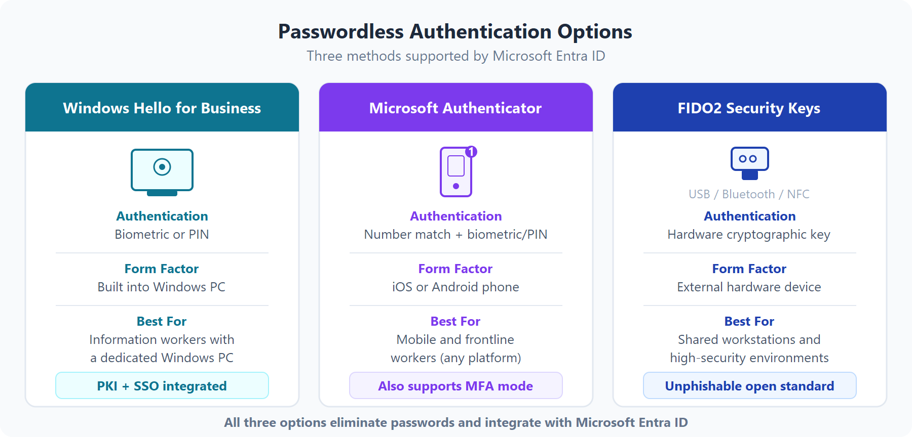

## Windows Hello for Business
Windows Hello for Business è ideale per gli Information Worker che hanno il proprio PC Windows designato. Le credenziali biometriche e PIN sono direttamente associate al PC dell'utente, impedendo l'accesso a chiunque non sia il proprietario. Con l'integrazione dell'infrastruttura a chiave pubblica (PKI) e il supporto predefinito per l'accesso Single Sign-On (SSO), Windows Hello for Business offre un metodo pratico per accedere facilmente alle risorse di lavoro in locale e nel cloud.

## App Microsoft Authenticator
L'app Microsoft Authenticator può anche fungere da credenziale senza password, trasformando qualsiasi telefono iOS o Android in un fattore di accesso sicuro.

Per accedere, l'utente riceve una notifica sul telefono, corrisponde a un numero visualizzato sullo schermo e conferma con un segnale biometrico (tocco o viso) o un PIN. Non è necessaria alcuna password.

## Chiavi di sicurezza FIDO2
FIDO2 è uno standard aperto per l'autenticazione senza password basata sulla specifica di autenticazione Web (WebAuthn). Le chiavi di sicurezza FIDO2 sono dispositivi hardware che non possono essere oggetto di phishing, tipicamente USB, ma disponibili anche con Bluetooth o NFC, e gestiscono l'autenticazione senza un nome utente né una password.

Gli utenti registrano una chiave FIDO2 e quindi la selezionano nella schermata di accesso come metodo di autenticazione principale. Poiché il dispositivo hardware gestisce l'autenticazione, non esiste alcuna password che potrebbe essere esposta o indovinata.

# Descrivere le identità esterne di Azure

Un'identità esterna è una persona, un dispositivo o un servizio esistente all'esterno del tenant. Microsoft Entra External ID include le funzionalità usate per interagire in modo sicuro con gli utenti oltre il limite del tenant.

## Perché le identità esterne sono importanti
Spesso le organizzazioni devono collaborare con partner, fornitori, fornitori e terzisti. Le identità esterne consentono agli utenti di accedere alle risorse approvate usando le credenziali esistenti, mentre il team applica ancora i criteri di accesso.

Ad esempio, un team di progetto può invitare gli utenti di un fornitore in spazi di collaborazione specifici senza creare e gestire credenziali locali separate per ogni guest.

Le identità esterne possono sembrare simili all'accesso Single Sign-On, ma vengono usate per scenari di accesso tra tenant e consumer. Gli utenti esterni possono portare le proprie identità, sia che si tratti di account aziendali, identità digitali rilasciate da enti pubblici o identità di social networking come Google o Facebook.

Il provider di identità esterno gestisce l'autenticazione e tu gestisci l'autorizzazione per le applicazioni con Microsoft Entra ID o Azure AD B2C.

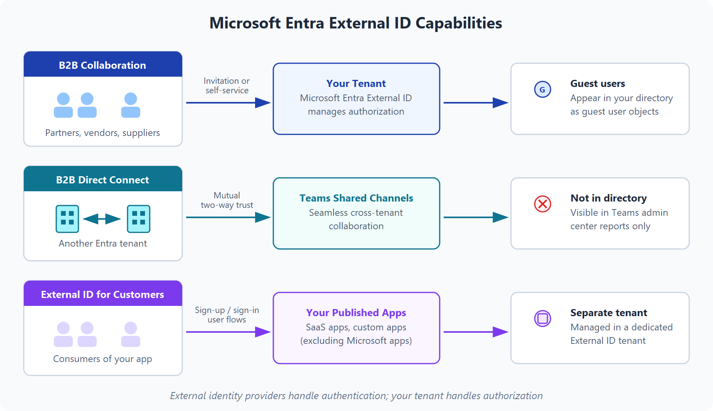

## Funzionalità di ID esterno
Le funzionalità seguenti costituiscono Identità esterne:

- **Collaborazione B2B**: collaborare con utenti esterni consentendo loro di usare la propria identità preferita per accedere alle applicazioni Microsoft o ad altre applicazioni interne (app SaaS, app sviluppate in modo personalizzato e così via). Gli utenti della collaborazione B2B sono rappresentati nella directory, in genere come utenti guest.
- **Connessione diretta B2B**: stabilire un trust reciproco bidirezionale con un altro tenant di Microsoft Entra per una collaborazione senza problemi. La connessione diretta B2B supporta attualmente i canali condivisi di Teams, consentendo agli utenti esterni di accedere alle risorse dalle proprie istanze di Teams. Gli utenti della connessione diretta B2B non sono rappresentati nella directory, ma sono visibili dal canale condiviso di Teams e possono essere monitorati nei report dell'interfaccia di amministrazione di Teams.
- **Microsoft Entra External ID per i clienti (in precedenza Azure AD B2C)**: pubblicare app SaaS moderne o app personalizzate (escluse le app Microsoft) per utenti e clienti, usando Entra External ID per la gestione delle identità e degli accessi.

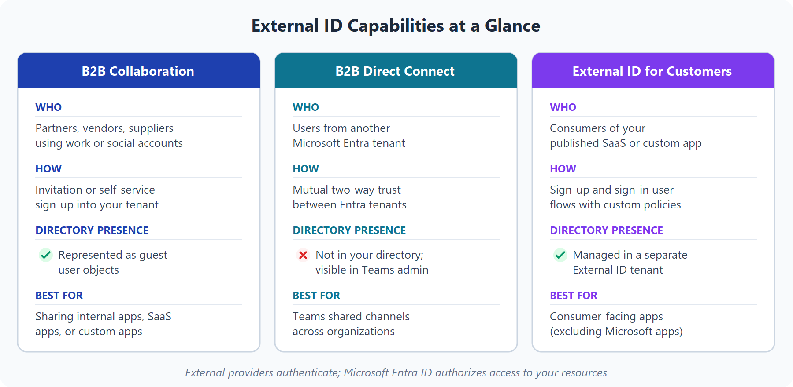

A seconda degli obiettivi di collaborazione e delle risorse condivise, è possibile combinare queste funzionalità.

## Gestire l'accesso degli ospiti nel corso del tempo
Con Microsoft Entra ID è possibile abilitare la collaborazione attraverso i limiti del tenant usando le funzionalità B2B. Gli utenti guest di altri tenant possono essere invitati dagli amministratori o dagli utenti autorizzati. Questa funzionalità si applica anche alle identità di social networking, ad esempio gli account Microsoft.

È possibile anche assicurarsi che gli utenti guest dispongano dell'accesso appropriato. Si può chiedere agli ospiti stessi o a un decision maker di partecipare a una revisione dell'accesso e ricertificare (o attestare) l'accesso degli ospiti. I revisori possono esprimere il proprio giudizio sull'effettiva esigenza di accesso continuo da parte di ogni utente in base ai suggerimenti ottenuti da Microsoft Entra ID. Al termine di una verifica di accesso è possibile apportare modifiche e rimuovere l'accesso per i guest per i quali non è più necessario.

# Descrivere l'accesso condizionale di Azure

L'accesso condizionale è uno strumento usato da Microsoft Entra ID per consentire o negare l'accesso alle risorse in base a segnali di identità. Questi segnali includono chi è l'utente, dove si trova l'utente e il dispositivo da cui richiede l'accesso.

L'accesso condizionale consente agli amministratori IT di:

- Consentire agli utenti di essere produttivi ovunque e in qualsiasi momento.
- Proteggere gli asset critici.

L'accesso condizionale offre anche un'esperienza di autenticazione a più fattori più granulare per gli utenti. Ad esempio, un utente potrebbe non essere richiesto per un secondo fattore di autenticazione se si trova in una posizione nota. Potrebbe essere invece richiesto all'utente un secondo fattore di autenticazione se i segnali di accesso sono insoliti o se l'utente si trova in una posizione imprevista.

Durante l'accesso, l'accesso condizionale raccoglie i segnali dall'utente, prende decisioni basate su tali segnali e quindi impone tale decisione consentendo o negando la richiesta di accesso o richiedendo una risposta dell'autenticazione a più fattori.

Il diagramma seguente illustra questo flusso:

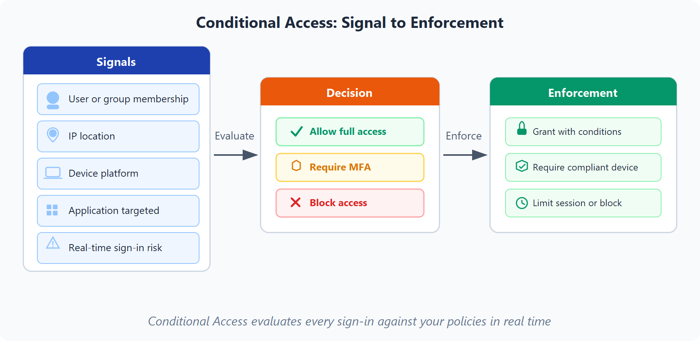

In questo caso, il segnale potrebbe essere la posizione dell'utente, il dispositivo dell'utente o l'applicazione a cui sta provando ad accedere.

In base a questi segnali, la decisione potrebbe essere quella di consentire l'accesso completo se l'utente accede da una posizione consueta. Se l'utente accede da una posizione insolita o contrassegnata come ad alto rischio, l'accesso potrebbe essere bloccato interamente o eventualmente concesso dopo che l'utente fornisce una seconda forma di autenticazione.

Per imposizione si intende l'azione che applica la decisione, ad esempio consentire l'accesso o richiedere all'utente di fornire una seconda forma di autenticazione.

## Quando è possibile usare l'accesso condizionale?
L'accesso condizionale è utile quando è necessario:

- Richiedere l'autenticazione a più fattori (MFA) per accedere a un'applicazione a seconda del ruolo, della posizione o della rete del richiedente. Ad esempio, è possibile richiedere l'autenticazione a più fattori per gli amministratori o per gli utenti che si connettono da percorsi di rete attendibili esterni.
- Richiedere l'accesso ai servizi solo tramite applicazioni client approvate. Ad esempio, è possibile limitare le applicazioni di posta elettronica che possono connettersi al servizio di posta elettronica.
- Richiedere agli utenti di accedere all'applicazione solo da dispositivi gestiti. Un dispositivo gestito è un dispositivo che soddisfa gli standard di sicurezza e conformità.
- Bloccare l'accesso da origini non attendibili, ad esempio l'accesso da posizioni sconosciute o impreviste.

Il diagramma seguente illustra come questi scenari comuni mappano i segnali alle azioni di applicazione.

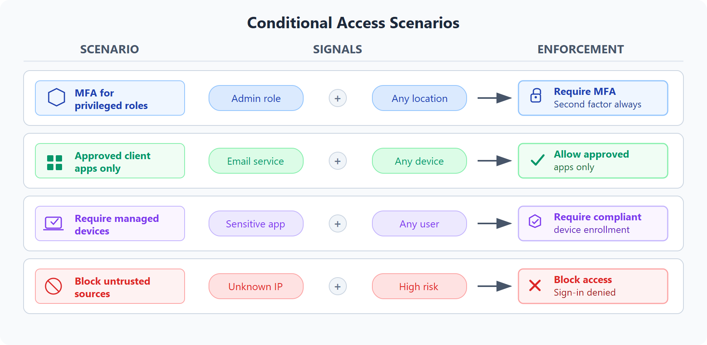

Le attività IT comuni includono la richiesta di autenticazione a più fattori per i ruoli con privilegi, la limitazione dell'accesso alle app sensibili da dispositivi non gestiti e il blocco degli accessi rischiosi da posizioni impreviste.

# Descrivere il controllo degli accessi in base al ruolo di Azure

Quando sono presenti più team IT e tecnici, come si controlla il tipo di accesso di ognuno alle risorse nell'ambiente cloud? Il principio dei privilegi minimi indica che è consigliabile concedere l'accesso solo fino al livello necessario per completare un'attività. Se è necessario solo l'accesso in lettura a un BLOB di archiviazione, è necessario concedere solo l'accesso in lettura a tale BLOB di archiviazione, non l'accesso in scrittura e non l'accesso ad altri BLOB. È una buona prassi di sicurezza da seguire.

Tuttavia, la gestione di tale livello di autorizzazioni per un intero team potrebbe risultare complessa. Invece di definire i requisiti di accesso dettagliati per ogni persona e quindi aggiornarli quando vengono create nuove risorse o quando nuove persone si aggiungono al team, Azure consente di controllare l'accesso tramite il controllo degli accessi in base al ruolo.

Azure offre ruoli predefiniti per la descrizione di regole di accesso comuni per le risorse cloud. È anche possibile definire ruoli personalizzati. A ogni ruolo è associato un set di autorizzazioni di accesso correlate al ruolo stesso. Quando si assegnano uno o più ruoli a persone o gruppi, questi ricevono tutte le autorizzazioni di accesso associate.

Quindi, se assumi un nuovo ingegnere e lo aggiungi al gruppo Azure RBAC per ingegneri, otterrà automaticamente lo stesso accesso degli altri ingegneri nel gruppo Azure RBAC. Analogamente, se si aggiungono altre risorse per cui si imposta il controllo degli accessi in base al ruolo di Azure, tutti i membri di quel gruppo di controllo degli accessi in base al ruolo di Azure avranno per le nuove risorse le stesse autorizzazioni che hanno per quelle esistenti.

## Come viene applicato il controllo degli accessi in base al ruolo alle risorse?

Il controllo degli accessi in base al ruolo viene applicato a un ambito, che è una risorsa o un set di risorse cui si applica l'accesso.

Il diagramma seguente illustra la relazione tra ruoli e ambiti. Si potrebbe assegnare il ruolo di proprietario a un gruppo di gestione, a una sottoscrizione o a un gruppo di risorse, che avranno quindi maggior controllo e autorità. "Un osservatore, che non è destinato a effettuare aggiornamenti, potrebbe ottenere il ruolo di Lettore per lo stesso ambito, consentendogli di esaminare o osservare il gruppo di gestione, la sottoscrizione o il gruppo di risorse."

Un diagramma che illustra la gerarchia degli ambiti di Azure RBAC dal più ampio al più piccolo: gruppo di gestione, sottoscrizione, gruppo di risorse e risorsa. Ogni livello di ambito mostra ruoli di esempio come Proprietario, Collaboratore e Lettore, con frecce colorate che indicano che le autorizzazioni ereditano da padre a figlio negli ambiti.

Gli ambiti includono:

- Un gruppo di gestione (raccolta di più sottoscrizioni).
- Una singola sottoscrizione.
- Un gruppo di risorse.
- Una singola risorsa.

Osservatori, utenti che gestiscono risorse, amministratori e processi automatizzati descrivono tutti i tipi di utenti o account a cui viene in genere assegnato ognuno dei diversi ruoli.

Il controllo degli accessi in base al ruolo di Azure è gerarchico, per cui quando si concede l'accesso in un ambito padre, le stesse autorizzazioni vengono ereditate dagli ambiti figlio. Ad esempio:

- Quando si assegna il ruolo Proprietario a un utente nell'ambito del gruppo di gestione, l'utente può gestire qualsiasi aspetto in tutte le sottoscrizioni all'interno del gruppo di gestione.
- Quando si assegna il ruolo Lettore a un gruppo nell'ambito della sottoscrizione, i membri del gruppo possono visualizzare tutti i gruppi di risorse e le risorse all'interno della sottoscrizione.

## Come viene applicato l'Azure RBAC?
Il controllo degli accessi in base al ruolo (Azure RBAC) viene applicato per ogni azione avviata su una risorsa di Azure che passa attraverso Azure Resource Manager. Resource Manager è un servizio di gestione che consente di organizzare e proteggere le risorse cloud.

In genere è possibile accedere a Resource Manager dal portale di Azure, da Azure Cloud Shell, da Azure PowerShell e dall'interfaccia della riga di comando di Azure. Azure RBAC non applica permessi di accesso a livello di applicazione o di dati. La sicurezza delle applicazioni deve essere gestita dall'applicazione.

Il controllo degli accessi in base al ruolo di Azure usa un modello di autorizzazione basato sull'approvazione. Quando viene assegnato un ruolo, Azure RBAC consente di eseguire azioni nell'ambito di tale ruolo. Se un'assegnazione di ruolo concede all'utente le autorizzazioni di lettura per un gruppo di risorse e un'altra assegnazione di ruolo concede le autorizzazioni di scrittura per lo stesso gruppo di risorse, l'utente avrà sia autorizzazioni sia di lettura sia di scrittura per il gruppo.

# Descrivere il modello Zero Trust

Zero Trust è un modello di sicurezza che presuppone lo scenario peggiore e protegge le risorse in base a tale previsione. Zero Trust presuppone che si verifichino violazioni a prescindere e quindi ogni richiesta viene verificata come se provenisse da una rete non controllata.

Oggi, i team IT necessitano di un modello di sicurezza che si adatti efficacemente alla complessità dell'ambiente moderno; abbraccia la forza lavoro mobile; e protegge persone, dispositivi, applicazioni e dati ovunque si trovino.

Per far fronte a questi nuovi ambienti informatici, Microsoft raccomanda vivamente di adottare il modello di sicurezza Zero Trust, basato su questi principi guida:

- **Verifica esplicitamente** - Effettuare sempre l'autenticazione e l'autorizzazione basandosi su tutti i punti dati disponibili.
- **Uso dell'accesso con privilegi minimi** - Limitare l'accesso degli utenti con accesso just-in-time e just-enough (JIT/JEA), criteri adattivi basati sul rischio e protezione dei dati.
- **Presupporre la violazione** : limitare l'impatto potenziale e l'accesso segmentato. Verificare la crittografia end-to-end. I dati analitici sono usati per aumentare la visibilità, favorire il rilevamento delle minacce e migliorare le difese.

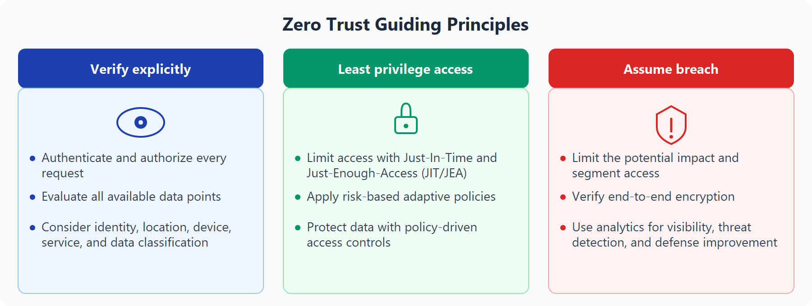

## Adattarsi al modello Zero Trust
Tradizionalmente, le reti basate su perimetro erano limitate, protette e generalmente considerate sicure. Solo i computer gestiti potevano essere aggiunti alla rete, l'accesso VPN era strettamente controllato e i dispositivi personali erano spesso limitati o bloccati.

Il modello Zero Trust capovolge questo scenario. Invece di presumere che un dispositivo sia sicuro perché si trova all'interno di una rete interna attendibile, richiede che tutti gli utenti eseguano l'autenticazione. Quindi l'accesso viene concesso in base all'autenticazione invece che alla posizione.

## Esempio di pratica
Si supponga che un utente si connetta da un dispositivo non gestito su una rete pubblica. Un approccio Zero Trust valuta comunque i segnali di identità, lo stato del dispositivo e le condizioni di rischio prima di concedere l'accesso. È possibile consentire l'accesso alle app a basso rischio, richiedere l'autenticazione a più fattori per i sistemi sensibili o bloccare completamente l'accesso quando il rischio è troppo elevato.

A livello di nozioni fondamentali, Zero Trust significa che le decisioni di accesso sono continue e consapevoli del contesto, non solo in base alla provenienza della richiesta.

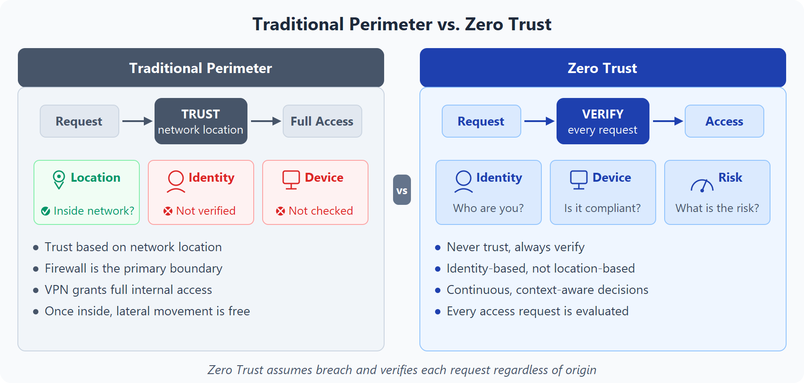

# Descrivi la difesa in profondità

Lo scopo della difesa in profondità è proteggere le informazioni e prevenirne il furto da parte di soggetti non autorizzati ad accedervi.

Una strategia di difesa avanzata impiega una serie di meccanismi per rallentare l'avanzamento di un attacco volto a ottenere l'accesso ai dati senza autorizzazione.

## Livelli di difesa in profondità
È possibile considerare la difesa in profondità come una serie di livelli, con i dati da proteggere al centro e tutti gli altri livelli impostati per proteggere questo livello centrale dei dati.

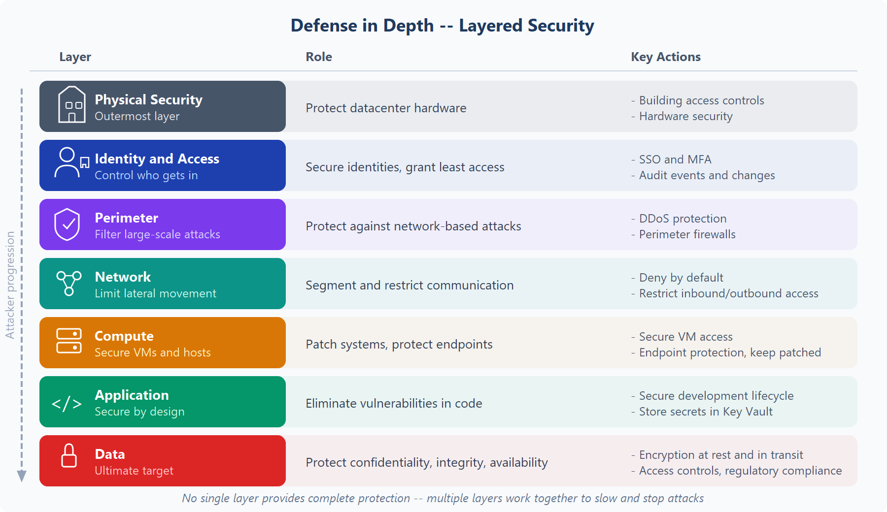

Poiché ogni livello offre funzioni di protezione, se un livello viene violato, vi è già un livello successivo pronto a impedire un'ulteriore esposizione. Con questo approccio si elimina la dipendenza da un singolo livello di protezione. Gli attacchi vengono rallentati e sono disponibili informazioni sugli avvisi sui quali i team responsabili della sicurezza possono agire, in modo automatico o manuale.

Ecco una breve panoramica del ruolo di ogni livello:

- Il livello Sicurezza fisica rappresenta la prima linea di difesa per proteggere l'hardware del computer nel data center.
- Il livello Identità e accesso controlla l'accesso all'infrastruttura e il controllo delle modifiche.
- Il livello Perimetro usa la protezione DDoS (Distributed Denial of Service) per filtrare gli attacchi su larga scala prima che possano causare la negazione del servizio agli utenti.
- Il livello Rete limita la comunicazione tra le risorse tramite segmentazione e controlli di accesso.
- Il livello di calcolo protegge l'accesso alle macchine virtuali.
- Il livello Applicazione contribuisce a garantire che le applicazioni siano sicure e prive di vulnerabilità di sicurezza.
- Il livello dati controlla l'accesso ai dati operativi e dei clienti che è necessario proteggere.

Questi livelli rappresentano una linea guida per prendere decisioni di configurazione della sicurezza in tutti i livelli delle applicazioni.

Azure fornisce gli strumenti e le funzionalità di sicurezza a ogni livello del concetto di difesa avanzata. Ogni livello verrà ora esaminato in modo dettagliato:

### Sicurezza fisica
La sicurezza fisica dell'accesso agli edifici e il controllo degli accessi all'hardware nel data center rappresentano la prima linea di difesa.

La finalità della sicurezza fisica è predisporre protezioni fisiche per l'accesso alle risorse. Queste misure di sicurezza impediscono che gli altri livelli vengano aggirati e assicurano una gestione appropriata di perdite e furti. Microsoft usa diversi meccanismi di sicurezza fisica nei data center del cloud.

### Identità e accesso
Lo scopo del livello di identità e accesso è verificare che le identità siano protette, che l'accesso venga concesso solo se necessario e che gli eventi di accesso e le modifiche vengano registrati.

A questo livello è importante:

- Controllare l'accesso all'infrastruttura e implementare il controllo delle modifiche.
- Usare l'accesso SSO (Single Sign-On) e l'autenticazione a più fattori.
- Controllare eventi e modifiche.

### Perimetro
A livello di perimetro della rete, lo scopo è impedire gli attacchi di rete diretti alle risorse. Identificare gli attacchi, neutralizzarne l'impatto e segnalarli quando si verificano sono modi importanti per proteggere la rete.

A questo livello è importante:

- Usare la protezione DDoS (Distributed Denial of Service) per filtrare gli attacchi su larga scala prima che possano influire sulla disponibilità di un sistema per gli utenti.
- Usare firewall perimetrali per identificare e segnalare gli attacchi dannosi alla rete.

### Rete
A questo livello, lo scopo è limitare la connettività di rete di tutte le risorse, consentendo unicamente quella necessaria. Limitando questa comunicazione, si riduce il rischio di un attacco distribuito ad altri sistemi nella rete.

A questo livello è importante:

- Limitare la comunicazione tra risorse.
- Negare per impostazione predefinita.
- Limitare l'accesso Internet in ingresso e in uscita, dove appropriato.
- Implementare una connettività sicura verso le reti locali.

### Calcolo
Malware, sistemi privi di patch e sistemi protetti in modo non corretto aprono l'ambiente agli attacchi. Lo scopo a questo livello è assicurarsi che le risorse di calcolo siano sicure e che siano stati predisposti controlli appropriati in grado di ridurre al minimo i problemi di sicurezza.

A questo livello è importante:

- Proteggere l'accesso alle macchine virtuali.
- Implementare la protezione degli endpoint nei dispositivi e mantenere aggiornati i sistemi con le patch di sicurezza.

### Applicazione
L'integrazione della sicurezza nel ciclo di sviluppo delle applicazioni consente di ridurre il numero di vulnerabilità introdotte nel codice. Ogni team di sviluppo deve garantire che le applicazioni siano sicure per impostazione predefinita.

A questo livello è importante:

- Verificare che le applicazioni siano protette e prive di vulnerabilità.
- Archiviare i segreti delle applicazioni sensibili in un supporto di archiviazione sicuro, ad esempio Azure Key Vault.
- Prevedere la sicurezza come requisito di progettazione per lo sviluppo di tutte le applicazioni.

### Dati
Gli utenti che archiviano e controllano l'accesso ai dati sono responsabili di garantire una sicurezza adeguata. Esistono spesso requisiti normativi che determinano i controlli e i processi da predisporre per garantire la riservatezza, l'integrità e la disponibilità dei dati.

A questo livello, è anche importante proteggere i dati con la crittografia a riposo e la crittografia in transito. I servizi di Azure offrono funzionalità di crittografia e Azure Key Vault consentono di proteggere e gestire le chiavi e i segreti usati dalle applicazioni.

Nella quasi totalità dei casi, gli utenti malintenzionati cercano dati.

- Archiviate in un database.
- Dati archiviati su disco all'interno di macchine virtuali.
- Dati archiviati in applicazioni Software as a Service (SaaS), ad esempio Office 365.
- Dati gestiti tramite archiviazione cloud.

# Descrivere la crittografia e la gestione delle chiavi in Azure

La crittografia consente di proteggere la riservatezza dei dati rendendo i dati illeggibili per gli utenti non autorizzati.

Crittografia dei dati inattivi e in transito
In Azure la crittografia viene comunemente descritta in due forme:

- La crittografia dei dati inattivi protegge i dati quando vengono archiviati, ad esempio nei database, nei dischi e negli account di archiviazione.
- La crittografia in transito protegge i dati mentre si sposta tra servizi, applicazioni e utenti.

Una forte strategia di sicurezza in genere include entrambi.

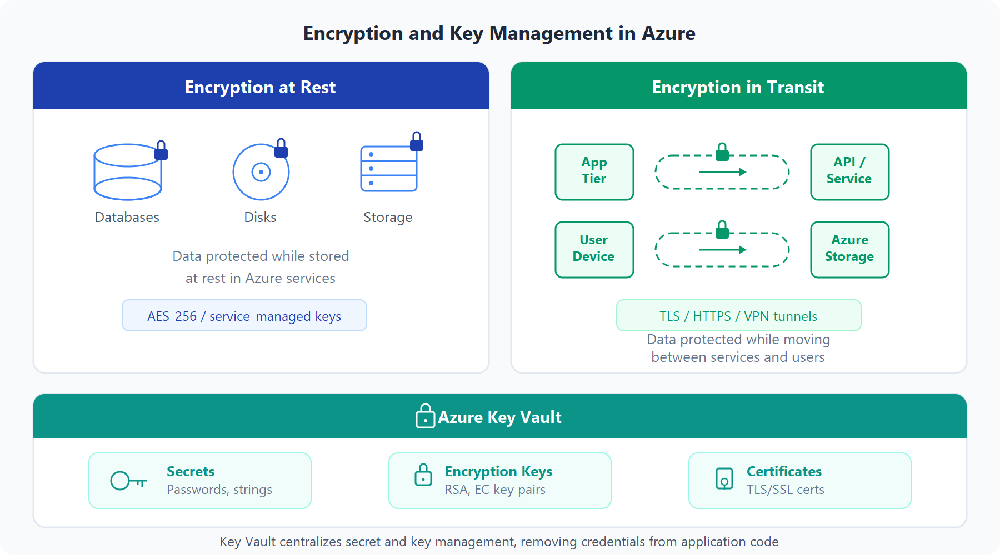

## Esempio pratico
Si consideri un'applicazione aziendale che archivia i record dei clienti in Azure Storage e Azure SQL. I dati devono essere crittografati durante l'archiviazione in tali servizi e durante lo spostamento tra livelli applicazione, API e dispositivi utente.

## Gestione delle chiavi con Azure Key Vault
Azure Key Vault è un servizio per archiviare e controllare in modo sicuro l'accesso a:

- Segreti (ad esempio stringhe di connessione e password)
- Chiavi di crittografia
- Attestati
L'uso di Key Vault consente di centralizzare la gestione dei segreti e delle chiavi anziché archiviare i valori sensibili direttamente nel codice dell'applicazione o nei file di configurazione.

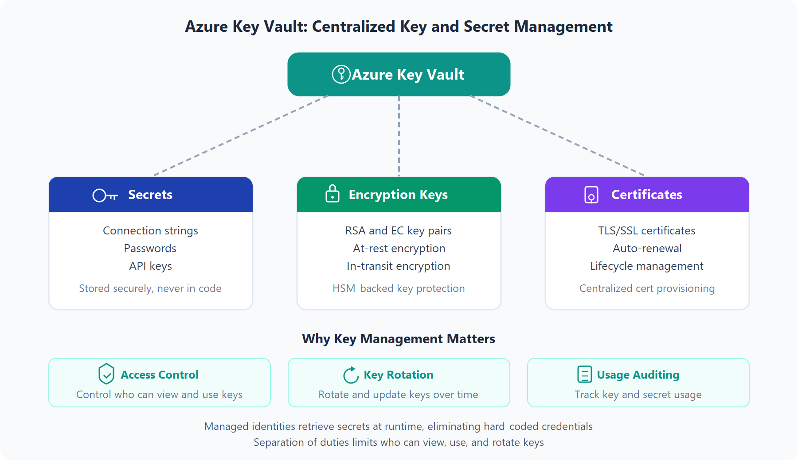

## Perché la gestione delle chiavi è importante
La gestione delle chiavi supporta gli obiettivi di sicurezza e conformità consentendo di:

- Controllare chi può accedere a chiavi e segreti
- Ruotare e aggiornare le chiavi periodicamente
- Verifica dell'utilizzo della chiave e del segreto

È anche possibile separare i compiti limitando gli utenti che possono visualizzare, usare e ruotare le chiavi. Questo approccio consente di ridurre i rischi e supporta la creazione di report sulla conformità.

Un'altra pratica comune consiste nell'impostare i criteri di rotazione delle chiavi e gli avvisi in modo che i team vengano informati prima della scadenza delle chiavi. Ciò consente di evitare interruzioni del servizio mantenendo al contempo l'igiene della chiave sicura.

Quando le applicazioni recuperano segreti da Key Vault in fase di esecuzione usando identità gestite, i team possono ridurre le credenziali hardcoded e migliorare la governance complessiva dei segreti.

A livello di nozioni fondamentali, tenere presente che Azure Key Vault è il servizio di Azure primario per l'archiviazione sicura di chiavi e segreti.

# Descrivere Microsoft Defender per il cloud

Defender for Cloud è una gestione del comportamento di sicurezza e un servizio di protezione dalle minacce. Monitora le risorse cloud, locali, ibride e multicloud e fornisce raccomandazioni e avvisi per migliorare il comportamento di sicurezza.

Defender for Cloud consente di rafforzare le risorse, tenere traccia dei rischi e rispondere alle minacce. In Azure è integrato in modo nativo e può essere abilitato rapidamente.

## Copertura tra ambienti cloud e ibridi
Poiché Defender for Cloud è nativo di Azure, molti servizi di Azure possono essere monitorati senza una distribuzione aggiuntiva. Per le aree ibride e multicloud, Defender for Cloud estende la visibilità in modo che i team di sicurezza possano lavorare da un piano di controllo.

Quando necessario, Defender for Cloud può distribuire componenti di raccolta dati per informazioni dettagliate sulla sicurezza. Azure Arc può estendere i piani di Microsoft Defender a computer non Azure e le funzionalità di Gestione del comportamento di sicurezza cloud (CSPM) possono valutare le risorse multicloud senza agente.

## Protezioni native di Azure
Defender per il cloud consente di rilevare le minacce in:

- **Servizi PaaS di Azure**: rileva le minacce tra i servizi, ad esempio Servizio app, Azure SQL e Archiviazione di Azure.
- **Servizi dati di Azure**: fornisce valutazioni e consigli sulla sicurezza dei dati per servizi come Azure SQL e Archiviazione.
- **Reti**: Consente di ridurre l'esposizione a forza bruta tramite controlli quali l'accesso just-in-time alle macchine virtuali e i criteri restrittivi sulle porte.

## Proteggere le risorse ibride
Oltre alla copertura di Azure, Defender for Cloud può proteggere i server non di Azure in ambienti ibridi e assegnare priorità agli avvisi in base all'ambiente in uso.

Per estendere la protezione ai computer locali, distribuire Azure Arc e abilitare le funzionalità di sicurezza avanzate di Defender per il cloud.

## Proteggere le risorse in esecuzione in altri cloud
Defender for Cloud può anche proteggere le risorse in altri cloud, tra cui AWS e GCP.

Per gli ambienti AWS connessi, Defender for Cloud può:

- Estendere le raccomandazioni e le valutazioni di conformità cspm alle risorse AWS.
- Estendere le protezioni di Defender per contenitori ai cluster Amazon EKS.
- Estendere le protezioni di Defender per server alle istanze EC2.

## Valutare, proteggere e difendere
Defender per il cloud soddisfa tre esigenze fondamentali man mano che si gestisce la sicurezza delle risorse e dei carichi di lavoro nel cloud e in locale:

- Valuta continuamente – conosci la tua postura di sicurezza. Identificare e tenere traccia delle vulnerabilità.
- Sicuro: rafforzare le risorse e i servizi con il benchmark di sicurezza cloud Microsoft (MCSB).
- Difendere: rilevare e risolvere le minacce a risorse, carichi di lavoro e servizi.

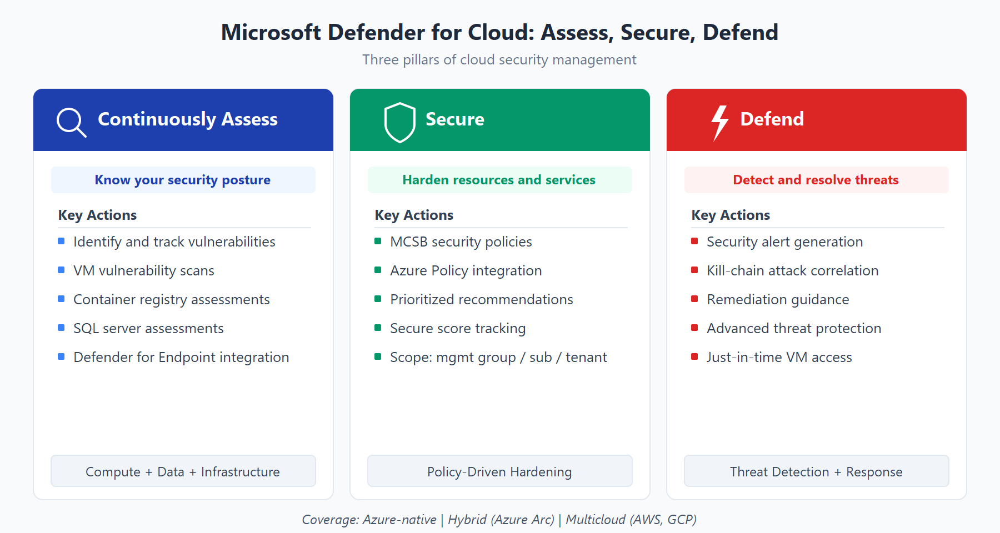

### Valutare in modo continuativo
Defender for Cloud consente di valutare continuamente l'ambiente. Include la valutazione della vulnerabilità per macchine virtuali, registri contenitori e server SQL.

Microsoft Defender per server include l'integrazione nativa e automatica con Microsoft Defender per endpoint. Con questa integrazione abilitata, si avrà accesso ai risultati della vulnerabilità di Microsoft Defender Vulnerability Management.

Insieme, questi strumenti offrono visibilità regolare delle vulnerabilità tra calcolo, dati e infrastruttura da un'esperienza unificata.

### Sicurezza
Per proteggere i carichi di lavoro, sono necessari criteri allineati all'ambiente. Defender for Cloud si basa su Criteri di Azure, in modo che i controlli possano essere definiti a livello di gruppo di gestione, sottoscrizione o tenant.

Man mano che vengono distribuite nuove risorse, Defender for Cloud li valuta in base alle procedure consigliate e presenta raccomandazioni con priorità. Queste raccomandazioni sono allineate alle linee guida di Microsoft Cloud Security Benchmark (MCSB).

Defender for Cloud raggruppa le raccomandazioni nei controlli di sicurezza e calcola un punteggio di sicurezza in modo che i team possano comprendere rapidamente la postura e dare priorità ai miglioramenti.

### Difendere
Le prime due aree sono incentrate sulla valutazione, il monitoraggio e la gestione dell'ambiente. Defender for Cloud difende anche l'ambiente fornendo avvisi di sicurezza e funzionalità avanzate di protezione dalle minacce.

### Avvisi di sicurezza
Quando Defender per il cloud rileva una minaccia in qualsiasi area dell'ambiente, genera un avviso di sicurezza. Avvisi di sicurezza:

Descrivono in dettaglio le risorse interessate
Suggeriscono i passaggi per la correzione
Forniscono, in alcuni casi, un'opzione per attivare un'app per la logica in risposta

Se un avviso viene generato da Defender for Cloud o ricevuto da un prodotto di sicurezza integrato, è possibile esportarlo. Defender for Cloud usa anche l'analisi della kill chain per correlare automaticamente gli avvisi correlati, consentendo di visualizzare la storia completa di un attacco, dove è stata avviata, quali risorse sono state interessate e quale impatto ha avuto.

### Protezione avanzata dalle minacce
Defender for Cloud offre protezione avanzata dalle minacce per risorse quali macchine virtuali, database SQL, contenitori, applicazioni Web e reti. Le protezioni includono l'accesso just-in-time alle macchine virtuali e i controlli adattivi delle applicazioni.

