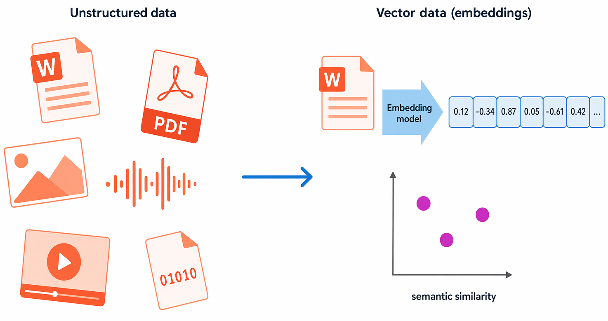
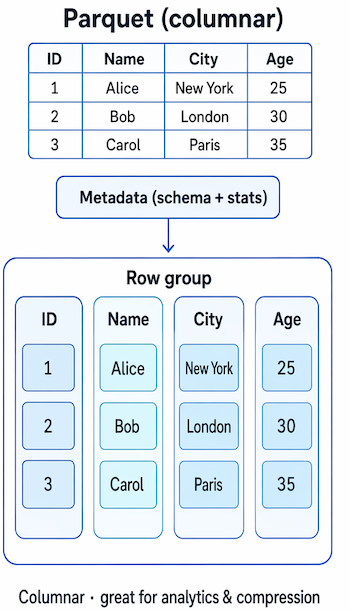
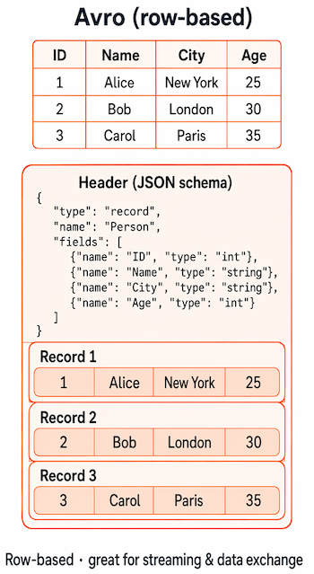
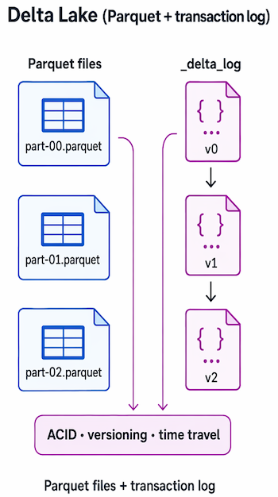

# Esplorare i concetti fondamentali sui dati

## Introduzione

Negli ultimi decenni, la quantità di dati generati da sistemi, applicazioni e dispositivi è aumentata in modo significativo. I dati si trovano ovunque, in un'ampia varietà di strutture e formati.

Ma non solo: è sempre più facile raccogliere i dati ed è sempre più economico archiviarli, risultando così accessibili a quasi tutte le aziende. Le soluzioni per i dati includono piattaforme e tecnologie software che semplificano la raccolta, l'analisi e l'archiviazione di informazioni importanti. Ogni azienda vuole aumentare i ricavi e i profitti. In un mercato così competitivo i dati sono una risorsa preziosa. Se analizzati correttamente, i dati forniscono innumerevoli informazioni utili e aiutano a prendere decisioni aziendali critiche.

La capacità di acquisire, archiviare e analizzare i dati è un requisito fondamentale per ogni azienda a livello mondiale. In questo modulo si acquisirà familiarità con le opzioni per la rappresentazione e l'archiviazione dei dati e sui principali carichi di lavoro dei dati. Completando questo modulo, si acquisiranno le basi per apprendere le tecniche e i servizi più usati per eseguire operazioni sui dati.

## Identificare i formati di dati

I dati sono una raccolta di fatti, ad esempio numeri, descrizioni e osservazioni, usati per registrare le informazioni. Le strutture di dati in cui questi dati sono organizzati spesso rappresentano entità importanti per un’organizzazione, ad esempio clienti, prodotti, ordini di vendita e così via. Ogni *entità* ha in genere uno o più *attributi* o caratteristiche, ad esempio un cliente potrebbe avere un nome, un indirizzo, un numero di telefono e così via.

È possibile classificare i dati come *strutturati*, *semistrutturati* o *non strutturati*.

### Dati strutturati

I dati strutturati sono dati che rispettano uno schema fisso e quindi hanno tutti gli stessi campi o le stesse proprietà. In genere, lo schema per le entità di dati strutturate è *tabulare*. In altre parole, i dati vengono rappresentati in una o più tabelle costituite da righe che rappresentano ogni istanza di un'entità dati e colonne che rappresentano gli attributi dell'entità. Ad esempio, l'immagine seguente mostra rappresentazioni di dati tabulari per le entità *Customer* e *Product*.

::: {#tbl-clienti-example}
| CustomerID | FirstName | LastName | Email | City |
|---|---|---|---|---|
| 1001 | Joe | Jones | joe@litware.com | Seattle |
| 1002 | Samir | Nadoy | samir@northwind.com | Redmond |
| 1003 | Anna | Lee | anna@contoso.com | Portland |
| 1004 | Marco | Diaz | marco@adventure.com | Boston |

Tabella clienti
:::

::: {#tbl-prodotti-example}
| ProductID | Name | Category | Price |
|---|---|---|---|
| 501 | Mountain Bike | Bikes | $799.99 |
| 502 | Helmet | Accessories | $59.99 |
| 503 | Water Bottle | Accessories | $14.99 |
| 504 | Road Tire | Components | $39.99 |

Tabella Prodotti
:::

I dati strutturati vengono spesso archiviati in un database in cui più tabelle possono farvi riferimento usando i valori chiave in un modello *relazionale*. Questo aspetto verrà trattato in modo approfondito più avanti.

### Dati semistrutturati

I dati *semistrutturati* sono informazioni con una struttura che consente una variazione tra istanze di entità. Ad esempio, mentre la maggior parte dei clienti può avere un indirizzo di posta elettronica, alcuni possono avere più indirizzi di posta elettronica e altri potrebbero non averne affatto.

Un formato comune per i dati semistrutturati è quello *JavaScript Object Notation* (JSON). Nell'esempio seguente viene illustrata una coppia di documenti JSON che rappresentano le informazioni sul cliente. Ogni documento del cliente include informazioni su contatti e indirizzi, ma i campi specifici variano tra i clienti.

::: {#lst-json-customers}
```{.json filename="JSON"}
// Customer 1
{
  "firstName": "Joe",
  "lastName": "Jones",
  "address":
  {
    "streetAddress": "1 Main St.",
    "city": "New York",
    "state": "NY",
    "postalCode": "10099"
  },
  "contact":
  [
    {
      "type": "home",
      "number": "555 123-1234"
    },
    {
      "type": "email",
      "address": "joe@litware.com"
    }
  ]
}

// Customer 2
{
  "firstName": "Samir",
  "lastName": "Nadoy",
  "address":
  {
    "streetAddress": "123 Elm Pl.",
    "unit": "500",
    "city": "Seattle",
    "state": "WA",
    "postalCode": "98999"
  },
  "contact":
  [
    {
      "type": "email",
      "address": "samir@northwind.com"
    }
  ]
}
```
Esempio codice JSON 
:::

:::{.callout-note}
JSON è solo uno dei molti modi in cui è possibile rappresentare i dati semistrutturati. Il punto qui non è fornire un esame dettagliato della sintassi JSON, ma piuttosto illustrare la natura flessibile delle rappresentazioni di dati semistrutturate.
:::

### Dati non strutturati

Non tutti i dati sono strutturati o semistrutturati. Documenti, immagini, dati audio e video e file binari, ad esempio, possono non avere una struttura specifica. Questo tipo di dati viene definito dati non strutturati.

::: {#fig-dati-non-strutturati fig-cap="Dati non strutturati"}
{width=60% fig-align="center"}
:::

Le organizzazioni lavorano sempre più spesso con i **dati vettoriali** (detti anche incorporamenti), ovvero il tipo di dati che consente agli assistenti di intelligenza artificiale di rispondere alle domande sui propri documenti e dati.

### Depositi dati

Le organizzazioni in genere archiviano i dati in formato strutturato, semistrutturato o non strutturato per registrare i dettagli delle entità (ad esempio, clienti e prodotti), eventi specifici (ad esempio transazioni di vendita) o altre informazioni in documenti, immagini e altri formati. I dati archiviati possono quindi essere recuperati per l'analisi e la creazione di report in un secondo momento.

Esistono due ampie categorie di archivio dati usati in genere:

- Archivi file
- Database

Entrambi questi tipi di archivio dati verranno esaminati negli argomenti successivi.

## Esplorare l'archiviazione di file

La possibilità di archiviare i dati nei file è un elemento fondamentale di qualsiasi sistema informatico. I file possono essere archiviati in file system locali sul disco rigido del personal computer e su supporti rimovibili come le unità USB, ma nella maggior parte delle organizzazioni, i file di dati importanti vengono archiviati centralmente in un qualche tipo di sistema di archiviazione di file condiviso. Sempre più spesso la posizione di archiviazione centrale è ospitata nel cloud, consentendo uno spazio di archiviazione economico, sicuro e affidabile per grandi volumi di dati.

Il formato di file specifico usato per archiviare i dati dipende da molti fattori, tra cui:

- Tipo di dati archiviati (strutturati, semistrutturati o non strutturati).
- Applicazioni e servizi che devono leggere, scrivere ed elaborare i dati.
- La necessità che i file di dati siano leggibili o ottimizzati per un'efficiente archiviazione ed elaborazione.
  
Di seguito sono illustrati alcuni formati di file comuni.

### File di testo delimitati

I dati vengono spesso archiviati in formato testo normale con delimitatori di campo specifici e terminatori di riga. Il formato più comune per i dati delimitati è costituito da valori delimitati da virgole (CSV), in cui i campi sono separati da virgole e le righe vengono terminate da un ritorno a capo/una nuova riga. Facoltativamente, la prima riga può includere i nomi dei campi. Altri formati comuni includono valori delimitati da tabulazioni (TSV) e da spazi, in cui si usano tabulazioni o spazi per separare i campi, e dati a larghezza fissa in cui a ogni campo viene assegnato un numero fisso di caratteri. Il testo delimitato rappresenta un'opzione valida per i dati strutturati a cui è necessario accedere da un'ampia gamma di applicazioni e servizi in un formato leggibile.

L'esempio seguente mostra i dati dei clienti in formato delimitato da virgole:

:::{#lst-csv lst-cap = "Esempio CSV"}
:::{.sourceCode}
```{.csv filename="CSV"}
FirstName,LastName,Email
Joe,Jones,joe@litware.com
```
:::
:::

### JavaScript Object Notation (JSON)

JSON è un formato universale in cui si usa uno schema di documento gerarchico per definire entità di dati (oggetti) che hanno più attributi. Ogni attributo può essere un oggetto (o una raccolta di oggetti), rendendo JSON un formato flessibile adatto sia per i dati strutturati che per i dati semistrutturati.

L'esempio seguente mostra un documento JSON contenente una raccolta di clienti. Ogni cliente ha tre attributi (firstName, lastName e contact) e l'attributo contact contiene una raccolta di oggetti che rappresentano uno o più metodi di contatto (posta elettronica o telefono). Gli oggetti sono racchiusi tra parentesi graffe (`{..}`) e le raccolte sono racchiuse tra parentesi quadre (`[..]`). Gli attributi sono rappresentati da coppie nome:valore e separate da virgole (`,`).

:::{#lst-json-customers2}
```{.json filename="JSON"}
{
  "customers":
  [
    {
      "firstName": "Joe",
      "lastName": "Jones",
      "contact":
      [
        {
          "type": "home",
          "number": "555 123-1234"
        },
        {
          "type": "email",
          "address": "joe@litware.com"
        }
      ]
    },
    {
      "firstName": "Samir",
      "lastName": "Nadoy",
      "contact":
      [
        {
          "type": "email",
          "address": "samir@northwind.com"
        }
      ]
    }
  ]
}
```
Esempio codice JSON 
:::

### Extensible Markup Language (XML)
XML è un formato di dati leggibile diffuso negli anni '90 e 2000. È stato in gran parte superato dal meno dettagliato formato JSON, ma esistono ancora alcuni sistemi che usano XML per rappresentare i dati. XML usa tag racchiusi tra parentesi angolari (<.. />) per definire elementi e attributi, come illustrato in questo esempio:

:::{#lst-XML-example}
```{.xml filename="XML"}
<Customers>
  <Customer name="Joe" lastName="Jones">
    <ContactDetails>
      <Contact type="home" number="555 123-1234"/>
      <Contact type="email" address="joe@litware.com"/>
    </ContactDetails>
  </Customer>
  <Customer name="Samir" lastName="Nadoy">
    <ContactDetails>
      <Contact type="email" address="samir@northwind.com"/>
    </ContactDetails>
  </Customer>
</Customers>
```
Esempio XML
:::

### Oggetto binario di grandi dimensioni (BLOB)
In definitiva, tutti i file vengono archiviati come dati binari (1 e 0), ma nei formati leggibili descritti sopra, i byte di dati binari vengono mappati a caratteri stampabili (in genere attraverso uno schema di codifica dei caratteri come ASCII o Unicode). Alcuni formati di file, tuttavia, in particolare per i dati non strutturati, archiviano i dati come file binari non elaborati che devono essere interpretati dalle applicazioni e sottoposti a rendering. I tipi comuni di dati archiviati come binari includono immagini, video, audio e documenti specifici delle applicazioni.

Quando si usano dati come questo, i professionisti dei dati spesso fanno riferimento ai file di dati come BLOB (oggetti binari di grandi dimensioni).

### Formati di file ottimizzati

Anche se i formati leggibili per i dati strutturati e semistrutturati possono essere utili, in genere non sono ottimizzati per lo spazio di archiviazione o l'elaborazione. Nel corso del tempo sono stati sviluppati alcuni formati di file specializzati che consentono la compressione, l'indicizzazione e l'archiviazione e l'elaborazione efficienti.

Alcuni formati di file ottimizzati comuni che potrebbero essere visualizzati includono Parquet e Avro:

- *Parquet* è un formato di dati a colonne e lo standard de facto   per data lakehouse moderni. Si tratta di un progetto Apache. I file Parquet contengono gruppi di righe. I dati di ogni colonna vengono archiviati insieme nello stesso gruppo di righe. Ogni gruppo di righe contiene uno o più blocchi di dati. Un file Parquet include metadati che descrivono il set di righe trovato in ogni blocco. Un'applicazione può usare questi metadati per individuare rapidamente il blocco corretto per un determinato set di righe e recuperare i dati nelle colonne specificate per queste righe. Parquet è specializzata nell'archiviazione e nell'elaborazione efficiente dei tipi di dati annidati e supporta schemi di compressione e codifica efficienti.

::: {#fig-parquet fig-cap="Parquet"}
{width=40% fig-align="center"}
:::

- **Avro** è un formato basato su righe. È stato creato da Apache. Ogni file contiene un'intestazione che descrive la struttura dei dati nel file. Questa intestazione viene archiviata come JSON. I dati vengono archiviati come informazioni binarie in uno o più blocchi di record. Un'applicazione usa le informazioni nell'intestazione per analizzare i dati binari ed estrarre i campi al suo interno. Avro è un buon formato per comprimere i dati e ridurre al minimo i requisiti di archiviazione e di larghezza di banda di rete.

::: {#fig-avro fig-cap="Avro"}
{width=40% fig-align="center"}
:::

- **Delta Lake** è un formato di archiviazione open source basato su Parquet aggiungendo un log delle transazioni, che consente transazioni ACID, controllo delle versioni dei dati e aggiornamenti affidabili sui file archiviati in un data lake.

::: {#fig-avro fig-cap="Delta Lake"}
{width=40% fig-align="center"}
:::

## Esplorare i database

Un database viene usato per definire un sistema centrale in cui è possibile archiviare i dati ed eseguirne le query. In parole semplice, il file system in cui vengono archiviati i file è un tipo di database, ma, quando si usa il termine in un contesto dei dati professionale, in genere si intende un sistema dedicato per la gestione dei record di dati invece che dei file.

### Database relazionali

I database relazionali vengono comunemente usati per archiviare i dati strutturati ed eseguire query su di essi. I dati vengono archiviati in tabelle che rappresentano entità, ad esempio clienti, prodotti o ordini di vendita. A ogni istanza di un'entità viene assegnata a una chiave primaria che la identifica in modo univoco. Queste chiavi vengono usate per fare riferimento all'istanza dell'entità in altre tabelle. È ad esempio possibile fare riferimento alla chiave primaria di un cliente in un record dell'ordine di vendita per indicare quale cliente ha inserito l'ordine. Questo uso delle chiavi per fare riferimento alle entità dei dati consente a un database relazionale di essere normalizzato, il che in parte significa eliminare i valori di dati duplicati in modo che, ad esempio, i dettagli di un singolo cliente vengano archiviati una sola volta e non per ogni ordine di vendita inserito dal cliente. Le tabelle vengono gestite e sottoposte a query usando Structured Query Language (SQL), basato su uno standard ANSI e quindi simile a più sistemi di database.

::: {#fig-sql-table fig-cap="Database Relazionali"}
{fig-align="center"}
:::

### Database non relazionali
I database non relazionali sono sistemi di gestione dei dati che non applicano uno schema relazionale ai dati. I database non relazionali vengono spesso definiti database NoSQL, anche se alcuni supportano una variante del linguaggio SQL.

Esistono quattro tipi comuni di database non relazionali comunemente in uso.

1. **Database di coppie chiave-valore** in cui ogni record è costituito da una chiave univoca e da un valore associato, in qualsiasi formato.

::: {#fig-db-docs fig-cap="Database Chiave Valore"}
{width=25% fig-align="center"}
:::
   
2. **Database di documenti**, che sono un tipo specifico di database di coppie chiave-valore in cui il valore è un documento JSON (che il sistema è ottimizzato per analizzare e sottoporre a query)

::: {#fig-db-dics fig-cap="Database di Documenti"}
{width=50% fig-align="center"}
:::

3. **Database della famiglia di colonne**, che archiviano i dati tabulari che comprendono righe e colonne, ma è possibile dividere le colonne in gruppi noti come famiglie di colonne. Ogni famiglia di colonne include un set di colonne logicamente correlate tra loro.

::: {#fig-db-fam fig-cap="Database Famiglia Di Colonne"}
{width=50% fig-align="center"}
:::

4. **Database a grafo**, che archiviano le entità come nodi con collegamenti per definire le relazioni tra di esse.

::: {#fig-db-grafo fig-cap="Database a Grafo"}
{width=50% fig-align="center"}
:::

## Esplorare l'elaborazione dei dati transazionali

Un sistema di elaborazione dati transazionale è spesso ciò che la maggior parte delle persone considera la funzione principale dell'informatica aziendale. Un sistema transazionale registra le transazioni che incapsulano eventi specifici di cui un'organizzazione desidera tenere traccia. Una transazione può essere finanziaria, ad esempio lo spostamento di denaro tra conti in un sistema bancario, oppure può far parte di un sistema di vendita al dettaglio, per tenere traccia dei pagamenti dei clienti per merci e servizi. È possibile paragonare una transazione a un'unità di lavoro piccola e discreta.

I sistemi transazionali gestiscono spesso un volume elevato, a volte fino a molti milioni di transazioni in un solo giorno. I dati elaborati devono essere accessibili rapidamente. Il lavoro eseguito dai sistemi transazionali viene spesso definito OLTP (Online Transactional Processing).

{width=50% fig-align="center"}

Per rendere concrete le seguenti proprietà, immagina un bonifico bancario di 40 dal conto A (saldo iniziale $ 100) al Conto B (saldo iniziale $ 50): il sistema deve addebitare conto A e conto B come un'unica operazione affidabile.

{width=50% fig-align="center"}

A questo scopo, i sistemi OLTP applicano transazioni che supportano la semantica nota come ACID:

- **Atomicità**: ogni transazione viene considerata come una singola unità, che ha esito positivo o negativo nella sua interezza. Ad esempio, una transazione che ha coinvolto l'addebito di fondi da un conto e il credito dello stesso importo a un altro conto deve completare entrambe le azioni. Se non è possibile completare un'azione, l'altra azione correlata deve avere esito negativo.

{width=50% fig-align="center"}

- **Coerenza**: le transazioni possono solo spostare i dati del database da uno stato valido a un altro. Per continuare con l'esempio di debito e credito precedente, lo stato completato della transazione deve riflettere il trasferimento di fondi da un conto all'altro.

{width=50% fig-align="center"}

- **Isolamento** : le transazioni simultanee non possono interferire tra loro e devono comportare uno stato coerente del database. Ad esempio, mentre la transazione per trasferire fondi da un conto a un altro è in elaborazione, un'altra transazione che controlla il saldo di questi conti deve generare risultati coerenti: la transazione che controlla il saldo non può recuperare un valore per un conto che riflette il saldo prima del trasferimento e un valore per l'altro conto che riflette il saldo dopo il trasferimento.

{width=50% fig-align="center"}

- **Durabilità** – quando una transazione è stata confermata, rimarrà confermata. Al termine della transazione di trasferimento conto, i saldi del conto modificati vengono mantenuti in modo che, anche se il sistema di database dovesse essere spento, la transazione di cui è stato eseguito il commit verrebbe riflessa quando viene nuovamente attivata.

{width=50% fig-align="center"}

I sistemi OLTP vengono in genere usati per supportare applicazioni live che elaborano i dati aziendali, spesso denominate applicazioni line of business (LOB).

## Esplorare l'elaborazione dei dati analitici

Per l'elaborazione dei dati analitici vengono in genere usati sistemi di sola lettura (o principalmente di lettura) che archiviano grandi volumi di dati cronologici o metriche aziendali. Le analisi possono essere basate su uno snapshot dei dati in un determinato momento o su una serie di snapshot.

Gli specifici dettagli per un sistema di elaborazione analitica possono variare in base alla specifica soluzione, ma un'architettura comune per l'analisi su scala aziendale è simile alla seguente:

{width=60% fig-align="center"}

1. I dati operativi vengono estratti, trasformati e caricati (**ETL**) in un data lake per l'analisi oppure estratti e caricati prima con trasformazioni applicate successivamente, un modello denominato **ELT** comune nei lakehouse moderni.
2. I dati vengono caricati in uno schema di tabelle, in genere in un *data lakehouse* con astrazioni tabulari sui file nel data lake o in un *data warehouse* con un motore SQL completamente relazionale.
3. I dati nel data warehouse possono essere aggregati e caricati in un modello **OLAP** (Online Analytical Processing), oggi più comunemente definito *modello semantico* (e storicamente un *cubo*). I valori numerici aggregati (*misure*) provenienti dalle tabelle dei fatti vengono calcolati in base alle intersezioni delle tabelle delle *dimensioni*. Ad esempio, è possibile calcolare i totali dei ricavi delle vendite per data, cliente e prodotto. Power BI modelli semantici sono l'esempio più comune che si incontrerà.
4. I dati inclusi nel data lake, nel data warehouse e nel modello analitico possono essere sottoposti a query in modo da produrre report, visualizzazioni e dashboard.

L''uso di *data lake* è una pratica comune per gli scenari di elaborazione analitica dei dati su larga scala, in cui è necessario raccogliere e analizzare un volume elevato di dati basati su file.

I *data warehouse* sono un modo stabilito per archiviare i dati in uno schema relazionale ottimizzato per le operazioni di lettura, principalmente query per supportare la creazione di report e la visualizzazione dei dati.

*Data Lakehouses* è un'innovazione più recente che combina l'archiviazione flessibile e scalabile di un data lake con la semantica di query relazionale di un data warehouse. Lo schema di tabelle può richiedere una denormalizzazione dei dati in un'origine dati OLTP, introducendo una duplicazione per rendere più veloce l'esecuzione di query.

Un modello OLAP (o *modello semantico*) è un tipo aggregato di archiviazione dei dati ottimizzato per i carichi di lavoro analitici. Le aggregazioni dei dati si trovano in dimensioni a livelli diversi, consentendo di eseguire il *drill-up/down* per visualizzare le aggregazioni a più livelli gerarchici; ad esempio, per trovare le vendite totali per area, per città o per un singolo indirizzo. Poiché i dati sono preaggregati, le query per restituire i riepiloghi contenuti possono essere eseguite rapidamente.

Diversi tipi di utenti possono eseguire operazioni analitiche sui dati in diverse fasi dell'architettura complessiva. Ad esempio:

- Gli scienziati dei dati possono lavorare direttamente con i file di dati in un data lake per esplorare e modellare i dati.
- Gli analisti dei dati possono eseguire query sulle tabelle direttamente nel data warehouse per produrre report e visualizzazioni complesse.
- Gli utenti aziendali possono utilizzare dati preaggregati in un modello analitico sotto forma di report o dashboard.

### Piattaforme di analisi moderne

Azure offre diversi servizi gestiti che coprono la pipeline di analisi completa, dall'inserimento di dati non elaborati a report interattivi. Due piattaforme "all-in-one" riuniscono la maggior parte di queste funzionalità in un'unica area di lavoro. **Microsoft Fabric** e **Azure Databricks** sono queste due piattaforme; un terzo servizio,** Microsoft Purview**, incentrato sulla governance dei dati in tutte le origini. Non è ancora necessario avere familiarità con nessuno di questi servizi. Le descrizioni seguenti offrono un'idea generale di ciò che ognuno fa.

**Microsoft Fabric** è una piattaforma di analisi SaaS (Software as a Service) unificata che offre funzionalità di archiviazione, ingegneria dei dati, data warehousing e creazione di report in un'unica area di lavoro. **Azure Databricks** è una piattaforma di analisi cloud creata per data engineering e data science su larga scala, usando **Delta Lake**, Parquet e un log delle transazioni che consente il controllo delle versioni e le transazioni ACID, come formato di archiviazione standard. **Microsoft Purview** offre sicurezza unificata dei dati, governance e conformità, consentendo di individuare, classificare, proteggere e gestire i dati in tutte le origini dati.

{width=70% fig-align="center"}

### Organizzazione dei dati con l'architettura Medallion
Uno schema comune per organizzare i dati in un lakehouse è l'architettura medallion, che si articola in tre livelli:

- **Bronze**: dati non elaborati inseriti as-is dai sistemi di origine, senza trasformazioni applicate, mantenendo i record originali per la rielaborazione.
- **Silver**: dati puliti e conformi, con duplicati rimossi e tipi di dati standardizzati.
- **Gold**: dati aggregati e pronti per l'azienda modellati per casi d'uso specifici di report e analisi.

{width=60% fig-align="center"}

I team usano questo modello perché creano limiti di qualità chiari a ogni livello ed è sempre possibile rielaborare i dati dai record Bronze originali se i requisiti cambiano.

Sia Fabric che Databricks includono esperienze Copilot che consentono di esplorare i dati usando il linguaggio naturale.

# Esplorare ruoli e servizi dati

## Esplora i ruoli professionali nel mondo dei dati

Per la gestione, il controllo e l'utilizzo dei dati è disponibile un'ampia gamma di ruoli. Alcuni ruoli sono orientati all'azienda, alcuni implicano una maggiore progettazione, alcuni si focalizzano sulla ricerca e alcuni sono ruoli ibridi che combinano aspetti diversi della gestione dei dati. L'organizzazione può definire i ruoli in modo diverso o assegnare loro nomi diversi, ma i ruoli descritti in questa unità incapsulano la divisione più comune di attività e responsabilità.

I principali ruoli professionali che si occupano di dati nella maggior parte delle organizzazioni sono:

- Gli **amministratori del database** gestiscono i database, assegnano autorizzazioni agli utenti, archiviano copie di backup dei dati e ripristinano i dati in caso di errore.
- I **data engineer** gestiscono l'infrastruttura e i processi per l'integrazione dei dati nell'organizzazione, applicando routine di pulizia dei dati, identificando le regole di governance dei dati e implementando pipeline per trasferire e trasformare i dati tra sistemi.
- Gli **analisti dei dati** esplorano e analizzano i dati per creare visualizzazioni e grafici che consentono alle organizzazioni di prendere decisioni informate.
- I **tecnici di intelligenza artificiale** creano e integrano funzionalità e flussi di lavoro basati sull'intelligenza artificiale, usando modelli linguistici di grandi dimensioni, pipeline di Machine Learning e origini dati per abilitare scenari intelligenti.
 
{width=60% fig-align="center"}

:::{.callout-note}
I *ruoli* di lavoro definiscono attività e responsabilità differenziate. In alcune organizzazioni, la stessa *persona* potrebbe svolgere più ruoli; pertanto, nel ruolo di amministratore del database, potrebbe effettuare il provisioning di un database transazionale e quindi nel ruolo di data engineer potrebbe creare una pipeline per trasferire i dati dal database a un data warehouse per l'analisi.
:::

### Amministratore del database

Un amministratore di database è responsabile della progettazione, dell'implementazione, della manutenzione e degli aspetti operativi dei sistemi di database locali e basati sul cloud. È responsabile della disponibilità complessiva e delle prestazioni e ottimizzazioni coerenti del database. Collaborano con gli stakeholder per implementare criteri, strumenti e processi per i piani di backup e ripristino in seguito a un'emergenza naturale o a un errore umano.

L'amministratore del database è inoltre responsabile della gestione della sicurezza dei dati nel database, della concessione di privilegi sui dati, della concessione o della negazione dell'accesso agli utenti in base alle esigenze.

Gli strumenti di intelligenza artificiale vengono sempre più usati dagli amministratori di database per risolvere i problemi di prestazioni e creare query usando il linguaggio naturale, oltre al giudizio e alle competenze richieste dal ruolo.

### Ingegnere dei dati

Un data engineer collabora con gli stakeholder per progettare e implementare carichi di lavoro correlati ai dati, tra cui pipeline di inserimento dati, attività di pulizia e trasformazione e archivi dati per carichi di lavoro analitici. Usano un'ampia gamma di tecnologie della piattaforma dati, tra cui database relazionali e non relazionali, archivi file e flussi di dati.

Sono anche responsabili di garantire che la privacy dei dati venga mantenuta all'interno del cloud e che si estenda dagli archivi dati locali a quelli nel cloud. Sono responsabili della gestione e del monitoraggio delle pipeline di dati per garantire che i caricamenti dei dati avvengano come previsto.

Gli strumenti di intelligenza artificiale possono aiutare i data engineer con attività di sviluppo della pipeline, ad esempio la generazione di codice di trasformazione e la suggerimenti di configurazioni usando il linguaggio naturale, insieme alle decisioni sull'architettura e al giudizio sulla qualità dei dati richiesto dal ruolo.

### Analista dati

Un analista di dati consente alle aziende di massimizzare il valore degli asset di dati. È responsabile dell'esplorazione dei dati per identificare tendenze e relazioni, progettare e creare modelli analitici e abilitare funzionalità di analisi avanzate usando report e visualizzazioni.

Un analista dei dati elabora dati non elaborati in informazioni cognitive dettagliate rilevanti in base ai requisiti aziendali identificati, per fornire informazioni rilevanti.

Gli strumenti di intelligenza artificiale possono aiutare gli analisti dei dati con attività quali riepilogare i report, suggerire visualizzazioni e generare espressioni analitiche usando il linguaggio naturale, insieme alle competenze di comprensione aziendale e comunicazione necessarie per il ruolo.

### Tecnico AI

Un tecnico di intelligenza artificiale compila e integra le funzionalità basate sull'intelligenza artificiale in applicazioni e flussi di lavoro di dati. Lavorano con modelli linguistici di grandi dimensioni (LLM) — sistemi di intelligenza artificiale addestrati su vaste quantità di testo, in grado di comprendere e generare linguaggio umano — nonché con pipeline di machine learning e fonti di dati per consentire scenari intelligenti come chat sui propri dati, generazione di contenuti e classificazione automatizzata.

I tecnici di intelligenza artificiale collaborano strettamente con i data engineer per accedere e preparare i dati sottostanti e con gli analisti dei dati per visualizzare informazioni dettagliate generate dall'intelligenza artificiale nei report e nelle applicazioni. Microsoft Foundry fornisce gli strumenti e i tecnici di intelligenza artificiale della piattaforma usati per compilare, testare e distribuire queste soluzioni.

L'assistenza per l'intelligenza artificiale è fondamentale per il lavoro quotidiano del tecnico di intelligenza artificiale, generando codice, spiegando il comportamento del modello e suggerendo architetture usando il linguaggio naturale, anche se le decisioni di progettazione, la valutazione e la distribuzione responsabile dei sistemi di intelligenza artificiale rimangono chiaramente responsabilità umane.

:::{.callout-note}
I ruoli descritti qui rappresentano i ruoli principali correlati ai dati che si riscontrano nella maggior parte delle organizzazioni di medie dimensioni. Esistono ruoli aggiuntivi correlati ai dati non menzionati qui, ad esempio *data scientist* e *data architect*; e ci sono altri professionisti tecnici che lavorano con i dati, inclusi *sviluppatori* di applicazioni e *ingegneri software*.
:::

## Identificare i servizi dati

Microsoft Azure è una piattaforma cloud che supporta le applicazioni e l'infrastruttura IT per alcune delle più grandi organizzazioni del mondo. Include molti servizi per supportare soluzioni cloud, inclusi i carichi di lavoro dei dati transazionali e analitici.

Di seguito sono descritti alcuni dei servizi cloud più usati per i dati.

:::{.callout-note}
Questo articolo illustra solo alcuni dei servizi dati più usati per soluzioni transazionali e analitiche moderne. Sono disponibili anche servizi aggiuntivi. Come principiante, non è necessario memorizzare ogni servizio. L'obiettivo è quello di acquisire consapevolezza dei tipi di strumenti disponibili e dei ruoli che li usano.
:::

:::{.callout-tip}
In questa unità verranno visualizzati i termini **PaaS** (platform-as-a-service) e **SaaS** (software-as-a-service). Si tratta di modelli di distribuzione cloud: **PaaS** significa Microsoft gestisce l'infrastruttura sottostante (server, applicazione di patch, backup) in modo da concentrarsi sui dati e sulle applicazioni. **SaaS** significa che l'intero prodotto viene distribuito come servizio pronto per l'uso tramite Internet, senza dover gestire l'installazione o l'infrastruttura.
:::

### SQL di Azure {width=5%}

Azure SQL è il nome collettivo per una famiglia di soluzioni di database relazionali basate sul motore di database di Microsoft SQL Server. I servizi specifici di Azure SQL includono:

- **Database SQL di Azure**: database PaaS (piattaforma distribuita come servizio) completamente gestito ospitato in Azure.
- **Istanza gestita di SQL di Azure**: istanza ospitata di SQL Server con manutenzione automatizzata, che consente una configurazione più flessibile rispetto al database SQL di Azure, ma con più responsabilità amministrative per il proprietario.
- **Macchina virtuale di Azure SQL**: macchina virtuale con un'installazione di SQL Server, che consente la massima configurabilità con piena responsabilità della gestione.
Gli amministratori dei database in genere effettuano il provisioning e la gestione dei sistemi di database SQL di Azure per supportare applicazioni line-of-business in cui è necessario archiviare i dati transazionali.

Gli ingegneri dei dati possono usare i sistemi di database SQL di Azure come origini per le pipeline di dati che eseguono operazioni di estrazione, trasformazione e caricamento (ETL) per inserire i dati transazionali in un sistema analitico.

Gli analisti dei dati possono eseguire query direttamente sui database SQL di Azure per creare report, anche se nelle organizzazioni di grandi dimensioni i dati vengono in genere combinati con quelli provenienti da altre origini in un archivio dati analitici per supportare l'analisi aziendale.

Azure SQL include funzionalità di intelligenza artificiale predefinite che gli amministratori di database e gli sviluppatori possono usare per generare query e risolvere i problemi relativi alle prestazioni usando il linguaggio naturale.

### Database open source in Azure {width=5%}

Azure include servizi gestiti per i sistemi di database relazionali open source più diffusi, tra cui:

- **Database di Azure per MySQL**: sistema intuitivo di gestione di database open source comunemente usato nelle app dello stack LAMP (Linux, Apache, MySQL e PHP).
- **Database di Azure per PostgreSQL**: database ibrido di oggetti relazionali. È possibile archiviare i dati in tabelle relazionali, ma un database PostgreSQL consente anche di archiviare tipi di dati personalizzati, con le proprie proprietà non relazionali.

Come i sistemi di database SQL di Azure, i database relazionali open source vengono gestiti dagli amministratori dei database per supportare le applicazioni transazionali e forniscono un'origine dati per gli ingegneri dei dati che creano pipeline per soluzioni analitiche e per gli analisti dei dati che creano report.

### Azure Cosmos DB {width=5%}

Azure Cosmos DB è un sistema di database non relazionale a livello globale (NoSQL) che supporta più API (Application Programming Interface), consentendo di archiviare e gestire i dati come documenti JSON, coppie chiave-valore, famiglie di colonne e grafici.

In alcune organizzazioni, un amministratore di database può effettuare il provisioning delle istanze di Cosmos DB e gestirle, ma spesso gli sviluppatori software gestiscono l'archiviazione dei dati NoSQL come parte dell'architettura generale dell'applicazione. Gli ingegneri dei dati spesso devono integrare le origini dati di Cosmos DB in soluzioni analitiche aziendali che supportano la modellazione e la creazione di report da parte degli analisti dei dati.

Azure Cosmos DB include funzionalità di intelligenza artificiale predefinite che gli sviluppatori possono usare per esplorare ed eseguire query sui dati usando il linguaggio naturale.

### Archiviazione di Azure {width=5%}

Archiviazione di Azure è un servizio di base Azure che consente di archiviare i dati in:

- **Contenitori BLOB**: risorsa di archiviazione scalabile e conveniente per i file binari.
- **Condivisioni file**: condivisioni file di rete come quelle tipiche delle reti aziendali.
- **Tabelle**: archiviazione chiave-valore per le applicazioni che devono leggere e scrivere rapidamente i valori dei dati.

Gli ingegneri dei dati usano Archiviazione di Azure per ospitare i data lake, ovvero archivi BLOB con uno spazio dei nomi gerarchico che consente di organizzare i file in cartelle in un file system distribuito.

### Azure Data Factory {width=5%}

Azure Data Factory è un servizio Azure che consente di definire e pianificare pipeline di dati per trasferire e trasformare i dati. È possibile integrare le pipeline con altri servizi di Azure, il che consente di inserire i dati provenienti dagli archivi dati cloud, elaborare i dati usando il calcolo basato sul cloud e salvare in modo permanente i risultati in un altro archivio dati.

Azure Data Factory viene usato dagli ingegneri dei dati per creare soluzioni di estrazione, trasformazione e caricamento (ETL) che popolano gli archivi dati analitici con i dati provenienti dai sistemi transazionali dell'organizzazione. Una versione di Data Factory è integrata anche in **Microsoft Fabric** come **Fabric Data Factory, la scelta consigliata per le pipeline di analisi integrata quando tutti i dati funzionano all'interno della piattaforma Fabric.

### Microsoft Fabric {width=5%}

Microsoft Fabric è Microsoft piattaforma di analisi saaS (Software as a Service) unificata. Riunisce l'ingegneria dei dati, il data warehousing, l'analisi in tempo reale, la data science e Power BI in un'unica area di lavoro basata su browser su un unico livello di archiviazione condiviso denominato **OneLake**. Non si gestiscono server o cluster, ovvero si creano aree di lavoro ed elementi e Microsoft esegue l'infrastruttura.

All'interno di Microsoft Fabric, i professionisti dei dati lavorano con funzionalità integrate, tra cui:

- Inserimento dati ed ETL con **Fabric Data Factory**
- Analisi di Data lakehouse con **Fabric Lakehouse**
- Analisi di data warehouse con **Fabric Warehouse**
- Data Science e Machine Learning
- Real-Time Intelligence per lo streaming dei dati
- Visualizzazione dei dati con **Power BI**
- Database (database SQL e Cosmos DB in Fabric)
- Governance e gestione dei dati

I data engineer possono usare Microsoft Fabric per creare una soluzione unificata di analisi dei dati che combina pipeline di inserimento dati, data warehouse, analisi in tempo reale, business intelligence e informazioni dettagliate basate sull'intelligenza artificiale, tutte archiviate centralmente in OneLake.

Microsoft Fabric include funzionalità di intelligenza artificiale predefinite che i professionisti dei dati possono usare per compilare pipeline, scrivere SQL, generare codice notebook ed esplorare i dati usando il linguaggio naturale.

### Microsoft Fabric IQ {width=5%}
Fabric IQ è un carico di lavoro in Microsoft Fabric che unifica i dati in OneLake e fornisce un significato aziendale coerente, quindi ogni strumento e team condivide le stesse definizioni per concetti come CustomerOrder, o Product. Consente agli utenti aziendali e agli agenti di intelligenza artificiale di porre domande sui dati in linguaggio naturale, in base a una conoscenza condivisa dei dati aziendali.

### Power BI {width=5%}

Power BI è Microsoft piattaforma di business intelligence e visualizzazione dei dati. Gli analisti dei dati usano Power BI per connettersi a origini dati, creare report e dashboard interattivi e condividere informazioni dettagliate nell'organizzazione.

Power BI è disponibile come servizio autonomo ed è integrato anche in Microsoft Fabric, in cui funziona insieme alle funzionalità di data engineering e warehouse nella stessa area di lavoro. In Fabric, Power BI si connette ai dati tramite **modelli semantici, ovvero livelli analitici strutturati che definiscono misure, relazioni e logica di business.

Power BI include funzionalità di intelligenza artificiale predefinite che gli analisti dei dati possono usare per riepilogare i report, suggerire visualizzazioni, generare misure DAX e creare narrazioni scritte dai dati usando il linguaggio naturale.

### Azure Databricks {width=5%}

Azure Databricks è una piattaforma di analisi cloud basata su Apache Spark. È ottimizzato per la progettazione dei dati su larga scala, l'analisi scientifica dei dati e l'analisi SQL su formati open lakehouse, principalmente Delta Lake. Viene eseguito come servizio gestito all'interno della sottoscrizione Azure ed è una scelta comune per i team che necessitano di flussi di lavoro basati su Notebook e Spark code-first.

Gli ingegneri dei dati possono usare le competenze esistenti in Databricks e Spark per creare archivi dati analitici in Azure Databricks.

Gli analisti dei dati possono usare il supporto del notebook nativo in Azure Databricks per eseguire query e visualizzare i dati in un'interfaccia basata sul Web facile da usare.

Azure Databricks include funzionalità di intelligenza artificiale predefinite che i data engineer e gli analisti possono usare per scrivere codice Spark, generare query SQL e spiegare la logica complessa dei notebook usando il linguaggio naturale.

### Analisi di flusso di Azure {width=5%}

Analisi di flusso di Azure è un motore di elaborazione di flussi in tempo reale che acquisisce un flusso di dati da un input, applica una query per estrarre e modificare i dati dal flusso di input e scrive i risultati in un output per l'analisi o un'ulteriore elaborazione.

Gli ingegneri dei dati possono incorporare Analisi di flusso di Azure in architetture di analisi dei dati che acquisiscono i dati in streaming per l'inserimento in un archivio dati analitici o per la visualizzazione in tempo reale.

### Esplora dati di Azure {width=5%}

Esplora dati di Azure è una piattaforma di analisi dei big data completamente gestita e indipendente che consente query ad alte prestazioni sui dati di log e telemetria.

Gli analisti dei dati possono usare Esplora dati di Azure per eseguire query sui dati che includono un attributo timestamp e analizzarli, ad esempio quelli che si trovano in genere nei file di log e nei dati di telemetria di Internet delle cose (IoT).

### Microsoft Purview {width=5%}

Microsoft Purview offre una soluzione per la governance e l'individuazione dei dati a livello aziendale. È possibile usare Microsoft Purview per creare una mappa dei dati e tenere traccia della derivazione dei dati tra più origini dati e sistemi, consentendo di trovare dati attendibili per l'analisi e la creazione di report.

Gli ingegneri dei dati possono usare Microsoft Purview per applicare la governance dei dati in tutta l'azienda e garantire l'integrità dei dati usati per supportare i carichi di lavoro analitici.

### Microsoft Foundry {width=5%}


Microsoft Foundry è Microsoft Azure piattaforma distribuita come servizio (PaaS) per operazioni di IA aziendali, generatori di modelli e sviluppo di applicazioni. Fornisce gli strumenti, l'accesso ai modelli e l'infrastruttura che i tecnici di intelligenza artificiale e gli sviluppatori usano per progettare, testare e distribuire soluzioni intelligenti, tra cui applicazioni chat-over-your-data, flussi di lavoro multi-agente e pipeline di intelligenza artificiale automatizzate integrate con Azure servizi dati.

