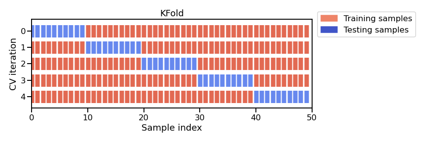

# Introduzione ai concetti di Machine Learning

## Cos'è il Machine Learning

In questa lezione, scopriremo cos'è il machine learning e i suoi concetti generali di base. Questa lezione è un'introduzione e si concentra sui concetti generali, piuttosto che sulla programmazione o sulla matematica.

In sintesi, il machine learning riguarda la creazione di modelli predittivi. Spiegherò cosa intendiamo per modelli predittivi più avanti.

## Alcuni esempi di Machine Learning

Partiamo da un paio di esempi concreti.

### Riconoscimento dei fiori

Consideriamo i fiori. L'iris è un fiore che esiste in tre varietà classiche:

- **Setosa**
- **Versicolor**
- **Virginica**

Possiamo descrivere gli iris attraverso le loro caratteristiche fisiche — lunghezza e larghezza di petali e sepali — e usare il machine learning per costruire regole che li distinguano.

| Lung. sepalo | Larg. sepalo | Lung. petalo | Larg. petalo | Tipo       |
|:------------:|:------------:|:------------:|:------------:|:----------:|
| 6 cm         | 3.4 cm       | 4.5 cm       | 1.6 cm       | versicolor |
| 5.7 cm       | 3.8 cm       | 1.7 cm       | 0.3 cm       | setosa     |
| 6.5 cm       | 3.2 cm       | 5.1 cm       | 2 cm         | virginica  |
| 5 cm         | 3 cm         | 1.6 cm       | 0.2 cm       | setosa     |

Guardando la distribuzione delle misure, si nota ad esempio che gli iris *setosa* hanno petali molto piccoli rispetto alle altre varietà — una regola che il machine learning può inferire automaticamente dai dati.

### Stima del reddito (US Census)

Un esempio più vicino a un caso d'uso aziendale: stimare il reddito di una persona a partire dai dati del censimento americano.

I dati includono informazioni demografiche variegate — età, categoria lavorativa, istruzione, stato civile, occupazione, sesso, ore settimanali lavorate, paese d'origine — e l'etichetta indica se il reddito annuo supera o meno i 50.000 dollari.

Anche in un esempio semplice come questo, avere un'intuizione immediata su molte osservazioni è difficile: la visualizzazione dei dati diventa essenziale.

## Perché usare il Machine Learning?

Gli esperti possono costruire regole decisionali dalla loro conoscenza del problema (es. un botanico sa che le *setosa* hanno petali piccoli). Il vantaggio del machine learning è che **automatizza la creazione di queste regole dai dati**, inclusi i dettagli come la soglia esatta da impostare sulla lunghezza del petalo.

## Modelli Predittivi

### Generalizzare vs. Memorizzare

Un approccio banale sarebbe memorizzare tutti i dati disponibili e, dato un nuovo individuo, predire il reddito della persona più simile nel database (strategia del *nearest neighbor*).

Su dati già visti, l'errore sarebbe zero: ogni osservazione troverebbe se stessa come corrispondenza esatta. Ma su dati nuovi, questo approccio fallirebbe, perché non esistono corrispondenze esatte.

$$\text{Generalizzare} \neq \text{Memorizzare}$$

| | |
|---|---|
| **Dati di training** | Dati usati per costruire il modello predittivo |
| **Dati di test** | Dati su cui il modello viene applicato |

I due insiemi differiscono perché il rumore è diverso e perché possono esistere combinazioni di feature mai osservate in fase di training.

### Il flusso di lavoro nel Machine Learning

Il flusso di lavoro tipico è:

1. Usare un dataset per apprendere un modello predittivo
2. Applicarlo a nuovi dati (il *test set*) per validarlo o metterlo in produzione

## Vocabolario di Base

- **Matrice dei dati $(X)$**: tabella 2D con $n\_samples$ righe e $n\_features$ colonne
- **Campioni (samples)**: le singole osservazioni (righe)
- **Feature**: le variabili descrittive di ciascuna osservazione (colonne)
- **Target $(y)$**: la proprietà da predire, di lunghezza $n\_samples$

## Tipi di Machine Learning

### Apprendimento Supervisionato

I dati sono **annotati**: ogni osservazione è associata a un'etichetta o a un valore target.

L'obiettivo è predire $y$ a partire da $X$.

Si distinguono due sottocasi:

- **Classificazione**: $y$ è discreto (categorie qualitative), es. tipo di iris
- **Regressione**: $y$ è continuo (valore numerico), es. reddito in dollari

### Apprendimento Non Supervisionato

I dati **non hanno target**. L'obiettivo è estrarre strutture o raggruppamenti dai dati che si generalizzino a nuove osservazioni (es. trovare similarità tra iris senza conoscerne il tipo a priori).

## Punti chiave

- Il machine learning **estrae dai dati regole che si generalizzano** a nuove osservazioni
- Si lavora con una matrice $X$ di dimensioni $n\_samples \times n\_features$
- Per l'apprendimento supervisionato si ha un vettore target $y$ di lunghezza $n\_samples$:
  - **numerico** per la regressione
  - **classi discrete** per la classificazione


# La pipeline di modellazione predittiva

## Introduzione

Questo modulo fornirà un esempio di una tipica pipeline di modellazione predittiva sviluppata utilizzando dati tabellari (dati strutturabili in una tabella bidimensionale). Presenteremo questa pipeline in modo progressivo. In primo luogo, analizzeremo il dataset utilizzato. Successivamente, addestreremo la nostra prima pipeline predittiva con un sottoinsieme del dataset. Quindi, presteremo particolare attenzione al tipo di dati, numerici e categorici, che il nostro modello deve gestire. Infine, estenderemo la nostra pipeline per utilizzare tipi di dati misti, ovvero dati numerici e categorici.

## Esplorazione dei dati tabellari


### Obiettivi del notebook

In questo notebook vediamo i passi necessari **prima** di qualsiasi operazione di machine learning:

- caricare i dati
- esaminare le variabili del dataset, distinguendo tra variabili numeriche e categoriali
- visualizzare la distribuzione delle variabili per capire meglio il dataset

### Caricamento del dataset Adult Census

Usiamo i dati del censimento americano del 1994, disponibili su OpenML (ID: 1590).  
Maggiori informazioni: <http://www.openml.org/d/1590>

Carichiamo il dataset direttamente tramite `sklearn`:

```{python}
from sklearn.datasets import fetch_openml
import pandas as pd

adult_census_raw = fetch_openml(data_id=1590, as_frame=True, parser="auto")
adult_census = adult_census_raw.frame

adult_census.head()
```

L'obiettivo è predire se una persona guadagna più o meno di 50.000 dollari l'anno
a partire da informazioni eterogenee: età, occupazione, istruzione, stato familiare, ecc.

### Le variabili (colonne) del dataset

Il dataset è memorizzato in un **DataFrame pandas**: una struttura dati tabellare 2D.

- Ogni **riga** è un'osservazione (anche detta *campione*, *record* o *istanza*)
- Ogni **colonna** è un tipo di informazione raccolta, chiamata **feature** (o *variabile*, *attributo*)

```{python}
adult_census
```

La colonna `class` è la nostra **variabile target** — quella che vogliamo predire.
I due valori possibili sono `<=50K` (reddito basso) e `>50K` (reddito alto):
si tratta quindi di un problema di **classificazione binaria**.

```{python}
target_column = "class"
adult_census[target_column].value_counts()
```

::: {.callout-note}
Le classi sono **sbilanciate**: ci sono molti più campioni `<=50K` rispetto a `>50K`.
Lo sbilanciamento tra classi è frequente in pratica e può richiedere tecniche specifiche
nella costruzione del modello predittivo.
:::

### Variabili numeriche e categoriali

Il dataset contiene entrambe le tipologie:

- **Numeriche**: valori continui, es. `age`
- **Categoriali**: numero finito di valori, es. `native-country`

```{python}
numerical_columns = [
    "age",
    "education-num",
    "capital-gain",
    "capital-loss",
    "hours-per-week",
]
categorical_columns = [
    "workclass",
    "education",
    "marital-status",
    "occupation",
    "relationship",
    "race",
    "sex",
    "native-country",
]
all_columns = numerical_columns + categorical_columns + [target_column]

adult_census = adult_census[all_columns]
```

Dimensioni del dataset:

```{python}
print(
    f"Il dataset contiene {adult_census.shape[0]} campioni e "
    f"{adult_census.shape[1]} colonne"
)
print(f"Il dataset contiene {adult_census.shape[1] - 1} feature.")
```

### Ispezione visiva dei dati

Prima di costruire un modello predittivo, vale la pena ispezionare i dati per:

- verificare se il problema è risolvibile senza machine learning
- controllare che le informazioni necessarie siano effettivamente presenti
- individuare peculiarità nei dati (valori mancanti, sensori difettosi, valori troncati, ecc.)

#### Distribuzione delle variabili numeriche

```{python}
_ = adult_census.hist(figsize=(20, 14))
```

:::{.callout-tip}
Nella cella precedente, abbiamo usato il seguente pattern: `_ = func()`. Lo facciamo per evitare di mostrare l'output di `func()`, che in questo caso non è molto utile. In realtà assegniamo l'output di `func()` alla variabile `_` (chiamata underscore). Per convenzione, in Python la variabile underscore viene utilizzata come variabile "spazzatura" per memorizzare risultati a cui non siamo interessati.
:::

Alcune osservazioni:

- **`age`**: pochi campioni con età > 70 (i pensionati sono stati esclusi dal dataset)
- **`education-num`**: due picchi a 10 e 13, da approfondire
- **`hours-per-week`**: picco a 40, probabilmente l'orario standard dell'epoca
- **`capital-gain` e `capital-loss`**: la maggior parte dei valori è vicina a zero

#### Distribuzione delle variabili categoriali

```{python}
adult_census["sex"].value_counts()
```

::: {.callout-warning}
Il processo di raccolta dati ha prodotto un **forte squilibrio tra campioni maschili e femminili**.
Addestrare un modello su dati così sbilanciati può causare errori di predizione sproporzionati
per i gruppi sottorappresentati — una causa tipica di problemi di **fairness**.
Per approfondire: [fairlearn.org](https://fairlearn.org)
:::

```{python}
adult_census["education"].value_counts()
```

#### Relazione tra education e education-num

I due picchi di `education-num` a 10 e 13 suggeriscono che rappresenti gli anni di istruzione.
Verifichiamo la relazione con `education`:

```{python}
pd.crosstab(
    index=adult_census["education"],
    columns=adult_census["education-num"]
)
```

Per ogni valore di `education` corrisponde **un unico valore** di `education-num`:
le due colonne sono quindi **ridondanti**. Nei notebook successivi useremo solo `education`.

::: {.callout-note}
Avere colonne ridondanti o altamente correlate non è necessariamente un problema,
ma può richiedere un trattamento speciale a seconda dell'algoritmo usato.
:::

### Pairplot per visualizzare le interazioni tra variabili

```{python}
import seaborn as sns

n_samples_to_plot = 5000
columns = ["age", "education-num", "hours-per-week"]

_ = sns.pairplot(
    data=adult_census[:n_samples_to_plot],
    vars=columns,
    hue=target_column,
    plot_kws={"alpha": 0.2},
    height=3,
    diag_kind="hist",
    diag_kws={"bins": 30},
)
```

I grafici sulla diagonale mostrano la distribuzione di ciascuna variabile per ogni classe.
Quelli fuori diagonale rivelano eventuali interazioni tra variabili.

### Costruire regole decisionali a mano

Guardando il pairplot possiamo provare a costruire regole "manuali". 
Concentriamoci su `age` e `hours-per-week`:

```{python}
import matplotlib.pyplot as plt

_ = sns.scatterplot(
    x="age",
    y="hours-per-week",
    data=adult_census[:n_samples_to_plot],
    hue=target_column,
    alpha=0.5,
)
```

Proviamo ad aggiungere soglie decisionali:

```{python}
ax = sns.scatterplot(
    x="age",
    y="hours-per-week",
    data=adult_census[:n_samples_to_plot],
    hue=target_column,
    alpha=0.5,
)

age_limit = 27
plt.axvline(x=age_limit, ymin=0, ymax=1, color="black", linestyle="--")

hours_per_week_limit = 40
plt.axhline(
    y=hours_per_week_limit, xmin=0.18, xmax=1, color="black", linestyle="--"
)

plt.annotate("<=50K", (17, 25), rotation=90, fontsize=35)
plt.annotate("<=50K", (35, 20), fontsize=35)
_ = plt.annotate("???", (45, 60), fontsize=35)
```

- **`age < 27`** (regione sinistra): quasi solo punti blu → predici reddito basso
- **`age > 27` e `hours-per-week < 40`** (in basso a destra): prevalenza blu → reddito basso
- **`age > 27` e `hours-per-week > 40`** (in alto a destra): mix di blu e arancione → difficile da classificare

Questo approccio manuale è simile a quello dei **decision tree**: anche loro costruiscono
soglie su singole feature. La differenza è che un decision tree sceglie le soglie **ottimali
automaticamente dai dati**, senza intervento umano.

### Riepilogo

In questo notebook abbiamo:

- caricato il dataset tramite `fetch_openml` di scikit-learn
- distinto variabili **numeriche** da **categoriali**
- ispezionato i dati con pandas e seaborn

Osservazioni importanti per i notebook futuri:

- un **target sbilanciato** richiede attenzione nella scelta e interpretazione delle metriche
- colonne **ridondanti** (come `education` e `education-num`) possono richiedere trattamento speciale
- i **decision tree** costruiscono regole confrontando ogni feature con una soglia,
  producendo confini decisionali paralleli agli assi

### Esercizio M1.1

Immaginiamo di essere interessati a prevedere la specie dei pinguini basandoci su due delle loro misurazioni corporee: la lunghezza del culmine e la profondità del culmine. Per prima cosa, vogliamo fare un po' di esplorazione dei dati per farci un'idea.

Quali sono le caratteristiche (features)? Qual è l'obiettivo (target)?

* **Caratteristiche (Features):** Sono le variabili di input utilizzate per fare la previsione. In questo caso, le caratteristiche sono la lunghezza del culmine e la profondità del culmine.
* **Obiettivo (Target):** È la variabile che vogliamo prevedere. In questo caso, l'obiettivo è la specie del pinguino.

```{python}
import pandas as pd

url = "https://raw.githubusercontent.com/INRIA/scikit-learn-mooc/main/datasets/penguins_classification.csv"
penguins = pd.read_csv(url)
```

Mostra alcuni campioni dei dati.

Quante caratteristiche sono numeriche? Quante caratteristiche sono categoriche?

```{python}
penguins.sample(5,random_state=11)
```

Quali sono le diverse specie di pinguini presenti nel set di dati e quanti esemplari ci sono per ciascuna specie? Suggerimento: seleziona la colonna giusta e usa il metodo `value_counts`.

```{python}
penguins["Species"].value_counts()
```

Tracciare gli istogrammi per le caratteristiche numeriche

```{python}
 _ = penguins.hist(figsize=(8, 4), bins=20, edgecolor="black", grid=False)
```

Mostra la distribuzione delle caratteristiche per ogni classe. Suggerimento: usa `seaborn.pairplot`

```{python}
import seaborn as sns

pairplot_figure = sns.pairplot(penguins, hue="Species")
pairplot_figure.fig.set_size_inches(9, 6.5)
```

Guardando queste distribuzioni, quanto pensi che sia difficile classificare i pinguini usando solo `"Culmen Depth"` e `"Culmen Length"`?

Le specie sono ragionevolmente ben separate:

- culmen length bassa → Adelie
- culmen depth bassa → Gentoo
- culmen depth alta e culmen length alta → Chinstrap

C'è una piccola sovrapposizione tra le specie, quindi ci aspettiamo che un modello statistico si comporti bene su questo dataset, ma non perfettamente.

## Addestrare un modello scikit-learn su dati numerici

###  Primo modello con scikit-learn

In questo notebook mostriamo come costruire modelli predittivi su dataset tabulari con sole feature numeriche. In particolare:

- l'API di scikit-learn: `.fit(X, y)` / `.predict(X)` / `.score(X, y)`
- come valutare la performance di generalizzazione con un train-test split

#### Caricamento del dataset

Usiamo il dataset `adult_census` già visto in precedenza, limitato alle sole colonne numeriche.

```{python}
import pandas as pd

url_train = "https://raw.githubusercontent.com/INRIA/scikit-learn-mooc/main/datasets/adult-census-numeric.csv"
adult_census = pd.read_csv(url_train)
adult_census
```

#### Separare i dati dal target

```{python}
target_name = "class"
target = adult_census[target_name]
target
```

```{python}
data = adult_census.drop(columns=[target_name])
data
```

```{python}
data.columns
data.dtypes
```

```{python}
print(
    f"Il dataset contiene {data.shape[0]} campioni e "
    f"{data.shape[1]} feature"
)
```

#### Addestrare un modello e fare previsioni

Costruiamo un modello di classificazione usando la strategia **K-nearest neighbors** (KNN): per predire il target di un nuovo campione, KNN considera i `k` campioni più vicini nel training set e predice il target maggioritario tra questi.

::: {.callout-warning}
Il KNN viene usato qui per la sua semplicità intuitiva. In pratica è raramente utile; nei notebook successivi introdurremo modelli più efficaci.
:::

```{python}
from sklearn.neighbors import KNeighborsClassifier

model = KNeighborsClassifier()
_ = model.fit(data, target)
```

{fig-align="center" width=50%}

In scikit-learn, un oggetto con un metodo `fit` è chiamato **estimator**. Il metodo `fit` è composto da due elementi: un **algoritmo di apprendimento** e degli **stati del modello**. L'algoritmo prende i dati e il target di training come input e imposta gli stati del modello, usati poi per predire o trasformare i dati.

::: {.callout-note}
In scikit-learn, `data` è comunemente chiamato `X` e `target` è comunemente chiamato `y`.
:::

```{python}
target_predicted = model.predict(data)
```

Un estimator con un metodo `predict` è chiamato **predictor**.

{fig-align="center" width=50%}


Confrontiamo le prime 5 predizioni con i valori reali:

```{python}
target_predicted[:5]
```

```{python}
target[:5]
```

```{python}
target[:5] == target_predicted[:5]
```

```{python}
print(
    "Numero di predizioni corrette: "
    f"{(target[:5] == target_predicted[:5]).sum()} / 5"
)
```

```{python}
(target == target_predicted).mean()
```

Il modello fa predizioni corrette per circa 82 campioni su 100. Tuttavia abbiamo usato gli **stessi dati** per addestrare e valutare il modello — questa valutazione può essere considerata affidabile?

#### Train-test split

Per valutare correttamente un modello è fondamentale testarlo su dati **non usati durante il training**. I dati usati per addestrare il modello si chiamano **training data**, quelli usati per valutarlo si chiamano **test data**.

```{python}
url_test = "https://raw.githubusercontent.com/INRIA/scikit-learn-mooc/main/datasets/adult-census-numeric-test.csv"
adult_census_test = pd.read_csv(url_test)

target_test = adult_census_test[target_name]
data_test = adult_census_test.drop(columns=[target_name])

print(
    f"Il dataset di test contiene {data_test.shape[0]} campioni e "
    f"{data_test.shape[1]} feature"
)
```

Il metodo `.score()` calcola automaticamente l'accuracy del modello:

```{python}
accuracy = model.score(data_test, target_test)
model_name = model.__class__.__name__

print(f"L'accuracy sul test set usando {model_name} è {accuracy:.3f}")
```

Confrontando l'accuracy sul training set (~82%) con quella sul test set, vediamo che la valutazione sul training era **ottimistica**. Questo dimostra l'importanza di valutare sempre la performance di generalizzazione su dati separati da quelli di training.

{fig-align="center" width=50%}

::: {.callout-note}
In questo corso, con **performance di generalizzazione** intendiamo il test score ottenuto confrontando le predizioni del modello con i target reali su dati mai visti. Termini equivalenti sono *predictive performance* e *statistical performance*.
:::

#### Riepilogo

In questo notebook abbiamo:

- addestrato un modello **K-nearest neighbors** su un training set
- valutato la sua performance di generalizzazione sul test set
- introdotto l'API di scikit-learn: `.fit(X, y)`, `.predict(X)`, `.score(X, y)`
- introdotto i termini *estimator*, *predictor* e *model*

### Esercizio M1.2


L'obiettivo di questo esercizio è addestrare un modello simile a quello del notebook precedente, per familiarizzare con gli oggetti di scikit-learn e in particolare con l'API `.fit` / `.predict` / `.score`.

#### Caricamento del dataset

```{python}
import pandas as pd

url_train = "https://raw.githubusercontent.com/INRIA/scikit-learn-mooc/main/datasets/adult-census-numeric.csv"
adult_census = pd.read_csv(url_train)

data = adult_census.drop(columns="class")
target = adult_census["class"]
```

#### Parametro `n_neighbors` di `KNeighborsClassifier`

Uno dei parametri di `KNeighborsClassifier` è `n_neighbors`, che controlla il numero di vicini usati per fare una predizione su un nuovo punto. Qual è il suo valore di default?

```{python}
from sklearn.neighbors import KNeighborsClassifier
```

Il valore di default di `n_neighbors` è **5**.

#### Creare il modello con `n_neighbors=50`

```{python}
model = KNeighborsClassifier(n_neighbors=50)
_ = model.fit(data,target)
```

#### Addestrare il modello

```{python}
target_predicted = model.predict(data)
```

#### Predizioni sui primi 10 campioni

Usa il modello per fare predizioni sui primi 10 campioni. Corrispondono ai valori reali del target?

```{python}
pd.DataFrame({
    "Predicted": target_predicted[:10],
    "Actual":    target[:10],
    "isEqual":   target_predicted[:10] == target[:10]
})
```

```{python}
print(
    "Numero di predizioni corrette: "
    f"{(target[:10] == target_predicted[:10]).sum()} / 10"
)
```

#### Accuracy sul training set

```{python}
accuracy = model.score(data, target)
model_name = model.__class__.__name__

print(f"L'accuracy sul training set usando {model_name} è {accuracy:.3f}")
```


#### Accuracy sul test set

```{python}
url_test = "https://raw.githubusercontent.com/INRIA/scikit-learn-mooc/main/datasets/adult-census-numeric-test.csv"

adult_census_test = pd.read_csv(url_test)

data_test = adult_census_test.drop(columns="class")
target_test = adult_census_test["class"]
```

```{python}
accuracy = model.score(data_test, target_test)
model_name = model.__class__.__name__

print(f"L'accuracy sul test set usando {model_name} è {accuracy:.3f}")
```


### Lavorare con dati numerici

Nel notebook precedente, abbiamo addestrato un modello k-nearest neighbors su alcuni dati.
Tuttavia, abbiamo semplificato eccessivamente la procedura caricando un dataset che conteneva esclusivamente dati numerici. Inoltre, abbiamo utilizzato dataset già suddivisi in set di training e test.
In questo notebook, miriamo a:
- identificare dati numerici in un dataset eterogeneo;
- selezionare il sottoinsieme di colonne corrispondenti a dati numerici;
- utilizzare un helper di scikit-learn per separare i dati in set di training e test;
- addestrare e valutare un modello scikit-learn più complesso.

Iniziamo caricando il dataset di censimento degli adulti utilizzato durante l'esplorazione dei dati.

#### Caricamento dell'intero dataset

Come nel notebook precedente, facciamo affidamento su pandas per aprire il file CSV in un dataframe pandas.

```{python}
import pandas as pd

adult_census = pd.read_csv("https://raw.githubusercontent.com/INRIA/scikit-learn-mooc/main/datasets/adult-census.csv")
# elimina la colonna duplicata `"education-num"` come indicato nel primo notebook
adult_census = adult_census.drop(columns="education-num")
adult_census
```

Il passo successivo separa il target dai dati. Abbiamo eseguito la stessa procedura nel notebook precedente.

```{python}
data, target = adult_census.drop(columns="class"), adult_census["class"]

data
```

```{python}
target
```

:::{.callout-note}
Qui e successivamente, utilizziamo il nome `data` e `target` per essere espliciti. Nella documentazione di scikit-learn, `data` è comunemente denominato $X$ e `target` è comunemente chiamato $y$.
:::

A questo punto, possiamo concentrarci sui dati che vogliamo utilizzare per addestrare il nostro modello predittivo.

#### Identificare i dati numerici

I dati numerici sono rappresentati con numeri. Sono collegati a dati misurabili (quantitativi), come l'età o il numero di ore che una persona lavora a settimana.

I modelli predittivi sono progettati nativamente per lavorare con dati numerici. Inoltre, i dati numerici di solito richiedono molto poco lavoro prima di iniziare l'addestramento.

Il primo compito qui è identificare i dati numerici nel nostro dataset.

:::{.callout-important}
I dati numerici sono rappresentati con numeri, ma i numeri non sempre rappresentano dati numerici. Le categorie potrebbero essere già codificate con numeri e potrebbe essere necessario identificare queste caratteristiche.
:::


Quindi, possiamo controllare il tipo di dato per ogni colonna nel dataset.

```{python}
data.dtypes
```

Sembra che abbiamo solo due tipi di dati: int64 e object. Possiamo assicurarci controllando i tipi di dati univoci.

```{python}
data.dtypes.unique()
```

Infatti, gli unici due tipi nel dataset sono integer `int64` e `str`. Possiamo guardare le prime righe del dataframe per comprendere il significato del tipo di dato object.

```{python}
data.sample(10, random_state=42)
```

Vediamo che il tipo di dato `str` corrisponde alle colonne contenenti stringhe. Come abbiamo visto nella sezione di esplorazione, queste colonne contengono categorie e vedremo più tardi come gestirle. Possiamo selezionare le colonne contenenti interi e controllarne il contenuto.

```{python}
numerical_columns = ["age", "capital-gain", "capital-loss", "hours-per-week"]
data[numerical_columns]
```

Ora che abbiamo limitato il dataset alle sole colonne numeriche, possiamo analizzare questi numeri per capire cosa rappresentano. Possiamo identificare due tipi di utilizzo.

La prima colonna, "age", è autoesplicativa. Possiamo notare che i valori sono continui, il che significa che possono assumere qualsiasi numero in un dato intervallo. Scopriamo quale sia questo intervallo:

```{python}
data["age"].describe()
```

Possiamo vedere che l'età varia tra 17 e 90 anni.

Potremmo estendere la nostra analisi e scopriremmo che `capital-gain`, `capital-loss` e `hours-per-week` rappresentano anche dati quantitativi.

Ora, memorizziamo il sottoinsieme di colonne numeriche in un nuovo dataframe.

```{python}
data_numeric = data[numerical_columns]
```

#### Suddividere il dataset in training e test

Nel notebook precedente, abbiamo caricato due dataset separati: uno di training e uno di test. Tuttavia, avere dataset separati in due file distinti è insolito: la maggior parte delle volte, abbiamo un singolo file contenente tutti i dati che dobbiamo suddividere una volta caricati in memoria.

Scikit-learn fornisce la funzione helper `sklearn.model_selection.train_test_split` che viene utilizzata per suddividere automaticamente il dataset in due sottoinsiemi.

```{python}
from sklearn.model_selection import train_test_split

data_train, data_test, target_train, target_test = train_test_split(
    data_numeric, target, random_state=42, test_size=0.25
)
```

:::{.callout-tip}
In scikit-learn, impostare il parametro random_state consente di ottenere risultati deterministici quando utilizziamo un generatore di numeri casuali. Nel caso di `train_test_split`, la casualità deriva dalla mescolanza dei dati, che decide come il dataset viene suddiviso in un set di training e test.
:::

Quando si chiama la funzione `train_test_split`, abbiamo specificato che desideriamo avere il $25\%$ dei campioni nel set di test mentre i campioni rimanenti ($75\%$) vengono assegnati al set di training. Possiamo verificare rapidamente se abbiamo ottenuto quello che ci aspettavamo.

```{python}
print(
    f"Numero di campioni nel test: {data_test.shape[0]} => "
    f"{data_test.shape[0] / data_numeric.shape[0] * 100:.1f}% del"
    " set originale"
)

print(
    f"Numero di campioni nel training: {data_train.shape[0]} => "
    f"{data_train.shape[0] / data_numeric.shape[0] * 100:.1f}% del"
    " set originale"
)
```

#### Addestrare e valutare un modello di regressione logistica

Nel notebook precedente, abbiamo utilizzato un modello k-nearest neighbors. Sebbene questo modello sia intuitivo da comprendere, non è ampiamente utilizzato in pratica. Ora, utilizziamo un modello più utile, chiamato regressione logistica, che appartiene alla famiglia dei modelli lineari.

:::{.callout-note}
In breve, i modelli lineari trovano un insieme di pesi per combinare linearmente le caratteristiche e prevedere il target. Ad esempio, il modello può formulare una regola del tipo:

$$0.1 \cdot \text{age} + 3.3 \cdot \text{hours-per-week} - 15.1 > 0$$

Se questa condizione è verificata, il modello predice un **alto reddito**; altrimenti, predice un **basso reddito**.
:::

I modelli lineari, e in particolare la regressione logistica, saranno trattati più dettagliatamente nel modulo "Modelli lineari" più avanti in questo corso. Per ora l'attenzione è su come utilizzare questo modello di regressione logistica in scikit-learn piuttosto che su come funziona nei dettagli.

Per creare un modello di regressione logistica in scikit-learn puoi fare:

```{python}
from sklearn.linear_model import LogisticRegression

model = LogisticRegression()
```

Ora che il modello è stato creato, puoi usarlo esattamente allo stesso modo in cui abbiamo usato il modello k-nearest neighbors nel notebook precedente. In particolare, possiamo usare il metodo fit per addestrare il modello usando i dati di training e le etichette:

```{python}
model.fit(data_train, target_train)
```

Possiamo anche usare il metodo score per verificare le prestazioni di generalizzazione del modello sul set di test.

```{python}
accuracy = model.score(data_test, target_test)
print(f"Accuratezza della regressione logistica: {accuracy:.3f}")
```

#### Riepilogo del notebook

In scikit-learn, il metodo `score` di un modello di classificazione restituisce l'accuratezza, cioè la frazione di campioni classificati correttamente. In questo caso, circa $8 / 10$ delle volte la regressione logistica predice il reddito corretto di una persona. Ora la vera domanda è: questa prestazione di generalizzazione è rilevante di un buon modello predittivo? Scoprilo risolvendo l'esercizio successivo!

In questo notebook, abbiamo imparato a:
- identificare dati numerici in un dataset eterogeneo;
- selezionare il sottoinsieme di colonne corrispondenti a dati numerici;
- utilizzare la funzione train_test_split di scikit-learn per separare i dati in un set di training e test;
- addestrare e valutare un modello di regressione logistica.

### Esercizio M1.3

L'obiettivo di questo esercizio è confrontare le prestazioni del nostro classificatore nel notebook precedente (circa 81% di accuratezza con `LogisticRegression`) con alcuni semplici classificatori baseline. Il classificatore baseline più semplice è quello che predice sempre la stessa classe, indipendentemente dai dati di input.

* Quale sarebbe il punteggio di un modello che predice sempre `' >50K'`?
* Quale sarebbe il punteggio di un modello che predice sempre `' <=50K'`?
* È un'accuratezza dell'81% o dell'82% un buon punteggio per questo problema?

Usa un `DummyClassifier` e fai una suddivisione training-test per valutare la sua accuratezza sul set di test. Questo [link](https://scikit-learn.org/stable/modules/model_evaluation.html#dummy-estimators) mostra alcuni esempi di come valutare le prestazioni di generalizzazione di questi modelli baseline.

```{python}
import pandas as pd
adult_census = pd.read_csv("https://raw.githubusercontent.com/INRIA/scikit-learn-mooc/main/datasets/adult-census.csv")
```

Innanzitutto, separiamo il target dai dati utilizzati per addestrare il nostro modello predittivo.

```{python}
target_name = "class"

target = adult_census[target_name]

data = adult_census.drop(columns=target_name)
```

Iniziamo selezionando solo le colonne numeriche come visto nel notebook precedente.

```{python}
numerical_columns = ["age", "capital-gain", "capital-loss", "hours-per-week"]

data_numeric = data[numerical_columns]
```

Suddividi i dati e il target in un set di training e test.

```{python}
from sklearn.model_selection import train_test_split

data_numeric_train, data_numeric_test, target_train, target_test = (train_test_split(data_numeric, target, random_state=42))
```

Usa un `DummyClassifier` in modo che il classificatore risultante predica sempre la classe `' >50K'`. Quale è il punteggio di accuratezza sul set di test? Ripeti l'esperimento predicendo sempre la classe `' <=50K'`.

Suggerimento: puoi impostare il parametro `strategy` di `DummyClassifier` per ottenere il comportamento desiderato.

```{python}
from sklearn.dummy import DummyClassifier
class_to_predict = " >50K"
high_revenue_clf = DummyClassifier(
    strategy="constant", constant=class_to_predict
)
high_revenue_clf.fit(data_numeric_train, target_train)
score = high_revenue_clf.score(data_numeric_test, target_test)
print(f"Accuracy of a model predicting only high revenue: {score:.3f}")
```

Notiamo chiaramente che il punteggio è inferiore a `0.5`, il che potrebbe sorprendere a prima vista. Ora verifichiamo le prestazioni di generalizzazione di un modello che prevede sempre la classe di basso fatturato, ovvero "`<=50K`".

```{python}
class_to_predict = " <=50K"
low_revenue_clf = DummyClassifier(
    strategy="constant", constant=class_to_predict
)
low_revenue_clf.fit(data_numeric_train, target_train)
score = low_revenue_clf.score(data_numeric_test, target_test)
print(f"Accuracy of a model predicting only low revenue: {score:.3f}")
```

Osserviamo che questo modello ha una precisione superiore a `0.5`. Ciò è dovuto al fatto che abbiamo $3/4$ del target appartenenti alla classe a basso reddito.

Pertanto, qualsiasi modello predittivo che dia risultati al di sotto di questo classificatore fittizio non sarebbe utile.

```{python}
adult_census["class"].value_counts()
```

```{python}
(target == " <=50K").mean()
```

In pratica potremmo avere la strategia `most_frequent` per prevedere la classe che compare di più nell'obiettivo formativo.

```{python}
most_freq_revenue_clf = DummyClassifier(strategy="most_frequent")
most_freq_revenue_clf.fit(data_numeric_train, target_train)
score = most_freq_revenue_clf.score(data_numeric_test, target_test)
print(f"Accuracy of a model predicting the most frequent class: {score:.3f}")
```

Pertanto la precisione di `LogisticRegression` (circa $81\%$) sembra migliore della precisione di `DummyClassifier` (circa $76\%$). In un certo senso è un po' rassicurante, utilizzare un modello di machine learning offre prestazioni migliori rispetto a prevedere sempre la classe maggioritaria, ovvero la classe a basso reddito "`<=50K`".

### Preprocessing per feature numeriche

In questo notebook usiamo ancora solo feature numeriche, introducendo due nuovi aspetti:

- un esempio di preprocessing: il **scaling delle variabili numeriche**
- l'uso di una **pipeline** di scikit-learn per concatenare preprocessing e training del modello

#### Preparazione dei dati

```{python}
import pandas as pd

url = "https://raw.githubusercontent.com/INRIA/scikit-learn-mooc/main/datasets/adult-census.csv"
adult_census = pd.read_csv(url)

target_name = "class"
target = adult_census[target_name]
data = adult_census.drop(columns=target_name)
```

```{python}
numerical_columns = ["age", "capital-gain", "capital-loss", "hours-per-week"]
data_numeric = data[numerical_columns]
```

```{python}
from sklearn.model_selection import train_test_split

data_train, data_test, target_train, target_test = train_test_split(
    data_numeric, target, random_state=42
)
```

#### Addestramento del modello con preprocessing

Scikit-learn offre una serie di algoritmi di preprocessing che trasformano i dati di input prima del training. In questo caso, standardizzeremo i dati e addestreremo una regressione logistica sulla nuova versione del dataset.

```{python}
data_train.describe()
```

Le feature del dataset hanno range molto diversi. Molti algoritmi fanno assunzioni sulle distribuzioni delle feature, e **normalizzarle** è generalmente utile.

::: {.callout-tip}
Alcune ragioni per scalare le feature:

- I modelli che si basano sulla distanza tra campioni (es. KNN) dovrebbero essere addestrati su feature normalizzate, affinché ciascuna contribuisca in modo approssimativamente uguale al calcolo delle distanze.
- Molti modelli come la regressione logistica usano un solver numerico basato sul *gradient descent* per trovare i parametri ottimali — questo converge più velocemente con feature scalate.

Se sia necessario o meno scalare le feature dipende dalla famiglia di modelli: i modelli lineari come la regressione logistica ne beneficiano, i decision tree no (ma non ne risentono).
:::

Usiamo il transformer `StandardScaler` di scikit-learn, che trasla e scala ogni feature individualmente in modo che abbiano media 0 e deviazione standard 1.

```{python}
from sklearn.preprocessing import StandardScaler

scaler = StandardScaler()
scaler.fit(data_train)
```

Il metodo `fit` per i transformer è simile a quello dei predictor, con la differenza che accetta un solo argomento (la matrice dei dati) anziché due (dati + target).


In questo caso, l'algoritmo calcola media e deviazione standard per ogni feature e le salva come stati del modello.

```{python}
scaler.mean_
```

```{python}
scaler.scale_
```

::: {.callout-note}
Convenzione scikit-learn: se un attributo viene appreso dai dati, il suo nome termina con un underscore (`_`), come `mean_` e `scale_` per `StandardScaler`.
:::

Una volta chiamato `fit`, possiamo trasformare i dati con il metodo `transform`:

```{python}
data_train_scaled = scaler.transform(data_train)
data_train_scaled
```


Il metodo `transform` è simile al metodo `predict` dei predictor: usa una funzione di trasformazione predefinita insieme agli stati del modello e ai dati in input. Invece di produrre predizioni, restituisce una versione trasformata dei dati.


Il metodo `fit_transform` è una scorciatoia che chiama `fit` e poi `transform` in successione:

```{python}
scaler = StandardScaler().set_output(transform="pandas")
data_train_scaled = scaler.fit_transform(data_train)
data_train_scaled.describe()
```

La media di tutte le colonne è vicina a 0 e la deviazione standard è vicina a 1. Visualizziamo l'effetto di `StandardScaler` con un jointplot: notiamo che la struttura dei dati non cambia, ma gli assi vengono traslati e scalati.

```{python}
import matplotlib.pyplot as plt
import seaborn as sns

num_points_to_plot = 300

sns.jointplot(
    data=data_train[:num_points_to_plot],
    x="age",
    y="hours-per-week",
    marginal_kws=dict(bins=15),
)
plt.suptitle(
    "Jointplot di 'age' vs 'hours-per-week'\nprima di StandardScaler", y=1.1
)

sns.jointplot(
    data=data_train_scaled[:num_points_to_plot],
    x="age",
    y="hours-per-week",
    marginal_kws=dict(bins=15),
)
_ = plt.suptitle(
    "Jointplot di 'age' vs 'hours-per-week'\ndopo StandardScaler", y=1.1
)
```

#### Pipeline

Possiamo combinare operazioni sequenziali con una `Pipeline` di scikit-learn, che concatena le operazioni e si usa come qualsiasi altro classificatore o regressore. La funzione helper `make_pipeline` crea una pipeline prendendo come argomenti le trasformazioni successive e il modello finale.

```{python}
import time
from sklearn.linear_model import LogisticRegression
from sklearn.pipeline import make_pipeline

model = make_pipeline(StandardScaler(), LogisticRegression())
model
```

`make_pipeline` assegna automaticamente un nome a ogni step basandosi sul nome della classe. Possiamo verificarlo:

```{python}
model.named_steps
```

La pipeline espone gli stessi metodi del predictor finale: `fit`, `predict` (e opzionalmente `predict_proba`, `decision_function`, `score`).

```{python}
start = time.time()
model.fit(data_train, target_train)
elapsed_time = time.time() - start
```


Quando si chiama `model.fit`, il metodo `fit_transform` di ogni transformer nella pipeline viene chiamato per:

1. apprendere gli stati interni del modello
2. trasformare i dati di training

I dati preprocessati vengono poi forniti al predictor per il training.

```{python}
predicted_target = model.predict(data_test)
predicted_target[:5]
```


Durante la predizione, il metodo `transform` di ogni transformer viene chiamato per preprocessare i dati — senza bisogno di chiamare `fit`, poiché gli stati interni sono già stati calcolati durante `model.fit`. I dati preprocessati vengono poi forniti al predictor.

```{python}
model_name = model.__class__.__name__
score = model.score(data_test, target_test)
print(
    f"L'accuracy usando {model_name} è {score:.3f} "
    f"con un tempo di fitting di {elapsed_time:.3f} secondi "
    f"in {model[-1].n_iter_[0]} iterazioni"
)
```

Confrontiamo questo risultato con il modello senza scaling:

```{python}
model = LogisticRegression()
start = time.time()
model.fit(data_train, target_train)
elapsed_time = time.time() - start

model_name = model.__class__.__name__
score = model.score(data_test, target_test)
print(
    f"L'accuracy usando {model_name} è {score:.3f} "
    f"con un tempo di fitting di {elapsed_time:.3f} secondi "
    f"in {model.n_iter_[0]} iterazioni"
)
```

Scalare i dati prima del training della regressione logistica è stato vantaggioso in termini di **performance computazionale**: il numero di iterazioni e il tempo di training sono diminuiti. La performance di generalizzazione non è cambiata perché entrambi i modelli convergono.

::: {.callout-warning}
Lavorare con dati non scalati può forzare l'algoritmo a iterare di più. Nel caso peggiore, il numero di iterazioni richieste supera il massimo consentito dal parametro `max_iter`. Quindi, prima di aumentare `max_iter`, assicurarsi che i dati siano ben scalati.
:::

#### Riepilogo

In questo notebook abbiamo:

- visto l'importanza di scalare le variabili numeriche
- usato una pipeline per concatenare scaling e training della regressione logistica

### Valutazione del modello con la cross-validation

In questo notebook usiamo ancora solo feature numeriche.

Discutiamo gli aspetti pratici della valutazione della performance di generalizzazione del nostro modello tramite cross-validation, in alternativa a un singolo train-test split.

#### Preparazione dei dati

Prima, carichiamo il dataset adult census completo.

```{python}
import pandas as pd

url = "https://raw.githubusercontent.com/INRIA/scikit-learn-mooc/main/datasets/adult-census.csv"
adult_census = pd.read_csv(url)
```

Rimuoviamo il target dai dati che useremo per addestrare il modello predittivo.

```{python}
target_name = "class"
target = adult_census[target_name]
data = adult_census.drop(columns=target_name)
```

Selezioniamo solo le colonne numeriche, come visto nel notebook precedente.

```{python}
numerical_columns = ["age", "capital-gain", "capital-loss", "hours-per-week"]
data_numeric = data[numerical_columns]
```

Possiamo ora creare un modello usando `make_pipeline` per concatenare preprocessing ed estimator in ogni iterazione della cross-validation.

```{python}
from sklearn.preprocessing import StandardScaler
from sklearn.linear_model import LogisticRegression
from sklearn.pipeline import make_pipeline

model = make_pipeline(StandardScaler(), LogisticRegression())
```

#### La necessità della cross-validation

Nel notebook precedente abbiamo diviso i dati originali in training set e test set. Il punteggio di un modello dipende in generale dal modo in cui viene effettuata questa divisione. Uno svantaggio di fare un singolo split è che non fornisce alcuna informazione su questa variabilità. Un altro svantaggio, in contesti con pochi dati, è che i dati disponibili per training e test sarebbero ancora più ridotti dopo la divisione.

In alternativa, possiamo usare la cross-validation. La cross-validation consiste nel ripetere la procedura in modo che training set e test set siano diversi ad ogni iterazione. Le metriche di performance di generalizzazione vengono raccolte per ogni ripetizione e poi aggregate. In questo modo possiamo valutare la variabilità della nostra misura della performance di generalizzazione del modello.

Si noti che esistono diverse strategie di cross-validation, ognuna delle quali definisce come ripetere la procedura fit/score. In questa sezione usiamo la strategia **K-fold**: l'intero dataset viene diviso in K partizioni. La procedura fit/score viene ripetuta $K$ volte: ad ogni iterazione, $K-1$ partizioni vengono usate per addestrare il modello e 1 partizione per valutarlo.



::: {.callout-note}
Questa figura mostra il caso particolare della strategia K-fold cross-validation. Per ogni split di cross-validation, la procedura addestra un clone del modello su tutti i campioni rossi e valuta il punteggio del modello sui campioni blu. Come accennato, esiste una varietà di strategie di cross-validation diverse. Alcuni di questi aspetti verranno trattati in maggiore dettaglio nei notebook futuri.
:::

La cross-validation è quindi **computazionalmente costosa** perché richiede di addestrare più modelli invece di uno solo.

In scikit-learn, la funzione `cross_validate` permette di eseguire la cross-validation e richiede il modello, i dati e il target. Poiché esistono diverse strategie di cross-validation, `cross_validate` accetta un parametro `cv` che definisce la strategia di splitting.

```{python}
from sklearn.model_selection import cross_validate

model = make_pipeline(StandardScaler(), LogisticRegression())
cv_result = cross_validate(model, data_numeric, target, cv=5)
cv_result
```

L'output di `cross_validate` è un dizionario Python che per default contiene tre voci:

- `fit_time`: il tempo per addestrare il modello sui dati di training per ogni fold
- `score_time`: il tempo per fare predizioni con il modello sui dati di test per ogni fold
- `test_score`: il punteggio di default sui dati di test per ogni fold

Impostare `cv=5` ha creato 5 split distinti per ottenere 5 varianti di training e test set. Ogni training set viene usato per addestrare un modello che viene poi valutato sul test set corrispondente. La strategia di default quando si imposta `cv=int` è la K-fold cross-validation, dove K corrisponde al numero (intero) di split. Usare `cv=5` o `cv=10` è una pratica comune, poiché rappresenta un buon compromesso tra tempo di calcolo e stabilità della variabilità stimata.

Si noti che per default la funzione `cross_validate` scarta i K modelli addestrati sui diversi subset sovrapposti del dataset. L'obiettivo della cross-validation non è addestrare un modello, ma piuttosto stimare approssimativamente la performance di generalizzazione di un modello che sarebbe stato addestrato sull'intero training set, insieme a una stima della variabilità (incertezza sull'accuracy di generalizzazione).

È possibile passare parametri aggiuntivi a `sklearn.model_selection.cross_validate` per raccogliere informazioni aggiuntive, come i training score dei modelli ottenuti in ogni round o persino restituire i modelli stessi invece di scartarli. Queste funzionalità verranno trattate in un notebook futuro.

Estraiamo gli score calcolati sul fold di test di ogni round di cross-validation dal dizionario `cv_result` e calcoliamo l'accuracy media e la variazione dell'accuracy tra i fold.

```{python}
scores = cv_result["test_score"]
print(
    "L'accuracy media in cross-validation è: "
    f"{scores.mean():.3f} ± {scores.std():.3f}"
)
```

Si noti che calcolando la deviazione standard degli score di cross-validation, possiamo stimare l'incertezza sulla performance di generalizzazione del nostro modello. Questo è il principale vantaggio della cross-validation e può essere cruciale in pratica, ad esempio quando si confrontano modelli diversi per capire se uno è migliore dell'altro o se le nostre misure della performance di generalizzazione di ciascun modello rientrano nelle barre d'errore dell'altro.

In questo caso particolare, solo le prime 2 cifre decimali sembrano affidabili. Se si torna all'inizio di questo notebook, si può verificare che la performance ottenuta con la cross-validation è compatibile con quella ottenuta da un singolo train-test split.

#### Riepilogo

In questo notebook abbiamo valutato la performance di generalizzazione del nostro modello tramite cross-validation.