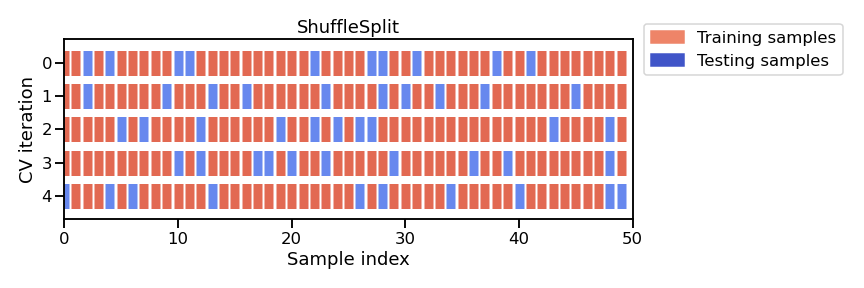

# Introduzione ai concetti di Machine Learning

## Cos'è il Machine Learning

In questa lezione, scopriremo cos'è il machine learning e i suoi concetti generali di base. Questa lezione è un'introduzione e si concentra sui concetti generali, piuttosto che sulla programmazione o sulla matematica.

In sintesi, il machine learning riguarda la creazione di modelli predittivi. Spiegherò cosa intendiamo per modelli predittivi più avanti.

## Alcuni esempi di Machine Learning

Partiamo da un paio di esempi concreti.

### Riconoscimento dei fiori

Consideriamo i fiori. L'iris è un fiore che esiste in tre varietà classiche:

- **Setosa**
- **Versicolor**
- **Virginica**

Possiamo descrivere gli iris attraverso le loro caratteristiche fisiche — lunghezza e larghezza di petali e sepali — e usare il machine learning per costruire regole che li distinguano.

| Lung. sepalo | Larg. sepalo | Lung. petalo | Larg. petalo | Tipo       |
|:------------:|:------------:|:------------:|:------------:|:----------:|
| 6 cm         | 3.4 cm       | 4.5 cm       | 1.6 cm       | versicolor |
| 5.7 cm       | 3.8 cm       | 1.7 cm       | 0.3 cm       | setosa     |
| 6.5 cm       | 3.2 cm       | 5.1 cm       | 2 cm         | virginica  |
| 5 cm         | 3 cm         | 1.6 cm       | 0.2 cm       | setosa     |

Guardando la distribuzione delle misure, si nota ad esempio che gli iris *setosa* hanno petali molto piccoli rispetto alle altre varietà — una regola che il machine learning può inferire automaticamente dai dati.

### Stima del reddito (US Census)

Un esempio più vicino a un caso d'uso aziendale: stimare il reddito di una persona a partire dai dati del censimento americano.

I dati includono informazioni demografiche variegate — età, categoria lavorativa, istruzione, stato civile, occupazione, sesso, ore settimanali lavorate, paese d'origine — e l'etichetta indica se il reddito annuo supera o meno i 50.000 dollari.

Anche in un esempio semplice come questo, avere un'intuizione immediata su molte osservazioni è difficile: la visualizzazione dei dati diventa essenziale.

## Perché usare il Machine Learning?

Gli esperti possono costruire regole decisionali dalla loro conoscenza del problema (es. un botanico sa che le *setosa* hanno petali piccoli). Il vantaggio del machine learning è che **automatizza la creazione di queste regole dai dati**, inclusi i dettagli come la soglia esatta da impostare sulla lunghezza del petalo.

## Modelli Predittivi

### Generalizzare vs. Memorizzare

Un approccio banale sarebbe memorizzare tutti i dati disponibili e, dato un nuovo individuo, predire il reddito della persona più simile nel database (strategia del *nearest neighbor*).

Su dati già visti, l'errore sarebbe zero: ogni osservazione troverebbe se stessa come corrispondenza esatta. Ma su dati nuovi, questo approccio fallirebbe, perché non esistono corrispondenze esatte.

$$\text{Generalizzare} \neq \text{Memorizzare}$$

| | |
|---|---|
| **Dati di training** | Dati usati per costruire il modello predittivo |
| **Dati di test** | Dati su cui il modello viene applicato |

I due insiemi differiscono perché il rumore è diverso e perché possono esistere combinazioni di feature mai osservate in fase di training.

### Il flusso di lavoro nel Machine Learning

Il flusso di lavoro tipico è:

1. Usare un dataset per apprendere un modello predittivo
2. Applicarlo a nuovi dati (il *test set*) per validarlo o metterlo in produzione

## Vocabolario di Base

- **Matrice dei dati $(X)$**: tabella 2D con $n\_samples$ righe e $n\_features$ colonne
- **Campioni (samples)**: le singole osservazioni (righe)
- **Feature**: le variabili descrittive di ciascuna osservazione (colonne)
- **Target $(y)$**: la proprietà da predire, di lunghezza $n\_samples$

## Tipi di Machine Learning

### Apprendimento Supervisionato

I dati sono **annotati**: ogni osservazione è associata a un'etichetta o a un valore target.

L'obiettivo è predire $y$ a partire da $X$.

Si distinguono due sottocasi:

- **Classificazione**: $y$ è discreto (categorie qualitative), es. tipo di iris
- **Regressione**: $y$ è continuo (valore numerico), es. reddito in dollari

### Apprendimento Non Supervisionato

I dati **non hanno target**. L'obiettivo è estrarre strutture o raggruppamenti dai dati che si generalizzino a nuove osservazioni (es. trovare similarità tra iris senza conoscerne il tipo a priori).

## Punti chiave

- Il machine learning **estrae dai dati regole che si generalizzano** a nuove osservazioni
- Si lavora con una matrice $X$ di dimensioni $n\_samples \times n\_features$
- Per l'apprendimento supervisionato si ha un vettore target $y$ di lunghezza $n\_samples$:
  - **numerico** per la regressione
  - **classi discrete** per la classificazione


# La pipeline di modellazione predittiva

## Introduzione

Questo modulo fornirà un esempio di una tipica pipeline di modellazione predittiva sviluppata utilizzando dati tabellari (dati strutturabili in una tabella bidimensionale). Presenteremo questa pipeline in modo progressivo. In primo luogo, analizzeremo il dataset utilizzato. Successivamente, addestreremo la nostra prima pipeline predittiva con un sottoinsieme del dataset. Quindi, presteremo particolare attenzione al tipo di dati, numerici e categorici, che il nostro modello deve gestire. Infine, estenderemo la nostra pipeline per utilizzare tipi di dati misti, ovvero dati numerici e categorici.

## Esplorazione dei dati tabellari


### Obiettivi del notebook

In questo notebook vediamo i passi necessari **prima** di qualsiasi operazione di machine learning:

- caricare i dati
- esaminare le variabili del dataset, distinguendo tra variabili numeriche e categoriali
- visualizzare la distribuzione delle variabili per capire meglio il dataset

### Caricamento del dataset Adult Census

Usiamo i dati del censimento americano del 1994, disponibili su OpenML (ID: 1590).  
Maggiori informazioni: <http://www.openml.org/d/1590>

Carichiamo il dataset direttamente tramite `sklearn`:

```{python}
from sklearn.datasets import fetch_openml
import pandas as pd

adult_census_raw = fetch_openml(data_id=1590, as_frame=True, parser="auto")
adult_census = adult_census_raw.frame

adult_census.head()
```

L'obiettivo è predire se una persona guadagna più o meno di 50.000 dollari l'anno
a partire da informazioni eterogenee: età, occupazione, istruzione, stato familiare, ecc.

### Le variabili (colonne) del dataset

Il dataset è memorizzato in un **DataFrame pandas**: una struttura dati tabellare 2D.

- Ogni **riga** è un'osservazione (anche detta *campione*, *record* o *istanza*)
- Ogni **colonna** è un tipo di informazione raccolta, chiamata **feature** (o *variabile*, *attributo*)

```{python}
adult_census
```

La colonna `class` è la nostra **variabile target** — quella che vogliamo predire.
I due valori possibili sono `<=50K` (reddito basso) e `>50K` (reddito alto):
si tratta quindi di un problema di **classificazione binaria**.

```{python}
target_column = "class"
adult_census[target_column].value_counts()
```

::: {.callout-note}
Le classi sono **sbilanciate**: ci sono molti più campioni `<=50K` rispetto a `>50K`.
Lo sbilanciamento tra classi è frequente in pratica e può richiedere tecniche specifiche
nella costruzione del modello predittivo.
:::

### Variabili numeriche e categoriali

Il dataset contiene entrambe le tipologie:

- **Numeriche**: valori continui, es. `age`
- **Categoriali**: numero finito di valori, es. `native-country`

```{python}
numerical_columns = [
    "age",
    "education-num",
    "capital-gain",
    "capital-loss",
    "hours-per-week",
]
categorical_columns = [
    "workclass",
    "education",
    "marital-status",
    "occupation",
    "relationship",
    "race",
    "sex",
    "native-country",
]
all_columns = numerical_columns + categorical_columns + [target_column]

adult_census = adult_census[all_columns]
```

Dimensioni del dataset:

```{python}
print(
    f"Il dataset contiene {adult_census.shape[0]} campioni e "
    f"{adult_census.shape[1]} colonne"
)
print(f"Il dataset contiene {adult_census.shape[1] - 1} feature.")
```

### Ispezione visiva dei dati

Prima di costruire un modello predittivo, vale la pena ispezionare i dati per:

- verificare se il problema è risolvibile senza machine learning
- controllare che le informazioni necessarie siano effettivamente presenti
- individuare peculiarità nei dati (valori mancanti, sensori difettosi, valori troncati, ecc.)

#### Distribuzione delle variabili numeriche

```{python}
_ = adult_census.hist(figsize=(20, 14))
```

:::{.callout-tip}
Nella cella precedente, abbiamo usato il seguente pattern: `_ = func()`. Lo facciamo per evitare di mostrare l'output di `func()`, che in questo caso non è molto utile. In realtà assegniamo l'output di `func()` alla variabile `_` (chiamata underscore). Per convenzione, in Python la variabile underscore viene utilizzata come variabile "spazzatura" per memorizzare risultati a cui non siamo interessati.
:::

Alcune osservazioni:

- **`age`**: pochi campioni con età > 70 (i pensionati sono stati esclusi dal dataset)
- **`education-num`**: due picchi a 10 e 13, da approfondire
- **`hours-per-week`**: picco a 40, probabilmente l'orario standard dell'epoca
- **`capital-gain` e `capital-loss`**: la maggior parte dei valori è vicina a zero

#### Distribuzione delle variabili categoriali

```{python}
adult_census["sex"].value_counts()
```

::: {.callout-warning}
Il processo di raccolta dati ha prodotto un **forte squilibrio tra campioni maschili e femminili**.
Addestrare un modello su dati così sbilanciati può causare errori di predizione sproporzionati
per i gruppi sottorappresentati — una causa tipica di problemi di **fairness**.
Per approfondire: [fairlearn.org](https://fairlearn.org)
:::

```{python}
adult_census["education"].value_counts()
```

#### Relazione tra education e education-num

I due picchi di `education-num` a 10 e 13 suggeriscono che rappresenti gli anni di istruzione.
Verifichiamo la relazione con `education`:

```{python}
pd.crosstab(
    index=adult_census["education"],
    columns=adult_census["education-num"]
)
```

Per ogni valore di `education` corrisponde **un unico valore** di `education-num`:
le due colonne sono quindi **ridondanti**. Nei notebook successivi useremo solo `education`.

::: {.callout-note}
Avere colonne ridondanti o altamente correlate non è necessariamente un problema,
ma può richiedere un trattamento speciale a seconda dell'algoritmo usato.
:::

### Pairplot per visualizzare le interazioni tra variabili

```{python}
import seaborn as sns

n_samples_to_plot = 5000
columns = ["age", "education-num", "hours-per-week"]

_ = sns.pairplot(
    data=adult_census[:n_samples_to_plot],
    vars=columns,
    hue=target_column,
    plot_kws={"alpha": 0.2},
    height=3,
    diag_kind="hist",
    diag_kws={"bins": 30},
)
```

I grafici sulla diagonale mostrano la distribuzione di ciascuna variabile per ogni classe.
Quelli fuori diagonale rivelano eventuali interazioni tra variabili.

### Costruire regole decisionali a mano

Guardando il pairplot possiamo provare a costruire regole "manuali". 
Concentriamoci su `age` e `hours-per-week`:

```{python}
import matplotlib.pyplot as plt

_ = sns.scatterplot(
    x="age",
    y="hours-per-week",
    data=adult_census[:n_samples_to_plot],
    hue=target_column,
    alpha=0.5,
)
```

Proviamo ad aggiungere soglie decisionali:

```{python}
ax = sns.scatterplot(
    x="age",
    y="hours-per-week",
    data=adult_census[:n_samples_to_plot],
    hue=target_column,
    alpha=0.5,
)

age_limit = 27
plt.axvline(x=age_limit, ymin=0, ymax=1, color="black", linestyle="--")

hours_per_week_limit = 40
plt.axhline(
    y=hours_per_week_limit, xmin=0.18, xmax=1, color="black", linestyle="--"
)

plt.annotate("<=50K", (17, 25), rotation=90, fontsize=35)
plt.annotate("<=50K", (35, 20), fontsize=35)
_ = plt.annotate("???", (45, 60), fontsize=35)
```

- **`age < 27`** (regione sinistra): quasi solo punti blu → predici reddito basso
- **`age > 27` e `hours-per-week < 40`** (in basso a destra): prevalenza blu → reddito basso
- **`age > 27` e `hours-per-week > 40`** (in alto a destra): mix di blu e arancione → difficile da classificare

Questo approccio manuale è simile a quello dei **decision tree**: anche loro costruiscono
soglie su singole feature. La differenza è che un decision tree sceglie le soglie **ottimali
automaticamente dai dati**, senza intervento umano.

### Riepilogo

In questo notebook abbiamo:

- caricato il dataset tramite `fetch_openml` di scikit-learn
- distinto variabili **numeriche** da **categoriali**
- ispezionato i dati con pandas e seaborn

Osservazioni importanti per i notebook futuri:

- un **target sbilanciato** richiede attenzione nella scelta e interpretazione delle metriche
- colonne **ridondanti** (come `education` e `education-num`) possono richiedere trattamento speciale
- i **decision tree** costruiscono regole confrontando ogni feature con una soglia,
  producendo confini decisionali paralleli agli assi

### Esercizio M1.01

Immaginiamo di essere interessati a prevedere la specie dei pinguini basandoci su due delle loro misurazioni corporee: la lunghezza del culmine e la profondità del culmine. Per prima cosa, vogliamo fare un po' di esplorazione dei dati per farci un'idea.

Quali sono le caratteristiche (features)? Qual è l'obiettivo (target)?

* **Caratteristiche (Features):** Sono le variabili di input utilizzate per fare la previsione. In questo caso, le caratteristiche sono la lunghezza del culmine e la profondità del culmine.
* **Obiettivo (Target):** È la variabile che vogliamo prevedere. In questo caso, l'obiettivo è la specie del pinguino.

```{python}
import pandas as pd

url = "https://raw.githubusercontent.com/INRIA/scikit-learn-mooc/main/datasets/penguins_classification.csv"
penguins = pd.read_csv(url)
```

Mostra alcuni campioni dei dati.

Quante caratteristiche sono numeriche? Quante caratteristiche sono categoriche?

```{python}
penguins.sample(5,random_state=11)
```

Quali sono le diverse specie di pinguini presenti nel set di dati e quanti esemplari ci sono per ciascuna specie? Suggerimento: seleziona la colonna giusta e usa il metodo `value_counts`.

```{python}
penguins["Species"].value_counts()
```

Tracciare gli istogrammi per le caratteristiche numeriche

```{python}
 _ = penguins.hist(figsize=(8, 4), bins=20, edgecolor="black", grid=False)
```

Mostra la distribuzione delle caratteristiche per ogni classe. Suggerimento: usa `seaborn.pairplot`

```{python}
import seaborn as sns

pairplot_figure = sns.pairplot(penguins, hue="Species")
pairplot_figure.fig.set_size_inches(9, 6.5)
```

Guardando queste distribuzioni, quanto pensi che sia difficile classificare i pinguini usando solo `"Culmen Depth"` e `"Culmen Length"`?

Le specie sono ragionevolmente ben separate:

- culmen length bassa → Adelie
- culmen depth bassa → Gentoo
- culmen depth alta e culmen length alta → Chinstrap

C'è una piccola sovrapposizione tra le specie, quindi ci aspettiamo che un modello statistico si comporti bene su questo dataset, ma non perfettamente.

## Addestrare un modello scikit-learn su dati numerici

###  Primo modello con scikit-learn

In questo notebook mostriamo come costruire modelli predittivi su dataset tabulari con sole feature numeriche. In particolare:

- l'API di scikit-learn: `.fit(X, y)` / `.predict(X)` / `.score(X, y)`
- come valutare la performance di generalizzazione con un train-test split

#### Caricamento del dataset

Usiamo il dataset `adult_census` già visto in precedenza, limitato alle sole colonne numeriche.

```{python}
import pandas as pd

url_train = "https://raw.githubusercontent.com/INRIA/scikit-learn-mooc/main/datasets/adult-census-numeric.csv"
adult_census = pd.read_csv(url_train)
adult_census
```

#### Separare i dati dal target

```{python}
target_name = "class"
target = adult_census[target_name]
target
```

```{python}
data = adult_census.drop(columns=[target_name])
data
```

```{python}
data.columns
data.dtypes
```

```{python}
print(
    f"Il dataset contiene {data.shape[0]} campioni e "
    f"{data.shape[1]} feature"
)
```

#### Addestrare un modello e fare previsioni

Costruiamo un modello di classificazione usando la strategia **K-nearest neighbors** (KNN): per predire il target di un nuovo campione, KNN considera i `k` campioni più vicini nel training set e predice il target maggioritario tra questi.

::: {.callout-warning}
Il KNN viene usato qui per la sua semplicità intuitiva. In pratica è raramente utile; nei notebook successivi introdurremo modelli più efficaci.
:::

```{python}
from sklearn.neighbors import KNeighborsClassifier

model = KNeighborsClassifier()
_ = model.fit(data, target)
```

{fig-align="center" width=50%}

In scikit-learn, un oggetto con un metodo `fit` è chiamato **estimator**. Il metodo `fit` è composto da due elementi: un **algoritmo di apprendimento** e degli **stati del modello**. L'algoritmo prende i dati e il target di training come input e imposta gli stati del modello, usati poi per predire o trasformare i dati.

::: {.callout-note}
In scikit-learn, `data` è comunemente chiamato `X` e `target` è comunemente chiamato `y`.
:::

```{python}
target_predicted = model.predict(data)
```

Un estimator con un metodo `predict` è chiamato **predictor**.

{fig-align="center" width=50%}


Confrontiamo le prime 5 predizioni con i valori reali:

```{python}
target_predicted[:5]
```

```{python}
target[:5]
```

```{python}
target[:5] == target_predicted[:5]
```

```{python}
print(
    "Numero di predizioni corrette: "
    f"{(target[:5] == target_predicted[:5]).sum()} / 5"
)
```

```{python}
(target == target_predicted).mean()
```

Il modello fa predizioni corrette per circa 82 campioni su 100. Tuttavia abbiamo usato gli **stessi dati** per addestrare e valutare il modello — questa valutazione può essere considerata affidabile?

#### Train-test split

Per valutare correttamente un modello è fondamentale testarlo su dati **non usati durante il training**. I dati usati per addestrare il modello si chiamano **training data**, quelli usati per valutarlo si chiamano **test data**.

```{python}
url_test = "https://raw.githubusercontent.com/INRIA/scikit-learn-mooc/main/datasets/adult-census-numeric-test.csv"
adult_census_test = pd.read_csv(url_test)

target_test = adult_census_test[target_name]
data_test = adult_census_test.drop(columns=[target_name])

print(
    f"Il dataset di test contiene {data_test.shape[0]} campioni e "
    f"{data_test.shape[1]} feature"
)
```

Il metodo `.score()` calcola automaticamente l'accuracy del modello:

```{python}
accuracy = model.score(data_test, target_test)
model_name = model.__class__.__name__

print(f"L'accuracy sul test set usando {model_name} è {accuracy:.3f}")
```

Confrontando l'accuracy sul training set (~82%) con quella sul test set, vediamo che la valutazione sul training era **ottimistica**. Questo dimostra l'importanza di valutare sempre la performance di generalizzazione su dati separati da quelli di training.

{fig-align="center" width=50%}

::: {.callout-note}
In questo corso, con **performance di generalizzazione** intendiamo il test score ottenuto confrontando le predizioni del modello con i target reali su dati mai visti. Termini equivalenti sono *predictive performance* e *statistical performance*.
:::

#### Riepilogo

In questo notebook abbiamo:

- addestrato un modello **K-nearest neighbors** su un training set
- valutato la sua performance di generalizzazione sul test set
- introdotto l'API di scikit-learn: `.fit(X, y)`, `.predict(X)`, `.score(X, y)`
- introdotto i termini *estimator*, *predictor* e *model*

### Esercizio M1.02


L'obiettivo di questo esercizio è addestrare un modello simile a quello del notebook precedente, per familiarizzare con gli oggetti di scikit-learn e in particolare con l'API `.fit` / `.predict` / `.score`.

#### Caricamento del dataset

```{python}
import pandas as pd

url_train = "https://raw.githubusercontent.com/INRIA/scikit-learn-mooc/main/datasets/adult-census-numeric.csv"
adult_census = pd.read_csv(url_train)

data = adult_census.drop(columns="class")
target = adult_census["class"]
```

#### Parametro `n_neighbors` di `KNeighborsClassifier`

Uno dei parametri di `KNeighborsClassifier` è `n_neighbors`, che controlla il numero di vicini usati per fare una predizione su un nuovo punto. Qual è il suo valore di default?

```{python}
from sklearn.neighbors import KNeighborsClassifier
```

Il valore di default di `n_neighbors` è **5**.

#### Creare il modello con `n_neighbors=50`

```{python}
model = KNeighborsClassifier(n_neighbors=50)
_ = model.fit(data,target)
```

#### Addestrare il modello

```{python}
target_predicted = model.predict(data)
```

#### Predizioni sui primi 10 campioni

Usa il modello per fare predizioni sui primi 10 campioni. Corrispondono ai valori reali del target?

```{python}
pd.DataFrame({
    "Predicted": target_predicted[:10],
    "Actual":    target[:10],
    "isEqual":   target_predicted[:10] == target[:10]
})
```

```{python}
print(
    "Numero di predizioni corrette: "
    f"{(target[:10] == target_predicted[:10]).sum()} / 10"
)
```

#### Accuracy sul training set

```{python}
accuracy = model.score(data, target)
model_name = model.__class__.__name__

print(f"L'accuracy sul training set usando {model_name} è {accuracy:.3f}")
```


#### Accuracy sul test set

```{python}
url_test = "https://raw.githubusercontent.com/INRIA/scikit-learn-mooc/main/datasets/adult-census-numeric-test.csv"

adult_census_test = pd.read_csv(url_test)

data_test = adult_census_test.drop(columns="class")
target_test = adult_census_test["class"]
```

```{python}
accuracy = model.score(data_test, target_test)
model_name = model.__class__.__name__

print(f"L'accuracy sul test set usando {model_name} è {accuracy:.3f}")
```


### Lavorare con dati numerici

Nel notebook precedente, abbiamo addestrato un modello k-nearest neighbors su alcuni dati.
Tuttavia, abbiamo semplificato eccessivamente la procedura caricando un dataset che conteneva esclusivamente dati numerici. Inoltre, abbiamo utilizzato dataset già suddivisi in set di training e test.
In questo notebook, miriamo a:
- identificare dati numerici in un dataset eterogeneo;
- selezionare il sottoinsieme di colonne corrispondenti a dati numerici;
- utilizzare un helper di scikit-learn per separare i dati in set di training e test;
- addestrare e valutare un modello scikit-learn più complesso.

Iniziamo caricando il dataset di censimento degli adulti utilizzato durante l'esplorazione dei dati.

#### Caricamento dell'intero dataset

Come nel notebook precedente, facciamo affidamento su pandas per aprire il file CSV in un dataframe pandas.

```{python}
import pandas as pd

adult_census = pd.read_csv("https://raw.githubusercontent.com/INRIA/scikit-learn-mooc/main/datasets/adult-census.csv")
# elimina la colonna duplicata `"education-num"` come indicato nel primo notebook
adult_census = adult_census.drop(columns="education-num")
adult_census
```

Il passo successivo separa il target dai dati. Abbiamo eseguito la stessa procedura nel notebook precedente.

```{python}
data, target = adult_census.drop(columns="class"), adult_census["class"]

data
```

```{python}
target
```

:::{.callout-note}
Qui e successivamente, utilizziamo il nome `data` e `target` per essere espliciti. Nella documentazione di scikit-learn, `data` è comunemente denominato $X$ e `target` è comunemente chiamato $y$.
:::

A questo punto, possiamo concentrarci sui dati che vogliamo utilizzare per addestrare il nostro modello predittivo.

#### Identificare i dati numerici

I dati numerici sono rappresentati con numeri. Sono collegati a dati misurabili (quantitativi), come l'età o il numero di ore che una persona lavora a settimana.

I modelli predittivi sono progettati nativamente per lavorare con dati numerici. Inoltre, i dati numerici di solito richiedono molto poco lavoro prima di iniziare l'addestramento.

Il primo compito qui è identificare i dati numerici nel nostro dataset.

:::{.callout-important}
I dati numerici sono rappresentati con numeri, ma i numeri non sempre rappresentano dati numerici. Le categorie potrebbero essere già codificate con numeri e potrebbe essere necessario identificare queste caratteristiche.
:::


Quindi, possiamo controllare il tipo di dato per ogni colonna nel dataset.

```{python}
data.dtypes
```

Sembra che abbiamo solo due tipi di dati: int64 e object. Possiamo assicurarci controllando i tipi di dati univoci.

```{python}
data.dtypes.unique()
```

Infatti, gli unici due tipi nel dataset sono integer `int64` e `str`. Possiamo guardare le prime righe del dataframe per comprendere il significato del tipo di dato object.

```{python}
data.sample(10, random_state=42)
```

Vediamo che il tipo di dato `str` corrisponde alle colonne contenenti stringhe. Come abbiamo visto nella sezione di esplorazione, queste colonne contengono categorie e vedremo più tardi come gestirle. Possiamo selezionare le colonne contenenti interi e controllarne il contenuto.

```{python}
numerical_columns = ["age", "capital-gain", "capital-loss", "hours-per-week"]
data[numerical_columns]
```

Ora che abbiamo limitato il dataset alle sole colonne numeriche, possiamo analizzare questi numeri per capire cosa rappresentano. Possiamo identificare due tipi di utilizzo.

La prima colonna, "age", è autoesplicativa. Possiamo notare che i valori sono continui, il che significa che possono assumere qualsiasi numero in un dato intervallo. Scopriamo quale sia questo intervallo:

```{python}
data["age"].describe()
```

Possiamo vedere che l'età varia tra 17 e 90 anni.

Potremmo estendere la nostra analisi e scopriremmo che `capital-gain`, `capital-loss` e `hours-per-week` rappresentano anche dati quantitativi.

Ora, memorizziamo il sottoinsieme di colonne numeriche in un nuovo dataframe.

```{python}
data_numeric = data[numerical_columns]
```

#### Suddividere il dataset in training e test

Nel notebook precedente, abbiamo caricato due dataset separati: uno di training e uno di test. Tuttavia, avere dataset separati in due file distinti è insolito: la maggior parte delle volte, abbiamo un singolo file contenente tutti i dati che dobbiamo suddividere una volta caricati in memoria.

Scikit-learn fornisce la funzione helper `sklearn.model_selection.train_test_split` che viene utilizzata per suddividere automaticamente il dataset in due sottoinsiemi.

```{python}
from sklearn.model_selection import train_test_split

data_train, data_test, target_train, target_test = train_test_split(
    data_numeric, target, random_state=42, test_size=0.25
)
```

:::{.callout-tip}
In scikit-learn, impostare il parametro random_state consente di ottenere risultati deterministici quando utilizziamo un generatore di numeri casuali. Nel caso di `train_test_split`, la casualità deriva dalla mescolanza dei dati, che decide come il dataset viene suddiviso in un set di training e test.
:::

Quando si chiama la funzione `train_test_split`, abbiamo specificato che desideriamo avere il $25\%$ dei campioni nel set di test mentre i campioni rimanenti ($75\%$) vengono assegnati al set di training. Possiamo verificare rapidamente se abbiamo ottenuto quello che ci aspettavamo.

```{python}
print(
    f"Numero di campioni nel test: {data_test.shape[0]} => "
    f"{data_test.shape[0] / data_numeric.shape[0] * 100:.1f}% del"
    " set originale"
)

print(
    f"Numero di campioni nel training: {data_train.shape[0]} => "
    f"{data_train.shape[0] / data_numeric.shape[0] * 100:.1f}% del"
    " set originale"
)
```

#### Addestrare e valutare un modello di regressione logistica

Nel notebook precedente, abbiamo utilizzato un modello k-nearest neighbors. Sebbene questo modello sia intuitivo da comprendere, non è ampiamente utilizzato in pratica. Ora, utilizziamo un modello più utile, chiamato regressione logistica, che appartiene alla famiglia dei modelli lineari.

:::{.callout-note}
In breve, i modelli lineari trovano un insieme di pesi per combinare linearmente le caratteristiche e prevedere il target. Ad esempio, il modello può formulare una regola del tipo:

$$0.1 \cdot \text{age} + 3.3 \cdot \text{hours-per-week} - 15.1 > 0$$

Se questa condizione è verificata, il modello predice un **alto reddito**; altrimenti, predice un **basso reddito**.
:::

I modelli lineari, e in particolare la regressione logistica, saranno trattati più dettagliatamente nel modulo "Modelli lineari" più avanti in questo corso. Per ora l'attenzione è su come utilizzare questo modello di regressione logistica in scikit-learn piuttosto che su come funziona nei dettagli.

Per creare un modello di regressione logistica in scikit-learn puoi fare:

```{python}
from sklearn.linear_model import LogisticRegression

model = LogisticRegression()
```

Ora che il modello è stato creato, puoi usarlo esattamente allo stesso modo in cui abbiamo usato il modello k-nearest neighbors nel notebook precedente. In particolare, possiamo usare il metodo fit per addestrare il modello usando i dati di training e le etichette:

```{python}
model.fit(data_train, target_train)
```

Possiamo anche usare il metodo score per verificare le prestazioni di generalizzazione del modello sul set di test.

```{python}
accuracy = model.score(data_test, target_test)
print(f"Accuratezza della regressione logistica: {accuracy:.3f}")
```

#### Riepilogo del notebook

In scikit-learn, il metodo `score` di un modello di classificazione restituisce l'accuratezza, cioè la frazione di campioni classificati correttamente. In questo caso, circa $8 / 10$ delle volte la regressione logistica predice il reddito corretto di una persona. Ora la vera domanda è: questa prestazione di generalizzazione è rilevante di un buon modello predittivo? Scoprilo risolvendo l'esercizio successivo!

In questo notebook, abbiamo imparato a:
- identificare dati numerici in un dataset eterogeneo;
- selezionare il sottoinsieme di colonne corrispondenti a dati numerici;
- utilizzare la funzione train_test_split di scikit-learn per separare i dati in un set di training e test;
- addestrare e valutare un modello di regressione logistica.

### Esercizio M1.03

L'obiettivo di questo esercizio è confrontare le prestazioni del nostro classificatore nel notebook precedente (circa 81% di accuratezza con `LogisticRegression`) con alcuni semplici classificatori baseline. Il classificatore baseline più semplice è quello che predice sempre la stessa classe, indipendentemente dai dati di input.

* Quale sarebbe il punteggio di un modello che predice sempre `' >50K'`?
* Quale sarebbe il punteggio di un modello che predice sempre `' <=50K'`?
* È un'accuratezza dell'81% o dell'82% un buon punteggio per questo problema?

Usa un `DummyClassifier` e fai una suddivisione training-test per valutare la sua accuratezza sul set di test. Questo [link](https://scikit-learn.org/stable/modules/model_evaluation.html#dummy-estimators) mostra alcuni esempi di come valutare le prestazioni di generalizzazione di questi modelli baseline.

```{python}
import pandas as pd
adult_census = pd.read_csv("https://raw.githubusercontent.com/INRIA/scikit-learn-mooc/main/datasets/adult-census.csv")
```

Innanzitutto, separiamo il target dai dati utilizzati per addestrare il nostro modello predittivo.

```{python}
target_name = "class"

target = adult_census[target_name]

data = adult_census.drop(columns=target_name)
```

Iniziamo selezionando solo le colonne numeriche come visto nel notebook precedente.

```{python}
numerical_columns = ["age", "capital-gain", "capital-loss", "hours-per-week"]

data_numeric = data[numerical_columns]
```

Suddividi i dati e il target in un set di training e test.

```{python}
from sklearn.model_selection import train_test_split

data_numeric_train, data_numeric_test, target_train, target_test = (train_test_split(data_numeric, target, random_state=42))
```

Usa un `DummyClassifier` in modo che il classificatore risultante predica sempre la classe `' >50K'`. Quale è il punteggio di accuratezza sul set di test? Ripeti l'esperimento predicendo sempre la classe `' <=50K'`.

Suggerimento: puoi impostare il parametro `strategy` di `DummyClassifier` per ottenere il comportamento desiderato.

```{python}
from sklearn.dummy import DummyClassifier
class_to_predict = " >50K"
high_revenue_clf = DummyClassifier(
    strategy="constant", constant=class_to_predict
)
high_revenue_clf.fit(data_numeric_train, target_train)
score = high_revenue_clf.score(data_numeric_test, target_test)
print(f"Accuracy of a model predicting only high revenue: {score:.3f}")
```

Notiamo chiaramente che il punteggio è inferiore a `0.5`, il che potrebbe sorprendere a prima vista. Ora verifichiamo le prestazioni di generalizzazione di un modello che prevede sempre la classe di basso fatturato, ovvero "`<=50K`".

```{python}
class_to_predict = " <=50K"
low_revenue_clf = DummyClassifier(
    strategy="constant", constant=class_to_predict
)
low_revenue_clf.fit(data_numeric_train, target_train)
score = low_revenue_clf.score(data_numeric_test, target_test)
print(f"Accuracy of a model predicting only low revenue: {score:.3f}")
```

Osserviamo che questo modello ha una precisione superiore a `0.5`. Ciò è dovuto al fatto che abbiamo $3/4$ del target appartenenti alla classe a basso reddito.

Pertanto, qualsiasi modello predittivo che dia risultati al di sotto di questo classificatore fittizio non sarebbe utile.

```{python}
adult_census["class"].value_counts()
```

```{python}
(target == " <=50K").mean()
```

In pratica potremmo avere la strategia `most_frequent` per prevedere la classe che compare di più nell'obiettivo formativo.

```{python}
most_freq_revenue_clf = DummyClassifier(strategy="most_frequent")
most_freq_revenue_clf.fit(data_numeric_train, target_train)
score = most_freq_revenue_clf.score(data_numeric_test, target_test)
print(f"Accuracy of a model predicting the most frequent class: {score:.3f}")
```

Pertanto la precisione di `LogisticRegression` (circa $81\%$) sembra migliore della precisione di `DummyClassifier` (circa $76\%$). In un certo senso è un po' rassicurante, utilizzare un modello di machine learning offre prestazioni migliori rispetto a prevedere sempre la classe maggioritaria, ovvero la classe a basso reddito "`<=50K`".

### Preprocessing per feature numeriche

In questo notebook usiamo ancora solo feature numeriche, introducendo due nuovi aspetti:

- un esempio di preprocessing: il **scaling delle variabili numeriche**
- l'uso di una **pipeline** di scikit-learn per concatenare preprocessing e training del modello

#### Preparazione dei dati

```{python}
import pandas as pd

url = "https://raw.githubusercontent.com/INRIA/scikit-learn-mooc/main/datasets/adult-census.csv"
adult_census = pd.read_csv(url)

target_name = "class"
target = adult_census[target_name]
data = adult_census.drop(columns=target_name)
```

```{python}
numerical_columns = ["age", "capital-gain", "capital-loss", "hours-per-week"]
data_numeric = data[numerical_columns]
```

```{python}
from sklearn.model_selection import train_test_split

data_train, data_test, target_train, target_test = train_test_split(
    data_numeric, target, random_state=42
)
```

#### Addestramento del modello con preprocessing

Scikit-learn offre una serie di algoritmi di preprocessing che trasformano i dati di input prima del training. In questo caso, standardizzeremo i dati e addestreremo una regressione logistica sulla nuova versione del dataset.

```{python}
data_train.describe()
```

Le feature del dataset hanno range molto diversi. Molti algoritmi fanno assunzioni sulle distribuzioni delle feature, e **normalizzarle** è generalmente utile.

::: {.callout-tip}
Alcune ragioni per scalare le feature:

- I modelli che si basano sulla distanza tra campioni (es. KNN) dovrebbero essere addestrati su feature normalizzate, affinché ciascuna contribuisca in modo approssimativamente uguale al calcolo delle distanze.
- Molti modelli come la regressione logistica usano un solver numerico basato sul *gradient descent* per trovare i parametri ottimali — questo converge più velocemente con feature scalate.

Se sia necessario o meno scalare le feature dipende dalla famiglia di modelli: i modelli lineari come la regressione logistica ne beneficiano, i decision tree no (ma non ne risentono).
:::

Usiamo il transformer `StandardScaler` di scikit-learn, che trasla e scala ogni feature individualmente in modo che abbiano media 0 e deviazione standard 1.

```{python}
from sklearn.preprocessing import StandardScaler

scaler = StandardScaler()
scaler.fit(data_train)
```

Il metodo `fit` per i transformer è simile a quello dei predictor, con la differenza che accetta un solo argomento (la matrice dei dati) anziché due (dati + target).


In questo caso, l'algoritmo calcola media e deviazione standard per ogni feature e le salva come stati del modello.

```{python}
scaler.mean_
```

```{python}
scaler.scale_
```

::: {.callout-note}
Convenzione scikit-learn: se un attributo viene appreso dai dati, il suo nome termina con un underscore (`_`), come `mean_` e `scale_` per `StandardScaler`.
:::

Una volta chiamato `fit`, possiamo trasformare i dati con il metodo `transform`:

```{python}
data_train_scaled = scaler.transform(data_train)
data_train_scaled
```


Il metodo `transform` è simile al metodo `predict` dei predictor: usa una funzione di trasformazione predefinita insieme agli stati del modello e ai dati in input. Invece di produrre predizioni, restituisce una versione trasformata dei dati.


Il metodo `fit_transform` è una scorciatoia che chiama `fit` e poi `transform` in successione:

```{python}
scaler = StandardScaler().set_output(transform="pandas")
data_train_scaled = scaler.fit_transform(data_train)
data_train_scaled.describe()
```

La media di tutte le colonne è vicina a 0 e la deviazione standard è vicina a 1. Visualizziamo l'effetto di `StandardScaler` con un jointplot: notiamo che la struttura dei dati non cambia, ma gli assi vengono traslati e scalati.

```{python}
import matplotlib.pyplot as plt
import seaborn as sns

num_points_to_plot = 300

sns.jointplot(
    data=data_train[:num_points_to_plot],
    x="age",
    y="hours-per-week",
    marginal_kws=dict(bins=15),
)
plt.suptitle(
    "Jointplot di 'age' vs 'hours-per-week'\nprima di StandardScaler", y=1.1
)

sns.jointplot(
    data=data_train_scaled[:num_points_to_plot],
    x="age",
    y="hours-per-week",
    marginal_kws=dict(bins=15),
)
_ = plt.suptitle(
    "Jointplot di 'age' vs 'hours-per-week'\ndopo StandardScaler", y=1.1
)
```

#### Pipeline

Possiamo combinare operazioni sequenziali con una `Pipeline` di scikit-learn, che concatena le operazioni e si usa come qualsiasi altro classificatore o regressore. La funzione helper `make_pipeline` crea una pipeline prendendo come argomenti le trasformazioni successive e il modello finale.

```{python}
import time
from sklearn.linear_model import LogisticRegression
from sklearn.pipeline import make_pipeline

model = make_pipeline(StandardScaler(), LogisticRegression())
model
```

`make_pipeline` assegna automaticamente un nome a ogni step basandosi sul nome della classe. Possiamo verificarlo:

```{python}
model.named_steps
```

La pipeline espone gli stessi metodi del predictor finale: `fit`, `predict` (e opzionalmente `predict_proba`, `decision_function`, `score`).

```{python}
start = time.time()
model.fit(data_train, target_train)
elapsed_time = time.time() - start
```


Quando si chiama `model.fit`, il metodo `fit_transform` di ogni transformer nella pipeline viene chiamato per:

1. apprendere gli stati interni del modello
2. trasformare i dati di training

I dati preprocessati vengono poi forniti al predictor per il training.

```{python}
predicted_target = model.predict(data_test)
predicted_target[:5]
```


Durante la predizione, il metodo `transform` di ogni transformer viene chiamato per preprocessare i dati — senza bisogno di chiamare `fit`, poiché gli stati interni sono già stati calcolati durante `model.fit`. I dati preprocessati vengono poi forniti al predictor.

```{python}
model_name = model.__class__.__name__
score = model.score(data_test, target_test)
print(
    f"L'accuracy usando {model_name} è {score:.3f} "
    f"con un tempo di fitting di {elapsed_time:.3f} secondi "
    f"in {model[-1].n_iter_[0]} iterazioni"
)
```

Confrontiamo questo risultato con il modello senza scaling:

```{python}
model = LogisticRegression()
start = time.time()
model.fit(data_train, target_train)
elapsed_time = time.time() - start

model_name = model.__class__.__name__
score = model.score(data_test, target_test)
print(
    f"L'accuracy usando {model_name} è {score:.3f} "
    f"con un tempo di fitting di {elapsed_time:.3f} secondi "
    f"in {model.n_iter_[0]} iterazioni"
)
```

Scalare i dati prima del training della regressione logistica è stato vantaggioso in termini di **performance computazionale**: il numero di iterazioni e il tempo di training sono diminuiti. La performance di generalizzazione non è cambiata perché entrambi i modelli convergono.

::: {.callout-warning}
Lavorare con dati non scalati può forzare l'algoritmo a iterare di più. Nel caso peggiore, il numero di iterazioni richieste supera il massimo consentito dal parametro `max_iter`. Quindi, prima di aumentare `max_iter`, assicurarsi che i dati siano ben scalati.
:::

#### Riepilogo

In questo notebook abbiamo:

- visto l'importanza di scalare le variabili numeriche
- usato una pipeline per concatenare scaling e training della regressione logistica

### Valutazione del modello con la cross-validation

In questo notebook usiamo ancora solo feature numeriche.

Discutiamo gli aspetti pratici della valutazione della performance di generalizzazione del nostro modello tramite cross-validation, in alternativa a un singolo train-test split.

#### Preparazione dei dati

Prima, carichiamo il dataset adult census completo.

```{python}
import pandas as pd

url = "https://raw.githubusercontent.com/INRIA/scikit-learn-mooc/main/datasets/adult-census.csv"
adult_census = pd.read_csv(url)
```

Rimuoviamo il target dai dati che useremo per addestrare il modello predittivo.

```{python}
target_name = "class"
target = adult_census[target_name]
data = adult_census.drop(columns=target_name)
```

Selezioniamo solo le colonne numeriche, come visto nel notebook precedente.

```{python}
numerical_columns = ["age", "capital-gain", "capital-loss", "hours-per-week"]
data_numeric = data[numerical_columns]
```

Possiamo ora creare un modello usando `make_pipeline` per concatenare preprocessing ed estimator in ogni iterazione della cross-validation.

```{python}
from sklearn.preprocessing import StandardScaler
from sklearn.linear_model import LogisticRegression
from sklearn.pipeline import make_pipeline

model = make_pipeline(StandardScaler(), LogisticRegression())
```

#### La necessità della cross-validation

Nel notebook precedente abbiamo diviso i dati originali in training set e test set. Il punteggio di un modello dipende in generale dal modo in cui viene effettuata questa divisione. Uno svantaggio di fare un singolo split è che non fornisce alcuna informazione su questa variabilità. Un altro svantaggio, in contesti con pochi dati, è che i dati disponibili per training e test sarebbero ancora più ridotti dopo la divisione.

In alternativa, possiamo usare la cross-validation. La cross-validation consiste nel ripetere la procedura in modo che training set e test set siano diversi ad ogni iterazione. Le metriche di performance di generalizzazione vengono raccolte per ogni ripetizione e poi aggregate. In questo modo possiamo valutare la variabilità della nostra misura della performance di generalizzazione del modello.

Si noti che esistono diverse strategie di cross-validation, ognuna delle quali definisce come ripetere la procedura fit/score. In questa sezione usiamo la strategia **K-fold**: l'intero dataset viene diviso in K partizioni. La procedura fit/score viene ripetuta $K$ volte: ad ogni iterazione, $K-1$ partizioni vengono usate per addestrare il modello e 1 partizione per valutarlo.


::: {.callout-note}
Questa figura mostra il caso particolare della strategia K-fold cross-validation. Per ogni split di cross-validation, la procedura addestra un clone del modello su tutti i campioni rossi e valuta il punteggio del modello sui campioni blu. Come accennato, esiste una varietà di strategie di cross-validation diverse. Alcuni di questi aspetti verranno trattati in maggiore dettaglio nei notebook futuri.
:::

La cross-validation è quindi **computazionalmente costosa** perché richiede di addestrare più modelli invece di uno solo.

In scikit-learn, la funzione `cross_validate` permette di eseguire la cross-validation e richiede il modello, i dati e il target. Poiché esistono diverse strategie di cross-validation, `cross_validate` accetta un parametro `cv` che definisce la strategia di splitting.

```{python}
from sklearn.model_selection import cross_validate

model = make_pipeline(StandardScaler(), LogisticRegression())
cv_result = cross_validate(model, data_numeric, target, cv=5)
cv_result
```

L'output di `cross_validate` è un dizionario Python che per default contiene tre voci:

- `fit_time`: il tempo per addestrare il modello sui dati di training per ogni fold
- `score_time`: il tempo per fare predizioni con il modello sui dati di test per ogni fold
- `test_score`: il punteggio di default sui dati di test per ogni fold

Impostare `cv=5` ha creato 5 split distinti per ottenere 5 varianti di training e test set. Ogni training set viene usato per addestrare un modello che viene poi valutato sul test set corrispondente. La strategia di default quando si imposta `cv=int` è la K-fold cross-validation, dove K corrisponde al numero (intero) di split. Usare `cv=5` o `cv=10` è una pratica comune, poiché rappresenta un buon compromesso tra tempo di calcolo e stabilità della variabilità stimata.

Si noti che per default la funzione `cross_validate` scarta i K modelli addestrati sui diversi subset sovrapposti del dataset. L'obiettivo della cross-validation non è addestrare un modello, ma piuttosto stimare approssimativamente la performance di generalizzazione di un modello che sarebbe stato addestrato sull'intero training set, insieme a una stima della variabilità (incertezza sull'accuracy di generalizzazione).

È possibile passare parametri aggiuntivi a `sklearn.model_selection.cross_validate` per raccogliere informazioni aggiuntive, come i training score dei modelli ottenuti in ogni round o persino restituire i modelli stessi invece di scartarli. Queste funzionalità verranno trattate in un notebook futuro.

Estraiamo gli score calcolati sul fold di test di ogni round di cross-validation dal dizionario `cv_result` e calcoliamo l'accuracy media e la variazione dell'accuracy tra i fold.

```{python}
scores = cv_result["test_score"]
print(
    "L'accuracy media in cross-validation è: "
    f"{scores.mean():.3f} ± {scores.std():.3f}"
)
```

Si noti che calcolando la deviazione standard degli score di cross-validation, possiamo stimare l'incertezza sulla performance di generalizzazione del nostro modello. Questo è il principale vantaggio della cross-validation e può essere cruciale in pratica, ad esempio quando si confrontano modelli diversi per capire se uno è migliore dell'altro o se le nostre misure della performance di generalizzazione di ciascun modello rientrano nelle barre d'errore dell'altro.

In questo caso particolare, solo le prime 2 cifre decimali sembrano affidabili. Se si torna all'inizio di questo notebook, si può verificare che la performance ottenuta con la cross-validation è compatibile con quella ottenuta da un singolo train-test split.

#### Riepilogo

In questo notebook abbiamo valutato la performance di generalizzazione del nostro modello tramite cross-validation.

## Gestione delle variabili categoriali

### Encoding delle variabili categoriali

In questo notebook presentiamo alcune strategie tipiche per gestire le variabili categoriali tramite encoding: **ordinal encoding** e **one-hot encoding**.

Carichiamo prima il dataset adult completo, che contiene sia dati numerici che categoriali.

```{python}
import pandas as pd

url = "https://raw.githubusercontent.com/INRIA/scikit-learn-mooc/main/datasets/adult-census.csv"
adult_census = pd.read_csv(url)
adult_census = adult_census.drop(columns="education-num")

target_name = "class"
target = adult_census[target_name]
data = adult_census.drop(columns=[target_name])
```

#### Identificare le variabili categoriali

Una variabile numerica è una quantità rappresentata da un numero reale o intero — gestita naturalmente dagli algoritmi di ML tramite operazioni aritmetiche.

Le variabili **categoriali** hanno invece valori discreti, tipicamente rappresentati da stringhe, scelti da un insieme finito di possibilità. Ad esempio, `native-country` è una variabile categoriale perché codifica i dati usando un elenco finito di paesi (più il simbolo `?` per i valori mancanti).

```{python}
data["native-country"].value_counts().sort_index()
```

Come riconoscere facilmente le colonne categoriali? Una parte della risposta sta nel tipo di dato della colonna:

```{python}
data.dtypes
```

La colonna `native-country` ha tipo `object`, cioè contiene stringhe.

#### Selezionare le feature in base al tipo di dato

Invece di definire manualmente le colonne categoriali, possiamo usare la funzione helper `make_column_selector` di scikit-learn, che seleziona le colonne in base al loro tipo di dato.

```{python}
from sklearn.compose import make_column_selector as selector

categorical_columns_selector = selector(dtype_include=object)
categorical_columns = categorical_columns_selector(data)
categorical_columns
```

```{python}
data_categorical = data[categorical_columns]
data_categorical
```

```{python}
print(f"Il dataset è composto da {data_categorical.shape[1]} feature")
```

#### Strategie di encoding

##### Encoding ordinale

La strategia più intuitiva è assegnare a ogni categoria un numero diverso. `OrdinalEncoder` trasforma i dati in questo modo. Iniziamo codificando una singola colonna per capire come funziona.

```{python}
from sklearn.preprocessing import OrdinalEncoder

education_column = data_categorical[["education"]]

encoder = OrdinalEncoder().set_output(transform="pandas")
education_encoded = encoder.fit_transform(education_column)
education_encoded
```

Ogni categoria in `education` è stata sostituita da un valore numerico. Possiamo verificare il mapping tra categorie e valori numerici tramite l'attributo `categories_`.

```{python}
encoder.categories_
```

Applichiamo ora l'encoding a tutte le feature categoriali.

```{python}
data_encoded = encoder.fit_transform(data_categorical)
data_encoded[:5]
```

```{python}
print(f"Il dataset codificato contiene {data_encoded.shape[1]} feature")
```

Le categorie sono state codificate per ciascuna feature in modo indipendente. Il numero di feature prima e dopo l'encoding rimane lo stesso.

::: {.callout-warning}
Attenzione: usando questa rappresentazione intera, i modelli predittivi a valle assumono che i valori siano **ordinati** (0 < 1 < 2 < 3...).

Per default, `OrdinalEncoder` usa una strategia lessicografica per mappare le etichette alle categorie — spesso arbitraria e priva di significato. Ad esempio, per una variabile `size` con categorie `"S"`, `"M"`, `"L"`, `"XL"`, la strategia alfabetica mapperebbe: `"L"→0`, `"M"→1`, `"S"→2`, `"XL"→3`, ignorando l'ordine semantico.

`OrdinalEncoder` accetta un argomento `categories` per specificare esplicitamente l'ordine desiderato.
:::

Se una variabile categoriale non ha un ordine significativo, l'ordinal encoding può essere fuorviante — in quel caso è preferibile il **one-hot encoding**.

##### Encoding nominale (senza assumere alcun ordine)

`OneHotEncoder` è un encoder alternativo che evita ai modelli di fare false assunzioni sull'ordinamento delle categorie. Per ogni feature, crea tante nuove colonne quante sono le categorie possibili. Per ogni campione, la colonna corrispondente alla sua categoria viene impostata a 1, tutte le altre a 0.

Codifichiamo prima una singola feature per capire il funzionamento.

```{python}
from sklearn.preprocessing import OneHotEncoder

encoder = OneHotEncoder(sparse_output=False).set_output(transform="pandas")
education_encoded = encoder.fit_transform(education_column)
education_encoded
```

::: {.callout-note}
`sparse_output=False` viene usato qui a scopo didattico per facilitare la visualizzazione. Le matrici sparse sono strutture dati efficienti quando la maggior parte degli elementi è zero, ma non verranno approfondite in questo corso.
:::

Ogni categoria diventa una colonna; per ogni campione viene impostato a 1 il valore corrispondente alla sua categoria.

Applichiamo ora l'encoding all'intero dataset categoriale.

```{python}
print(f"Il dataset è composto da {data_categorical.shape[1]} feature")
data_categorical
```

```{python}
data_encoded = encoder.fit_transform(data_categorical)
data_encoded[:5]
```

```{python}
print(f"Il dataset codificato contiene {data_encoded.shape[1]} feature")
```

Il numero di feature dopo l'encoding è più di 10 volte superiore rispetto all'originale, perché alcune variabili come `occupation` e `native-country` hanno molte categorie possibili.

#### Scegliere una strategia di encoding

::: {.callout-note}
In generale:

- **OneHotEncoder** è la strategia usata con i **modelli lineari**
- **OrdinalEncoder** è spesso una buona scelta con i **modelli ad albero**

`OrdinalEncoder` produce categorie ordinali (0 < 1 < 2...). L'impatto di violare questa assunzione dipende dal modello a valle: i modelli lineari ne risentono, quelli ad albero no.

Il one-hot encoding su variabili con alta cardinalità può causare inefficienze computazionali nei modelli ad albero — in quel caso non è raccomandato anche se le categorie non hanno un ordine.
:::

#### Valutare la pipeline predittiva

Integriamo l'encoder in una pipeline di ML e valutiamo la performance con cross-validation.

Prima però, osserviamo la colonna `native-country`:

```{python}
data["native-country"].value_counts()
```

La categoria `"Holand-Netherlands"` appare raramente. Questo è un problema durante la cross-validation: se quel campione finisce nel test set, il classificatore non l'avrà mai vista durante il training e non sarà in grado di codificarla.

Soluzioni possibili in scikit-learn:

- passare esplicitamente tutte le categorie possibili via `categories`
- impostare `handle_unknown="ignore"`: le colonne one-hot di una categoria sconosciuta vengono tutte impostate a 0
- usare `min_frequency` per raggruppare le categorie più rare in un'unica colonna

In questo notebook usiamo la seconda opzione.

```{python}
from sklearn.pipeline import make_pipeline
from sklearn.linear_model import LogisticRegression

model = make_pipeline(
    OneHotEncoder(handle_unknown="ignore"), LogisticRegression(max_iter=500)
)
```

::: {.callout-note}
Aumentiamo `max_iter` per ottenere una `LogisticRegression` completamente conversa e silenziare un `ConvergenceWarning`. Le feature one-hot encoded sono già sulla stessa scala (valori 0 o 1), quindi non beneficerebbero dello scaling — in questo caso aumentare `max_iter` è la scelta corretta.
:::

```{python}
from sklearn.model_selection import cross_validate

cv_results = cross_validate(model, data_categorical, target)
cv_results
```

```{python}
scores = cv_results["test_score"]
print(f"L'accuracy è: {scores.mean():.3f} ± {scores.std():.3f}")
```

Come si vede, questa rappresentazione delle variabili categoriali è leggermente più predittiva del reddito rispetto alle variabili numeriche usate in precedenza — questo perché abbiamo più feature categoriali (predittive) che numeriche.

#### Riepilogo

In questo notebook abbiamo:

- visto due strategie comuni per codificare le feature categoriali: **ordinal encoding** e **one-hot encoding**
- usato una pipeline per applicare il one-hot encoder prima di addestrare una regressione logistica


### Esercizio M1.04

L'obiettivo di questo esercizio è valutare l'impatto dell'uso di una codifica intera arbitraria per le variabili categoriali insieme a un modello di classificazione lineare come la Regressione Logistica.

Per farlo, proviamo a usare `OrdinalEncoder` per preprocessare le variabili categoriali. Questo preprocessore viene assemblato in una pipeline con `LogisticRegression`. La performance di generalizzazione della pipeline può essere valutata tramite cross-validation e poi confrontata con il punteggio ottenuto usando `OneHotEncoder`.

#### Caricamento del dataset

```{python}
import pandas as pd

url = "https://raw.githubusercontent.com/INRIA/scikit-learn-mooc/main/datasets/adult-census.csv"
adult_census = pd.read_csv(url)

target_name = "class"
target = adult_census[target_name]
data = adult_census.drop(columns=[target_name, "education-num"])
```

Nel notebook precedente abbiamo usato `make_column_selector` per selezionare automaticamente le colonne in base al tipo di dato. Qui lo usiamo per ottenere solo le colonne contenenti stringhe (tipo `object`), che corrispondono alle feature categoriali del nostro dataset.

```{python}
from sklearn.compose import make_column_selector as selector

categorical_columns_selector = selector(dtype_include=object)
categorical_columns = categorical_columns_selector(data)
data_categorical = data[categorical_columns]
data_categorical.head()
```

#### Pipeline con `OrdinalEncoder`

Definisci una pipeline scikit-learn composta da un `OrdinalEncoder` e un classificatore `LogisticRegression`.

Poiché `OrdinalEncoder` può sollevare errori se incontra una categoria sconosciuta durante la predizione, imposta i parametri `handle_unknown="use_encoded_value"` e `unknown_value`. Consulta la [documentazione di scikit-learn](https://scikit-learn.org/stable/modules/generated/sklearn.preprocessing.OrdinalEncoder.html) per maggiori dettagli.

```{python}
from sklearn.pipeline import make_pipeline
from sklearn.preprocessing import OrdinalEncoder
from sklearn.linear_model import LogisticRegression

model = make_pipeline(
    OrdinalEncoder(handle_unknown="use_encoded_value",unknown_value=-1),
    LogisticRegression(max_iter=500)
)
```

#### Valutazione con cross-validation

Il modello è ora definito. Valutalo usando `cross_validate`.

::: {.callout-note}
Se si verifica un errore durante la cross-validation, `cross_validate` restituisce `NaN` come score. Per ottenere invece un'eccezione Python standard con traceback, passa l'argomento `error_score="raise"` alla chiamata di `cross_validate`. L'eccezione viene sollevata al primo problema incontrato — utile quando si sviluppano pipeline complesse.
:::

```{python}
from sklearn.model_selection import cross_validate

cv_results = cross_validate(model, data_categorical, target)
cv_results
```

Stampa la media e la deviazione standard degli score

```{python}
scores = cv_results["test_score"]
print(f"L'accuracy è: {scores.mean():.3f} ± {scores.std():.3f}")
```

L'utilizzo di una mappatura arbitraria dalle etichette di stringa agli interi, come fatto in questo caso, porta il modello lineare a formulare ipotesi errate sull'ordine relativo delle categorie.

Ciò impedisce al modello di apprendere informazioni sufficientemente predittive e il punteggio ottenuto con la convalida incrociata risulta persino inferiore al valore di riferimento ottenuto ignorando i dati di input e limitandoci a prevedere costantemente la classe più frequente.

```{python}
from sklearn.dummy import DummyClassifier

cv_results = cross_validate(
    DummyClassifier(strategy="most_frequent"), data_categorical, target
)
scores = cv_results["test_score"]
print(
    "The mean cross-validation accuracy is: "
    f"{scores.mean():.3f} ± {scores.std():.3f}"
)
```

#### Pipeline con `OneHotEncoder`

Confronta la performance del modello precedente con un nuovo modello che usa `OneHotEncoder` al posto di `OrdinalEncoder`. Ripeti la valutazione con cross-validation, confronta i punteggi e trai conclusioni sull'impatto della scelta della strategia di encoding con un modello lineare.

```{python}
from sklearn.preprocessing import OneHotEncoder

model = make_pipeline(
    OneHotEncoder(handle_unknown="ignore"),
    LogisticRegression(max_iter=500)
)
```

Stampa la media e la deviazione standard degli score

```{python}
cv_results = cross_validate(model, data_categorical, target)
cv_results
```

```{python}
scores = cv_results["test_score"]
print(f"L'accuracy è: {scores.mean():.3f} ± {scores.std():.3f}")
```

#### Conclusioni

Con il classificatore lineare scelto, l'utilizzo di una codifica che non presuppone alcun ordinamento porta a risultati molto migliori.

Il messaggio importante qui è: il modello lineare e `OrdinalEncoder` sono usati insieme solo per caratteristiche categoriali ordinali, cioè caratteristiche che hanno un ordinamento specifico. Altrimenti, il tuo modello funzionerebbe male.


### Usare variabili numeriche e categoriali insieme

Nei notebook precedenti abbiamo mostrato il preprocessing necessario per le variabili numeriche e categoriali, trattandole separatamente. In questo notebook mostriamo come combinare questi step di preprocessing.

Carichiamo prima l'intero dataset adult census.

```{python}
import pandas as pd

url = "https://raw.githubusercontent.com/INRIA/scikit-learn-mooc/main/datasets/adult-census.csv"
adult_census = pd.read_csv(url)
adult_census = adult_census.drop(columns="education-num")

target_name = "class"
target = adult_census[target_name]
data = adult_census.drop(columns=[target_name])
```

#### Selezione basata sul tipo di dato

Separiamo le variabili categoriali e numeriche usando il loro tipo di dato per identificarle, come abbiamo visto in precedenza: `object` corrisponde alle colonne categoriali (stringhe). Usiamo l'helper `make_column_selector` per selezionare le colonne corrispondenti.

```{python}
from sklearn.compose import make_column_selector as selector

numerical_columns_selector   = selector(dtype_exclude=object)
categorical_columns_selector = selector(dtype_include=object)

numerical_columns   = numerical_columns_selector(data)
categorical_columns = categorical_columns_selector(data)
```

::: {.callout-warning}
Qui sappiamo che il tipo `object` viene usato per rappresentare stringhe e quindi feature categoriali. Attenzione: questo non è sempre vero. A volte il tipo `object` può contenere altri tipi di informazione, come date non formattate correttamente (stringhe) che però rappresentano una quantità di tempo trascorso.

In uno scenario più generale, è opportuno ispezionare manualmente il contenuto del dataframe per non usare `make_column_selector` in modo errato.
:::

#### Assegnare le colonne a un preprocessore specifico

Nelle sezioni precedenti abbiamo visto che i dati devono essere trattati in modo diverso a seconda della loro natura (numerica o categoriale).

Scikit-learn fornisce la classe `ColumnTransformer`, che invia colonne specifiche a transformer specifici, rendendo semplice addestrare un unico modello predittivo su un dataset che combina entrambi i tipi di variabili (dati tabulari eterogenei).

Definiamo la strategia per ogni tipo di colonna:

- **One-hot encoding** per le colonne categoriali, con `handle_unknown="ignore"` per gestire le categorie rare
- **Scaling** per le feature numeriche, standardizzandole con `StandardScaler`

```{python}
from sklearn.preprocessing import OneHotEncoder, StandardScaler

categorical_preprocessor = OneHotEncoder(handle_unknown="ignore")
numerical_preprocessor   = StandardScaler()
```

Creiamo ora il `ColumnTransformer` associando ogni preprocessore alle rispettive colonne.

```{python}
from sklearn.compose import ColumnTransformer

preprocessor = ColumnTransformer(
    [
        ("one-hot-encoder", categorical_preprocessor, categorical_columns),
        ("standard_scaler", numerical_preprocessor,   numerical_columns),
    ]
)
```


Un `ColumnTransformer` esegue le seguenti operazioni:

1. **Divide** le colonne del dataset originale in base ai nomi o agli indici forniti, ottenendo tanti subset quanti sono i transformer passati
2. **Trasforma** ciascun subset applicando il transformer specifico (chiamando internamente `fit_transform` o `transform`)
3. **Concatena** i dataset trasformati in un unico dataset

Il `ColumnTransformer` è un transformer scikit-learn a tutti gli effetti e può essere combinato con un classificatore in una pipeline:

```{python}
from sklearn.linear_model import LogisticRegression
from sklearn.pipeline import make_pipeline

model = make_pipeline(preprocessor, LogisticRegression(max_iter=500))
model
```

Il modello finale è più complesso dei precedenti, ma segue la stessa API:

- `fit`: preprocessa i dati e addestra il classificatore
- `predict`: fa predizioni su nuovi dati
- `score`: valuta le predizioni sul test set calcolando l'accuracy

Dividiamo i dati in training e test set.

```{python}
from sklearn.model_selection import train_test_split

data_train, data_test, target_train, target_test = train_test_split(
    data, target, random_state=42
)
```

::: {.callout-warning}
Qui usiamo `train_test_split` a scopo didattico, per mostrare l'API di scikit-learn. In uno scenario reale è preferibile usare la cross-validation per stimare anche l'incertezza sulla performance di generalizzazione del modello, come mostrato in precedenza.
:::

Addestriamo il modello sul training set.

```{python}
_ = model.fit(data_train, target_train)
```

Possiamo ora passare il dataset grezzo direttamente alla pipeline — non è necessario fare alcun preprocessing manuale, perché viene già gestito internamente quando si chiama `predict`. Facciamo una predizione sui primi 5 campioni del test set.

```{python}
data_test
```

```{python}
model.predict(data_test)[:5]
```

```{python}
target_test[:5]
```

Calcoliamo l'accuracy sull'intero test set.

```{python}
model.score(data_test, target_test)
```

#### Valutazione del modello con cross-validation

Come già discusso, un modello predittivo dovrebbe essere valutato tramite cross-validation. Il nostro modello è compatibile con gli strumenti di cross-validation di scikit-learn come qualsiasi altro predictor.

```{python}
from sklearn.model_selection import cross_validate

cv_results = cross_validate(model, data, target, cv=5)
cv_results
```

```{python}
scores = cv_results["test_score"]
print(
    "L'accuracy media in cross-validation è: "
    f"{scores.mean():.3f} ± {scores.std():.3f}"
)
```

Il modello combinato ha un'accuracy predittiva più alta rispetto ai due modelli che usavano variabili numeriche e categoriali in isolamento.

#### Addestrare un modello più potente

I modelli lineari sono utili perché sono generalmente economici da addestrare, leggeri da distribuire, veloci nelle predizioni e forniscono una buona baseline.

Tuttavia, è spesso utile verificare se modelli più complessi — come un ensemble di decision tree — possono portare a performance predittive superiori. In questa sezione usiamo un modello chiamato **gradient boosting** e ne valutiamo la performance di generalizzazione. Più precisamente, il modello scikit-learn che usiamo è `HistGradientBoostingClassifier`. I modelli di boosting verranno trattati in dettaglio in un modulo futuro.

Per i modelli ad albero, la gestione di variabili numeriche e categoriali è più semplice rispetto ai modelli lineari:

- **non** è necessario scalare le feature numeriche
- usare un **ordinal encoding** per le variabili categoriali va bene, anche se l'encoding produce un ordinamento arbitrario

La pipeline di preprocessing per `HistGradientBoostingClassifier` è quindi leggermente più semplice:

```{python}
from sklearn.ensemble import HistGradientBoostingClassifier
from sklearn.preprocessing import OrdinalEncoder

categorical_preprocessor = OrdinalEncoder(
    handle_unknown="use_encoded_value", unknown_value=-1
)

preprocessor = ColumnTransformer(
    [("categorical", categorical_preprocessor, categorical_columns)],
    remainder="passthrough",  # Le colonne numeriche vengono passate così come sono
)

model = make_pipeline(preprocessor, HistGradientBoostingClassifier())
```

Valutiamo la performance di generalizzazione.

```{python}
_ = model.fit(data_train, target_train)
model.score(data_test, target_test)
```

Osserviamo accuracy significativamente più alte con il modello Gradient Boosting. Questo è spesso quello che si osserva quando il dataset ha un numero elevato di campioni e un numero limitato di feature informative (es. meno di 1000), con un mix di variabili numeriche e categoriali.

Questo spiega perché i **Gradient Boosted Machines** sono molto popolari tra i data scientist che lavorano con dati tabulari.

#### Riepilogo

In questo notebook abbiamo:

- usato un `ColumnTransformer` per applicare preprocessing diversi a variabili categoriali e numeriche
- usato una pipeline per concatenare il preprocessing del `ColumnTransformer` e l'addestramento della regressione logistica
- osservato che i metodi di gradient boosting possono superare i modelli lineari

### Esercizio M1.05

L'obiettivo di questo esercizio è valutare l'impatto del preprocessing delle feature su una pipeline che usa un classificatore basato su decision tree invece della regressione logistica.

- La prima domanda è valutare empiricamente se scalare le feature numeriche sia utile o meno
- La seconda domanda è valutare se sia empiricamente meglio (sia dal punto di vista computazionale che statistico) usare categorie codificate con interi oppure con one-hot encoding

```{python}
import pandas as pd

url = "https://raw.githubusercontent.com/INRIA/scikit-learn-mooc/main/datasets/adult-census.csv"
adult_census = pd.read_csv(url)

target_name = "class"
target = adult_census[target_name]
data = adult_census.drop(columns=[target_name, "education-num"])
```

Come nei notebook precedenti, usiamo `make_column_selector` per selezionare solo le colonne con un tipo di dato specifico.

```{python}
from sklearn.compose import make_column_selector as selector

numerical_columns_selector   = selector(dtype_exclude=object)
categorical_columns_selector = selector(dtype_include=object)

numerical_columns   = numerical_columns_selector(data)
categorical_columns = categorical_columns_selector(data)
```

#### Pipeline di riferimento (senza scaling numerico e con categorie codificate con interi)

Prima di tutto, misuriamo i tempi della pipeline usata nel notebook principale come riferimento.

```{python}
import time

from sklearn.model_selection import cross_validate
from sklearn.pipeline import make_pipeline
from sklearn.compose import ColumnTransformer
from sklearn.preprocessing import OrdinalEncoder
from sklearn.ensemble import HistGradientBoostingClassifier

categorical_preprocessor = OrdinalEncoder(
    handle_unknown="use_encoded_value", unknown_value=-1
)
preprocessor = ColumnTransformer(
    [("categorical", categorical_preprocessor, categorical_columns)],
    remainder="passthrough",
)

model = make_pipeline(preprocessor, HistGradientBoostingClassifier())

start = time.time()
cv_results = cross_validate(model, data, target)
elapsed_time = time.time() - start

scores = cv_results["test_score"]

print(
    "L'accuracy media in cross-validation è: "
    f"{scores.mean():.3f} ± {scores.std():.3f} "
    f"con un tempo di fitting di {elapsed_time:.3f} secondi"
)
```

#### Scaling delle feature numeriche

Scrivi una pipeline simile che scala anche le feature numeriche usando `StandardScaler` (o simile).

```{python}
import time
from sklearn.compose import make_column_transformer
from sklearn.preprocessing import StandardScaler

preprocessor = make_column_transformer(
    (StandardScaler(), numerical_columns),
    (
        OrdinalEncoder(handle_unknown="use_encoded_value", unknown_value=-1),
        categorical_columns,
    ),
)

model = make_pipeline(preprocessor, HistGradientBoostingClassifier())

start = time.time()
cv_results = cross_validate(model, data, target)
elapsed_time = time.time() - start

scores = cv_results["test_score"]

print(
    "The mean cross-validation accuracy is: "
    f"{scores.mean():.3f} ± {scores.std():.3f} "
    f"with a fitting time of {elapsed_time:.3f}"
)
```

#### One-hot encoding delle variabili categoriali

Abbiamo osservato che la codifica intera delle variabili categoriali può essere molto dannosa per i modelli lineari. Tuttavia, non sembra essere il caso per i modelli `HistGradientBoostingClassifier`, poiché il punteggio di cross-validation della pipeline di riferimento con `OrdinalEncoder` è ragionevolmente buono.

Vediamo se riusciamo a ottenere un'accuracy ancora migliore con `OneHotEncoder`.

::: {.callout-tip}
`HistGradientBoostingClassifier` non supporta ancora input sparsi. Usa `OneHotEncoder(handle_unknown="ignore", sparse_output=False)` per forzare l'uso di una rappresentazione densa.
:::

```{python}
import time

from sklearn.preprocessing import OneHotEncoder

categorical_preprocessor = OneHotEncoder(
    handle_unknown="ignore", sparse_output=False
)
preprocessor = make_column_transformer(
    (categorical_preprocessor, categorical_columns),
    remainder="passthrough",
)

model = make_pipeline(preprocessor, HistGradientBoostingClassifier())

start = time.time()
cv_results = cross_validate(model, data, target)
elapsed_time = time.time() - start

scores = cv_results["test_score"]

print(
    "The mean cross-validation accuracy is: "
    f"{scores.mean():.3f} ± {scores.std():.3f} "
    f"with a fitting time of {elapsed_time:.3f}"
)
```

#### Analisi

Dal punto di vista dell'accuracy, il risultato è quasi identico. Il motivo è che `HistGradientBoostingClassifier` è sufficientemente espressivo e robusto da gestire l'ordinamento fuorviante delle categorie codificate con interi (cosa che non valeva per i modelli lineari).

Dal punto di vista computazionale invece, il tempo di training è molto più lungo: questo è causato dal fatto che `OneHotEncoder` genera più feature rispetto a `OrdinalEncoder` — per ogni valore categoriale unico viene creata una colonna.

Il messaggio principale è che la codifica intera arbitraria delle categorie va perfettamente bene per `HistGradientBoostingClassifier` e produce tempi di training rapidi.

#### Quale encoder usare?

|                    | Ordine significativo       | Ordine non significativo              |
|--------------------|----------------------------|---------------------------------------|
| **Modello ad albero** | `OrdinalEncoder`        | `OrdinalEncoder` con profondità adeguata |
| **Modello lineare**   | `OrdinalEncoder` con cautela | `OneHotEncoder`                  |

::: {.callout-important}
- **`OneHotEncoder`**: produce sempre un risultato sensato, ma può essere inutilmente lento con gli alberi.
- **`OrdinalEncoder`**: può essere dannoso per i modelli lineari a meno che la categoria non abbia un ordine significativo e ci si assicuri che l'encoder rispetti questo ordine. I modelli ad albero gestiscono bene `OrdinalEncoder` purché siano sufficientemente profondi. Tuttavia, permettere all'albero di crescere molto in profondità può portare a overfitting su altre feature.
:::


Oltre a one-hot encoding e ordinal encoding, scikit-learn offre il `TargetEncoder`, adatto per feature categoriali nominali con alta cardinalità. Questa strategia va oltre lo scope di questo corso, ma il lettore interessato è incoraggiato a esplorarla.

# Selezionare il modello migliore

## Panoramica del modulo

Questo modulo offre un'introduzione intuitiva ai concetti fondamentali di *overfitting* (sovradattamento) e *underfitting* (sottodattamento) nel machine learning.

I modelli di machine learning non possono mai effettuare previsioni perfette: l'errore sul test set non è mai esattamente pari a zero. Questo limite deriva da un **compromesso fondamentale** tra la **flessibilità del modello** e la **dimensione limitata del dataset di addestramento**.

La prima parte definirà questi problemi e ne analizzerà il come e il perché.

Successivamente, presenteremo una metodologia per quantificare tali problemi, confrontando l'**errore sul set di addestramento** (*train error*) con l'**errore sul set di test** (*test error*) per diverse tipologie di modelli e parametri. Più importante ancora, sottolineeremo l'i**mpatto della dimensione del dataset di addestramento su questo compromesso**.

Infine, metteremo in relazione l'**overfitting** e l'**underfitting** con i concetti statistici di varianza e bias.

## Overfitting e Underfitting

### Framework di cross-validation

Nei notebook precedenti abbiamo introdotto alcuni concetti riguardanti la valutazione dei modelli predittivi. Sebbene questa sezione possa essere leggermente ridondante, intendiamo approfondire nel dettaglio il framework di cross-validation.

Prima di iniziare, concentriamoci sui motivi per cui è sempre necessario avere training e test set. Vediamo prima il limite di usare un dataset senza tenere da parte nessun campione.

Per illustrare i diversi concetti, useremo il dataset California housing.

```{python}
from sklearn.datasets import fetch_california_housing

housing = fetch_california_housing(as_frame=True)
data, target = housing.data, housing.target
```

In questo dataset, l'obiettivo è predire il valore mediano delle case in un'area della California. Le feature raccolte si basano su informazioni generali immobiliari e geografiche.

Il task da risolvere è quindi diverso da quello mostrato nel notebook precedente. Il target da predire è una variabile continua e non più discreta. Questo task si chiama **regressione**.

Useremo quindi un modello predittivo specifico per la regressione e non per la classificazione.

```{python}
print(housing.DESCR)
```

```{python}
data
```

Per semplificare le visualizzazioni future, trasformiamo i prezzi dal range delle centinaia di migliaia di dollari al range delle migliaia di dollari.

```{python}
target *= 100
target
```

::: {.callout-note}
Per una panoramica più approfondita di questo dataset, puoi fare riferimento alla sezione Appendice - Descrizione dei dataset alla fine di questo MOOC.
:::

#### Errore di training vs errore di test

Per risolvere questo task di regressione, useremo un decision tree regressor.

```{python}
from sklearn.tree import DecisionTreeRegressor

regressor = DecisionTreeRegressor(random_state=0)
regressor.fit(data, target)
```

Dopo aver addestrato il regressore, vorremmo conoscere la sua potenziale performance di generalizzazione una volta messo in produzione. A questo scopo, usiamo il **mean absolute error**, che ci fornisce un errore nell'unità nativa, ovvero k$.

```{python}
from sklearn.metrics import mean_absolute_error

target_predicted = regressor.predict(data)
score = mean_absolute_error(target, target_predicted)
print(f"In media, il nostro regressore fa un errore di {score:.2f} k$")
```

Otteniamo una predizione perfetta senza alcun errore. È troppo ottimistico e rivela quasi sempre un problema metodologico nel machine learning.

Infatti, abbiamo addestrato e predetto sullo stesso dataset. Poiché il nostro decision tree è stato fatto crescere completamente, ogni campione del dataset è memorizzato in un nodo foglia. Il nostro decision tree ha quindi memorizzato completamente il dataset fornito durante il fit e non ha commesso errori nella predizione.

Questo errore calcolato sopra si chiama **errore empirico** o **errore di training**.

::: {.callout-note}
In questo MOOC useremo sempre il termine "errore di training".
:::

Abbiamo addestrato un modello predittivo per minimizzare l'errore di training, ma il nostro obiettivo è minimizzare l'errore su dati non visti durante il training.

Questo errore si chiama anche **errore di generalizzazione** o **"vero" errore di test**.

::: {.callout-note}
In questo MOOC useremo sempre il termine "errore di test".
:::

La valutazione più basilare prevede quindi:

- dividere il dataset in due subset: un training set e un test set
- addestrare il modello sul training set
- stimare l'errore di training sul training set
- stimare l'errore di test sul test set

Dividiamo quindi il dataset.

```{python}
from sklearn.model_selection import train_test_split

data_train, data_test, target_train, target_test = train_test_split(
    data, target, random_state=0
)
```

Addestriamo il modello.

```{python}
regressor.fit(data_train, target_train)
```

Stimiamo i diversi tipi di errore. Iniziamo calcolando l'errore di training.

```{python}
target_predicted = regressor.predict(data_train)
score = mean_absolute_error(target_train, target_predicted)
print(f"L'errore di training del nostro modello è {score:.2f} k$")
```

Osserviamo lo stesso fenomeno dell'esperimento precedente: il nostro modello ha memorizzato il training set. Calcoliamo ora l'errore di test.

```{python}
target_predicted = regressor.predict(data_test)
score = mean_absolute_error(target_test, target_predicted)
print(f"L'errore di test del nostro modello è {score:.2f} k$")
```

Questo errore di test rappresenta ciò che ci aspetteremmo dal nostro modello se venisse usato in un ambiente di produzione.

#### Stabilità delle stime di cross-validation

Facendo un singolo train-test split non forniamo alcuna indicazione sulla robustezza della valutazione del nostro modello predittivo: in particolare, se il test set è piccolo, la stima dell'errore di test sarà instabile e non rifletterà il "vero tasso di errore" che avremmo osservato con lo stesso modello su una quantità illimitata di dati di test.

Ad esempio, potremmo essere stati fortunati quando abbiamo fatto la nostra divisione casuale del dataset limitato e aver isolato per caso alcuni dei casi più facili da predire nel test set: la stima dell'errore di test sarebbe in questo caso eccessivamente ottimistica.

La cross-validation permette di stimare la robustezza di un modello predittivo ripetendo la procedura di divisione. Fornisce diversi errori di training e test e quindi una stima della variabilità della performance di generalizzazione del modello.

Esistono diverse strategie di cross-validation; per ora ci concentriamo su una chiamata **"shuffle-split"**. Ad ogni iterazione di questa strategia:

- mescoliamo casualmente l'ordine dei campioni di una copia dell'intero dataset
- dividiamo il dataset mescolato in training e test set
- addestriamo un nuovo modello sul training set
- valutiamo l'errore di test sul test set

Ripetiamo questa procedura `n_splits` volte. Teniamo presente che il costo computazionale aumenta con `n_splits`.

{fig-align="center" width=70%}

::: {.callout-note}
La figura mostra il caso particolare della strategia shuffle-split con `n_splits=5`. Per ogni split di cross-validation, la procedura addestra un modello su tutti i campioni rossi e valuta il punteggio del modello sui campioni blu.
:::

In questo caso imposteremo `n_splits=40`, il che significa che addestreremo 40 modelli in totale, tutti poi scartati: registriamo solo la loro performance di generalizzazione su ciascuna variante del test set.

Per valutare la performance di generalizzazione del nostro regressore, usiamo `cross_validate` con un oggetto `ShuffleSplit`:

```{python}
from sklearn.model_selection import cross_validate
from sklearn.model_selection import ShuffleSplit

cv = ShuffleSplit(n_splits=40, test_size=0.3, random_state=0)
cv_results = cross_validate(
    regressor, data, target, cv=cv, scoring="neg_mean_absolute_error"
)
```

I risultati `cv_results` sono memorizzati in un dizionario Python. Lo convertiamo in un dataframe pandas per facilitare la visualizzazione e la manipolazione.

```{python}
import pandas as pd

cv_results = pd.DataFrame(cv_results)
cv_results
```

::: {.callout-tip}
Uno **score** è una metrica per cui valori più alti significano risultati migliori. Al contrario, un **errore** è una metrica per cui valori più bassi significano risultati migliori. Il parametro `scoring` in `cross_validate` si aspetta sempre una funzione che sia uno score.

Per comodità, tutte le metriche di errore in scikit-learn, come `mean_absolute_error`, possono essere trasformate in score da usare in `cross_validate`. Per farlo, è necessario passare una stringa della metrica di errore con il prefisso `neg_` al parametro `scoring`; ad esempio `scoring="neg_mean_absolute_error"`. In questo caso viene calcolato il negativo del mean absolute error, che equivale a uno score.
:::

Invertiamo la negazione per ottenere l'errore effettivo:

```{python}
cv_results["test_error"] = -cv_results["test_score"]
```

Verifichiamo i risultati riportati dalla cross-validation.

```{python}
cv_results.head(10)
```

Otteniamo informazioni sui tempi di fit e predict per ogni iterazione di cross-validation. Otteniamo anche il test score, che corrisponde all'errore di test su ciascuno degli split.

```{python}
len(cv_results)
```

Otteniamo 40 righe nel dataframe risultante perché abbiamo eseguito 40 split. Possiamo quindi visualizzare la distribuzione dell'errore di test e avere una stima della sua variabilità.

```{python}
import matplotlib.pyplot as plt

cv_results["test_error"].plot.hist(bins=10, edgecolor="black")
plt.xlabel("Mean absolute error (k$)")
_ = plt.title("Distribuzione dell'errore di test")
```

Osserviamo che l'errore di test è concentrato intorno a $47k\$$ e varia da $43 k\$$ a $50k\$$.

```{python}
print(
    "L'errore di test medio in cross-validation è: "
    f"{cv_results['test_error'].mean():.2f} k$"
)
print(
    "La deviazione standard dell'errore di test è: "
    f"{cv_results['test_error'].std():.2f} k$"
)
```

Si noti che la deviazione standard è molto più piccola della media: possiamo riassumere che la nostra stima in cross-validation dell'errore di test è $46.36 \pm 1.17 k\$$.

Se dovessimo addestrare un singolo modello sull'intero dataset (senza cross-validation) e poi avere accesso a una quantità illimitata di dati di test, ci aspetteremmo che il suo vero errore di test cada vicino a quella regione.

Sebbene questa informazione sia interessante di per sé, dovrebbe essere confrontata con la scala della variabilità naturale del vettore target nel nostro dataset.

Visualizziamo la distribuzione della variabile target:

```{python}
target.plot.hist(bins=20, edgecolor="black")
plt.xlabel("Median House Value (k$)")
_ = plt.title("Distribuzione del target")
```

```{python}
print(f"La deviazione standard del target è: {target.std():.2f} k$")
```

La variabile target varia da quasi $0k\$$ fino a $500k\$$, con una deviazione standard di circa $115k\$$.

Notiamo che la stima media dell'errore di test ottenuta dalla cross-validation è un po' più piccola della scala naturale di variazione della variabile target. Inoltre, la deviazione standard della stima in cross-validation dell'errore di test è ancora più piccola.

È un buon punto di partenza, ma non necessariamente sufficiente per decidere se la performance di generalizzazione è abbastanza buona da rendere le nostre predizioni utili in pratica.

Ricordiamo che il nostro modello fa, in media, un errore di circa $47 k\$$. Con questa informazione e guardando la distribuzione del target, un tale errore potrebbe essere accettabile nel predire case da $500k\$$. Tuttavia, sarebbe un problema per una casa dal valore di $50 k\$$. Questo indica che la nostra metrica (Mean Absolute Error) non è ideale.

Potremmo invece scegliere una metrica relativa al valore target da predire: il **mean absolute percentage error** sarebbe stata una scelta molto migliore.

In ogni caso, un errore di 47 k$ potrebbe essere troppo grande per usare automaticamente il nostro modello per etichettare i valori delle case senza supervisione esperta.

#### Maggiori dettagli su `cross_validate`

Durante la cross-validation, molti modelli vengono addestrati e valutati. Il numero di elementi in ogni array dell'output di `cross_validate` è il risultato di una di queste procedure fit/score. Per rendere esplicito questo aspetto, è possibile recuperare i modelli addestrati per ciascuno degli split passando l'opzione `return_estimator=True` a `cross_validate`.

```{python}
cv_results = cross_validate(regressor, data, target, return_estimator=True)
cv_results
```

```{python}
cv_results["estimator"]
```

I cinque decision tree regressors corrispondono ai cinque decision tree addestrati sui diversi fold. Avere accesso a questi regressori è utile perché permette di ispezionare i parametri interni appresi.

Nel caso in cui si sia interessati solo al test score, scikit-learn fornisce la funzione `cross_val_score`. È identica a chiamare `cross_validate` e selezionare solo il `test_score` (come abbiamo fatto estensivamente nei notebook precedenti).

```{python}
from sklearn.model_selection import cross_val_score

scores = cross_val_score(regressor, data, target)
scores
```

#### Riepilogo

In questo notebook abbiamo visto:

- la necessità di dividere i dati in training e test set
- il significato degli errori di training e di test
- il framework generale di cross-validation con la possibilità di studiare le variazioni della performance di generalizzazione


## Validation e learning curve

### Overfit, generalizzazione e underfit

Nel notebook precedente abbiamo presentato il framework generale di cross-validation e come ci aiuta a quantificare gli errori di training e test e le loro fluttuazioni.

In questo notebook mettiamo questi due errori in prospettiva e mostriamo come possono aiutarci a capire se il nostro modello generalizza, va in overfitting o in underfitting.

Carichiamo prima i dati e creiamo lo stesso modello del notebook precedente.

```{python}
from sklearn.datasets import fetch_california_housing

housing = fetch_california_housing(as_frame=True)
data, target = housing.data, housing.target
target *= 100  # ridimensioniamo il target in k$
```

::: {.callout-note}
Per una panoramica più approfondita di questo dataset, puoi fare riferimento alla sezione Appendice - Descrizione dei dataset alla fine di questo MOOC.
:::

```{python}
from sklearn.tree import DecisionTreeRegressor

regressor = DecisionTreeRegressor()
```

#### Overfitting vs. underfitting

Per comprendere meglio la performance di generalizzazione del nostro modello e trovare spunti su come migliorarla, confrontiamo l'errore di test con l'errore di training. È necessario quindi calcolare l'errore sul training set, il che è possibile usando la funzione `cross_validate`.

```{python}
import pandas as pd
from sklearn.model_selection import cross_validate, ShuffleSplit

cv = ShuffleSplit(n_splits=30, test_size=0.2, random_state=0)
cv_results = cross_validate(
    regressor,
    data,
    target,
    cv=cv,
    scoring="neg_mean_absolute_error",
    return_train_score=True,
    n_jobs=2,
)
cv_results = pd.DataFrame(cv_results)
```

La cross-validation ha usato il negative mean absolute error. Trasformiamo il negative mean absolute error in un positive mean absolute error.

```{python}
scores = pd.DataFrame()
scores[["train error", "test error"]] = -cv_results[
    ["train_score", "test_score"]
]
```

```{python}
import matplotlib.pyplot as plt

scores.plot.hist(bins=50, edgecolor="black")
plt.xlabel("Mean absolute error (k$)")
_ = plt.title("Distribuzione degli errori di train e test via cross-validation")
```

Visualizzando la distribuzione degli errori di training e test, otteniamo informazioni su se il nostro modello va in over-fitting, under-fitting (o entrambi contemporaneamente).

Qui osserviamo un errore di training piccolo (praticamente zero), il che significa che il modello non va in under-fitting: è sufficientemente flessibile da catturare qualsiasi variazione presente nel training set.

Tuttavia, l'errore di test significativamente più grande ci dice che il modello va in over-fitting: il modello ha memorizzato molte variazioni del training set che potrebbero essere considerate "rumore" perché non si generalizzano e non ci aiutano a fare buone predizioni sul test set.

#### Validation curve

Chiamiamo **iperparametri** quei parametri che potenzialmente influenzano il risultato dell'apprendimento e le successive predizioni di un predictor. Per esempio:

- il numero di vicini in un modello k-nearest neighbors
- il grado del polinomio

Alcuni iperparametri del modello sono solitamente la chiave per passare da un modello che va in underfitting a uno che va in overfitting, passando auspicabilmente per una regione in cui si trova un buon bilanciamento tra i due. Possiamo acquisire questa conoscenza tracciando una curva chiamata **validation curve**. Questa curva può essere applicata all'esperimento precedente e varia il valore di un iperparametro.

Per il decision tree, l'iperparametro `max_depth` viene usato per controllare il trade-off tra under-fitting e over-fitting.

```{python}
import numpy as np
from sklearn.model_selection import ValidationCurveDisplay

max_depth = np.array([1, 5, 10, 15, 20, 25])
disp = ValidationCurveDisplay.from_estimator(
    regressor,
    data,
    target,
    param_name="max_depth",
    param_range=max_depth,
    cv=cv,
    scoring="neg_mean_absolute_error",
    negate_score=True,
    std_display_style="errorbar",
    n_jobs=2,
)
_ = disp.ax_.set(
    xlabel="Maximum depth of decision tree",
    ylabel="Mean absolute error (k$)",
    title="Validation curve per decision tree",
)
```

La validation curve può essere divisa in tre aree:

- Per `max_depth < 10`, il decision tree va in underfitting. Sia l'errore di training che quello di test sono alti. Il modello è troppo vincolato e non riesce a catturare gran parte della variabilità della variabile target.
- La regione intorno a `max_depth = 10` corrisponde al parametro per cui il decision tree generalizza meglio. È sufficientemente flessibile da catturare una parte della variabilità del target che si generalizza, senza memorizzare tutto il rumore nel target.
- Per `max_depth > 10`, il decision tree va in overfitting. L'errore di training diventa molto piccolo, mentre l'errore di test aumenta. In questa regione, i modelli creano decisioni specifiche per campioni rumorosi, compromettendo la capacità di generalizzare sui dati di test.

Si noti che per `max_depth = 10`, il modello va leggermente in overfitting perché c'è un gap tra l'errore di training e quello di test. Potrebbe anche andare leggermente in underfitting allo stesso tempo, perché l'errore di training è ancora lontano da zero (più di 30 k$), il che significa che il modello potrebbe essere ancora troppo vincolato per modellare parti interessanti dei dati. Tuttavia, l'errore di test è minimo, ed è questo che conta davvero. Questo è il miglior compromesso raggiungibile regolando solo questo parametro.

:::{.callout-important}
Guardare solo gli errori medi è abbastanza limitante. Dovremmo anche guardare la deviazione standard per valutare la dispersione dello score. A questo scopo, possiamo usare il parametro `std_display_style` per mostrare anche la deviazione standard degli errori. In questo caso, la varianza degli errori è piccola rispetto ai rispettivi valori, e quindi le conclusioni sopra sono abbastanza chiare. Non è necessariamente sempre così.
:::

#### Cos'è il rumore?

In questo notebook abbiamo parlato del fatto che i dataset possono contenere rumore.

Esistono diversi tipi di rumore, tra cui possiamo identificare:

- imprecisione di misura da un sensore fisico (es. temperatura)
- errori di rilevazione da parte di raccoglitori umani

Questi errori imprevedibili di acquisizione dati possono verificarsi sia sulle feature di input che sulla variabile target (nel qual caso spesso li chiamiamo **label noise**).

In pratica, la fonte più comune di "rumore" non è necessariamente un rumore reale, ma piuttosto l'assenza della misurazione di una feature rilevante.

Consideriamo il seguente esempio: nel predire il prezzo di una casa, la superficie sicuramente influenzerà il prezzo. Tuttavia, il prezzo sarà influenzato anche dal fatto che il venditore abbia fretta e decida di vendere la casa sotto il prezzo di mercato. Un modello sarà in grado di fare predizioni basandosi sul primo fattore ma non sul secondo, quindi la "fretta del venditore" è una fonte di rumore poiché non sarà presente nelle feature.

Poiché questa feature mancante/non osservata varia casualmente da un campione all'altro, sembra che la variabile target cambi a causa dell'impatto di una perturbazione casuale o rumore, anche se non ci sono stati errori significativi durante il processo di raccolta dati (se non quello di non misurare la feature di input non osservata).

Un caso estremo potrebbe verificarsi se nel dataset ci fossero campioni con esattamente gli stessi valori delle feature di input ma valori diversi per la variabile target. È molto improbabile in situazioni reali, ma potrebbe accadere se tutte le feature sono categoriali o se le feature numeriche sono state discretizzate o arrotondate ingenuamente. Nel nostro esempio, possiamo immaginare due case con le stesse feature nel dataset ma prezzi diversi a causa della (non misurata) fretta del venditore.

A parte questi casi estremi, è difficile sapere con certezza cosa debba qualificarsi o meno come rumore e quale tipo di "rumore" stia dominando. Ma in pratica, i modi migliori per rendere i nostri modelli predittivi robusti al rumore sono evitare l'overfitting:

- selezionando modelli sufficientemente semplici o con iperparametri ottimizzati, come spiegato in questo modulo
- raccogliendo un numero maggiore di campioni etichettati per il training set

#### Riepilogo

In questo notebook abbiamo visto:

- come identificare se un modello sta generalizzando, andando in overfitting o in underfitting
- come verificare l'influenza di un iperparametro sul trade-off underfit/overfit

### Effetto della dimensione del campione nella cross-validation

Nel notebook precedente abbiamo presentato il framework generale di cross-validation e come valutare se un modello predittivo va in underfitting, overfitting o generalizza. Oltre a questi aspetti, è importante capire come i diversi errori sono influenzati dal numero di campioni disponibili.

In questo notebook mostreremo questo aspetto guardando la variabilità dei diversi errori.

Carichiamo prima i dati e creiamo lo stesso modello del notebook precedente.

```{python}
from sklearn.datasets import fetch_california_housing

housing = fetch_california_housing(as_frame=True)
data, target = housing.data, housing.target
target *= 100  # ridimensioniamo il target in k$
```

::: {.callout-note}
Per una panoramica più approfondita di questo dataset, puoi fare riferimento alla sezione Appendice - Descrizione dei dataset alla fine di questo MOOC.
:::

```{python}
from sklearn.tree import DecisionTreeRegressor

regressor = DecisionTreeRegressor()
```

#### Learning curve

Per capire l'impatto del numero di campioni disponibili per il training sulla performance di generalizzazione di un modello predittivo, è possibile ridurre sinteticamente il numero di campioni usati per addestrare il modello e verificare gli errori di training e test.

Possiamo quindi variare il numero di campioni nel training set e ripetere l'esperimento. Gli score di training e test possono essere visualizzati in modo simile alla validation curve, ma invece di variare un iperparametro, variamo il numero di campioni di training. Questa curva si chiama **learning curve**.

Fornisce informazioni sul beneficio di aggiungere nuovi campioni di training per migliorare la performance di generalizzazione di un modello.

Calcoliamo la learning curve per un decision tree, variando la proporzione del training set dal 10% al 100%.

```{python}
import numpy as np

train_sizes = np.linspace(0.1, 1.0, num=5, endpoint=True)
train_sizes
```

Useremo una cross-validation `ShuffleSplit` per valutare il nostro modello predittivo.

```{python}
from sklearn.model_selection import ShuffleSplit

cv = ShuffleSplit(n_splits=30, test_size=0.2)
```

Siamo ora pronti per eseguire l'esperimento.

```{python}
from sklearn.model_selection import LearningCurveDisplay

display = LearningCurveDisplay.from_estimator(
    regressor,
    data,
    target,
    train_sizes=train_sizes,
    cv=cv,
    score_type="both",
    scoring="neg_mean_absolute_error",
    negate_score=True,
    score_name="Mean absolute error (k$)",
    std_display_style="errorbar",
    n_jobs=2,
)
_ = display.ax_.set(xscale="log", title="Learning curve per decision tree")
```

Guardando solo l'errore di training, vediamo che otteniamo un errore di 0 k$. Significa che il modello addestrato (ovvero il decision tree) sta chiaramente andando in overfitting sui dati di training.

Guardando solo l'errore di test, osserviamo che più campioni vengono aggiunti al training set, più l'errore di test diminuisce. Cerchiamo anche il plateau dell'errore di test, oltre il quale non c'è più beneficio nell'aggiungere campioni, oppure valutiamo il potenziale guadagno di aggiungerne altri.

Se l'errore di test raggiunge un plateau nonostante l'aggiunta di nuovi campioni di training, è possibile che il modello abbia raggiunto la sua performance ottimale. In questo caso, usare un modello più espressivo potrebbe aiutare a ridurre ulteriormente l'errore. Altrimenti, l'errore potrebbe aver raggiunto il **Bayes error rate**, il minimo teorico dell'errore dovuto all'incertezza intrinseca non risolvibile dai dati disponibili. Questo errore minimo è diverso da zero ogni volta che una parte della variazione della variabile target $y$ dipende da fattori esterni non completamente osservati nelle feature disponibili in $X$, il che è quasi sempre il caso in pratica.

#### Riepilogo

In questo notebook abbiamo visto:

- l'influenza del numero di campioni in un dataset, in particolare sulla variabilità degli errori riportati durante la cross-validation
- la learning curve, che è una rappresentazione visiva della capacità di un modello di migliorare aggiungendo nuovi campioni

---

### Esercizio M2.01

L'obiettivo di questo esercizio è fare i seguenti esperimenti:

- addestrare e testare un classificatore support vector machine tramite cross-validation
- studiare l'effetto del parametro `gamma` di questo classificatore usando una validation curve
- usare una learning curve per determinare l'utilità di aggiungere nuovi campioni al dataset nella costruzione di un classificatore

Per fare questi esperimenti carichiamo prima il dataset blood transfusion.

::: {.callout-note}
Per una panoramica più approfondita di questo dataset, puoi fare riferimento alla sezione Appendice - Descrizione dei dataset alla fine di questo MOOC.
:::

```{python}
import pandas as pd

url = "https://raw.githubusercontent.com/INRIA/scikit-learn-mooc/main/datasets/blood_transfusion.csv"
blood_transfusion = pd.read_csv(url)
data   = blood_transfusion.drop(columns="Class")
target = blood_transfusion["Class"]
```

Qui usiamo un classificatore support vector machine (SVM). Nella sua forma più semplice, un classificatore SVM è un classificatore lineare che si comporta in modo simile a una regressione logistica. L'ottimizzazione usata per trovare i pesi ottimali del modello lineare è diversa, ma non è necessario conoscere questi dettagli per l'esercizio.

Questo classificatore può diventare più flessibile/espressivo usando un cosiddetto **kernel** che rende il modello non lineare. Anche in questo caso, non è necessaria nessuna comprensione della matematica per completare l'esercizio.

Useremo un kernel RBF dove un parametro `gamma` permette di regolare la flessibilità del modello.

Prima di tutto, crea una pipeline predittiva composta da:

- uno `sklearn.preprocessing.StandardScaler` con parametri di default
- uno `sklearn.svm.SVC` dove il parametro `kernel` può essere impostato a `"rbf"` (che è anche il default)

```{python}
from sklearn.pipeline import make_pipeline
from sklearn.preprocessing import StandardScaler
from sklearn.svm import SVC

model = make_pipeline(StandardScaler(), SVC())
```

Valuta la performance di generalizzazione del modello tramite cross-validation con uno schema `ShuffleSplit`. Usa `cross_validate` e passa un oggetto `ShuffleSplit` al parametro `cv`. Imposta solo `random_state=0` nello `ShuffleSplit` e lascia gli altri parametri al default.

```{python}
from sklearn.model_selection import cross_validate, ShuffleSplit

cv = ShuffleSplit(random_state=0)
cv_results = cross_validate(model, data, target, cv=cv, n_jobs=2)
cv_results = pd.DataFrame(cv_results)
cv_results
```

```{python}
print(
    "Accuracy score of our model:\n"
    f"{cv_results['test_score'].mean():.3f} ± "
    f"{cv_results['test_score'].std():.3f}"
)
```

Come accennato in precedenza, il parametro `gamma` è uno dei parametri che controllano under/over-fitting in un support vector machine con kernel RBF.

Valuta l'effetto del parametro `gamma` usando `ValidationCurveDisplay`. Puoi lasciare il default `scoring=None`, equivalente a `scoring="accuracy"` per i problemi di classificazione. Varia `gamma` tra `10e-3` e `10e2` generando campioni su scala logaritmica con `np.logspace(-3, 2, num=30)`.

Poiché stiamo manipolando una `Pipeline`, il nome del parametro è `svc__gamma` invece di solo `gamma`. Puoi recuperare il nome del parametro usando `model.get_params().keys()`. Approfondiremo l'accesso e l'impostazione degli iperparametri nella prossima sezione.

```{python}
import numpy as np

from sklearn.model_selection import ValidationCurveDisplay

gammas = np.logspace(-3, 2, num=30)
param_name = "svc__gamma"
disp = ValidationCurveDisplay.from_estimator(
    model,
    data,
    target,
    param_name=param_name,
    param_range=gammas,
    cv=cv,
    scoring="accuracy",  # this is already the default for classifiers
    score_name="Accuracy",
    std_display_style="errorbar",
    errorbar_kw={"alpha": 0.7},  # transparency for better visualization
    n_jobs=2,
)

_ = disp.ax_.set(
    xlabel=r"Value of hyperparameter $\gamma$",
    title="Validation curve of support vector machine",
)
```

Osservando la curva, possiamo identificare chiaramente il regime di overfitting del classificatore SVC quando `gamma > 1`. L'impostazione migliore si trova intorno a `gamma = 1`, mentre per `gamma < 1` non è molto chiaro se il classificatore sia in underfitting, ma il punteggio di test è peggiore rispetto a quello ottenuto con `gamma = 1`.

Ora puoi eseguire un'analisi per verificare se aggiungere nuovi campioni al dataset potrebbe aiutare il modello a generalizzare meglio. Calcola la learning curve usando `LearningCurveDisplay`, calcolando gli score di train e test per diverse dimensioni del dataset di training. Visualizza gli score di train e test in funzione del numero di campioni.

```{python}
from sklearn.model_selection import LearningCurveDisplay

train_sizes = np.linspace(0.1, 1, num=10)
LearningCurveDisplay.from_estimator(
    model,
    data,
    target,
    train_sizes=train_sizes,
    cv=cv,
    score_type="both",
    scoring="accuracy",  # this is already the default for classifiers
    score_name="Accuracy",
    std_display_style="errorbar",
    errorbar_kw={"alpha": 0.7},  # transparency for better visualization
    n_jobs=2,
)

_ = disp.ax_.set(title="Learning curve for support vector machine")
```

Osserviamo che l'aggiunta di nuovi campioni al set di dati di addestramento non sembra migliorare i punteggi di addestramento e di test. In particolare, il punteggio di test oscilla attorno al 76% di accuratezza. Infatti, circa il 76% dei campioni appartiene alla classe `not donated`. Si noti quindi che un classificatore che prevede sempre la classe `not donated` otterrebbe un'accuratezza del 76% senza utilizzare alcuna informazione dai dati stessi. Ciò potrebbe significare che la nostra piccola pipeline non è in grado di utilizzare le caratteristiche di input per migliorare rispetto a quella baseline semplicistica, e aumentare la dimensione del set di addestramento non aiuta.

Potrebbe essere che le caratteristiche di input non siano fondamentalmente molto informative e che il problema di classificazione sia intrinsecamente impossibile da risolvere con un'accuratezza elevata. Ma potrebbe anche essere che la nostra scelta di utilizzare il valore predefinito degli iperparametri della classe `SVC` sia stata una cattiva idea, o che la scelta della classe `SVC` sia di per sé sub-ottimale.

Più avanti in questo MOOC vedremo come ottimizzare meglio gli iperparametri di un modello ed esploreremo come confrontare le prestazioni predittive di diverse classi di modelli in modo più sistematico.

